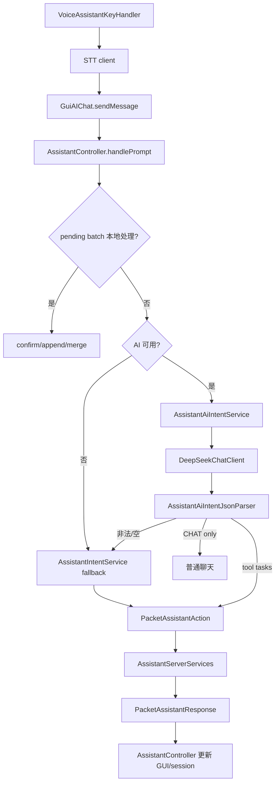

# AdvanceDataMonitor 开发者技术文档

本文档面向继续开发、维护和移植 `AdvanceDataMonitor429` 的开发者。玩家功能说明请看 `AdvanceDataMonitor_使用说明.md`；AI 助手的细节交接可继续参考 `AdvanceDataMonitor_AI助手技术说明.md`。本文重点说明项目结构、初始化链路、核心模块、数据流、构建测试和常见扩展点。

## 1. 项目定位

`AdvanceDataMonitor` 是一个 Minecraft `1.7.10` / Forge `10.13.4.1614` / GTNH 环境下的工具模组，mod id 为 `advancedatamonitor`。核心能力分为三层：

- 世界内监视器：`TileEntityAdvanceDataMonitor` 采集目标 TileEntity / AE2 Link 数据，客户端 TESR 渲染为图表、文本、合成状态或存储物品列表。
- AE2 链接方块：Network Link、Storage Link、Crafting Link 接入 AE2 网络，提供存储容量、指定物品数量、合成 CPU 状态和自动合成能力。
- AI / 语音助手：客户端把自然语言解析为结构化 intent，通过 Forge packet 调服务端查询 AE2、提交合成、取出物品到背包或管理计划；语音入口先 STT，再复用文本助手链路。

项目大体仍沿用 GTNH ExampleMod 构建骨架，但业务代码已经集中在 `com.imgood.advancedatamonitor` 包下。

## 2. 构建与运行环境

关键配置：

- `build.gradle.kts`：只应用 `com.gtnewhorizons.gtnhconvention`，主要构建行为来自 GTNH convention 插件。
- `gradle.properties`：定义 `modName`、`modId`、`modGroup`、MC/Forge/MCP 版本、Jabel、shadow、发布配置和代理配置。
- `dependencies.gradle`：声明运行/编译依赖。当前包含 Vosk/JNA shadow 依赖，以及 GTNH、AE2 Fluid Craft、GT5、ArchitectureCraft、BlockRenderer6343 等 dev 依赖。
- `repositories.gradle`：补充依赖仓库。
- `libs/`：放置部分本地 dev jar。

常用命令：

```powershell
.\gradlew.bat build
.\gradlew.bat runClient
.\gradlew.bat runServer
.\gradlew.bat test
```

Unix-like shell 下对应使用 `./gradlew`。项目通过 Jabel 允许使用部分现代 Java 语法，但产物仍面向 JVM 8；开发时要避免引入 Java 8 运行期不存在的 API。

## 3. 源码目录结构

主要目录如下：

- `src/main/java/com/imgood/advancedatamonitor/`：mod 入口、proxy、配置和各业务包。
- `blocks/`：四类方块实现，负责创建对应 TileEntity、打开 GUI、放置方向、基础交互。
- `items/`：`ItemDataWeave` 和 `ItemAdvanceStorageLinkCell`。
- `tileentity/`：监视器和三个 AE2 Link 的服务端状态、NBT 持久化、AE2 网络访问和同步逻辑。
- `gui/`：Forge GUI handler、container、自定义 GUI 控件和所有客户端配置界面。
- `renders/`：TESR、物品渲染、监视器内容渲染器注册表。
- `network/`：SimpleNetworkWrapper packet 与 handler。
- `loader/`：Forge 生命周期内的集中注册入口。
- `handler/`：tick handler，定期刷新 AE2 Link 缓存。
- `assistant/`：AI 助手 intent、controller、服务端执行、格式化、偏好记忆和本地计划存储。
- `ai/`：OpenAI-compatible chat client、请求选项、provider profile、stream listener。
- `voice/` 与 `client/`：录音、STT、Vosk 嵌入模型、语音热键。
- `utils/`：NBT 解析、绑定数据模型、TileEntity 类型识别、AE2 合成模板等辅助工具。
- `src/main/resources/assets/advancedatamonitor/`：lang、texture、AI 词表、嵌入式 Vosk 模型文件清单。
- `src/test/java/test/AssistantIntentParserSuite.java`：assistant intent 规则 parser 与 AI JSON parser 的回归用例。

注意代码中存在少量历史命名拼写，例如 `LoaerGui`、`RenderAdvanceDataMonotor`。维护时优先判断是否已有外部引用或注册名依赖，避免仅为命名整洁破坏兼容性。

## 4. Forge 生命周期与注册链路

入口类是 `AdvanceDataMonitor`：

- `preInit()`：调用 `proxy.preInit()` 读取配置，然后注册 block、item、handler、TileEntity；客户端额外注册 renderer。
- `init()`：调用 `proxy.init()`，再注册 GUI handler。
- `postInit()`：调用 `proxy.postInit()`，再注册 SimpleNetworkWrapper packet。
- `serverStarting()`：交给 proxy 注册命令。

`CommonProxy.preInit()` 调用 `Config.synchronizeConfiguration()` 读取 Forge config。`ClientProxy.init()` 在客户端注册 `/admai`、`/admassistant`、语音热键和热键事件对象；服务端只注册 `CommandAssistant`。

集中注册类：

- `LoaderBlock` 注册 `advDataMonitor`、`advNetworkLinkBlock`、`advStorageLink`、`advCraftingLink`。
- `LoaderItem` 注册 `data_weave`、`advance_storage_link_cell`，并把存储链接元件声明为支持 AE2 `FUZZY`、`INVERTER` 和 `ORE_FILTER` upgrade。
- `LoaderTileEntity` 注册四个 TileEntity。
- `LoaderRender` 绑定 TESR / item renderer，并在 `RenderController` 注册 `line`、`crafting`、`storage` 内容渲染器。
- `LoaderGui` 注册 `GuiHandler`。
- `LoaderHandler` 注册 `HandlerTick`，用于服务端延迟任务队列、计划提醒扫描和部分玩家 tick 逻辑。
- `LoaderNetWork` 注册所有 packet，当前使用固定 discriminator `0` 到 `7`。

新增注册项时建议延续这些 loader 的集中入口，避免分散到 block 构造器或 GUI 类中。

## 5. 方块、物品与 TileEntity

### 5.1 Advanced Data Monitor

核心类：

- `BlockAdvanceDataMonitor`
- `TileEntityAdvanceDataMonitor`
- `GuiMainAdvanceDataMonitor` 及多个 `GuiSub*` 配置页
- `RenderAdvanceDataMonotor`
- `RenderController` / `IADMRender`

`TileEntityAdvanceDataMonitor` 持有 `dataBoundList`，每个 index 对应一个 `NBTTagCompound` 显示项。显示项里保存目标坐标、字段名、采样间隔、颜色、缩放、旋转、数据类型等。服务端 `updateEntity()` 按每个显示项的 `interval` 采样：

1. 解析绑定坐标。
2. 找到目标 TileEntity。
3. 如果目标是 Crafting Link，写入 `lines` 或 `networkLines` 并标记 `dataType=crafting`。
4. 如果目标是 Storage Link，写入 `storageItems` 并标记 `dataType=storage`。
5. 如果目标是 Network Link，根据字段读取 AE2 网络统计值，可选择转百分比。
6. 普通 TileEntity 则从目标 NBT 读取指定数值字段。
7. 更新本地数据并通过 `syncData()` / `PacketSynTileEntity` / vanilla description packet 同步给客户端渲染。

客户端渲染时根据显示项中的 `dataType` 或 renderer type 分发到 `LineChartRenderer`、`CraftingInfoRenderer`、`StorageInfoRenderer`。要新增一种显示类型，通常需要：

1. 定义显示项 NBT 字段和 GUI 编辑入口。
2. 在采集逻辑中写入稳定的数据结构。
3. 实现 `IADMRender`。
4. 在 `LoaderRender.registerRenderers()` 注册 type。

### 5.2 Data Weave

核心类：`ItemDataWeave`、`GuiHandler`、`GUINBTViewer`、NBT 工具类。

`ItemDataWeave` 用于绑定目标方块并保存目标 TileEntity 的 NBT 快照。GUI handler 的 `NBT_VIEWER_GUI_ID` 会读取手持物品上的 `tileNBT`，通过 `NBTJsonParserHelper` 转成 JSON 后打开 NBT 查看器。它是玩家寻找可监控 NBT 字段的辅助工具，但从开发角度也是理解监视器字段绑定格式的入口。

### 5.3 Network Link

核心类：`BlockAdvanceNetworkLink`、`TileEntityAdvanceNetworkLink`。

`TileEntityAdvanceNetworkLink` 继承 AE2 `AENetworkTile`，要求频道，连接类型为 `SMART`。它通过 AE2 grid 遍历 `TileDrive` / `TileChest` 等存储设备，统计：

- 物品总字节、已用字节、总类型数、已用类型数。
- 流体总字节、已用字节、总类型数、已用类型数。

它订阅 `MENetworkCellArrayUpdate` 和 `MENetworkStorageEvent` 刷新缓存，并通过 NBT / description packet 同步。监视器绑定它后，可以读取这些字段作为图表或百分比展示。

### 5.4 Storage Link

核心类：`BlockAdvanceStorageLink`、`TileEntityAdvanceStorageLink`、`ContainerAdvanceStorageLink`、`GuiAdvanceStorageLink`、`ItemAdvanceStorageLinkCell`。

`TileEntityAdvanceStorageLink` 同样是 AE2 `AENetworkTile`，并实现 `IInventory`。它有 36 个槽位，只接受 `ItemAdvanceStorageLinkCell`。每个 cell 保存一组 AE2 分区标记物品，并可带 Fuzzy / Inverter / Ore Filter upgrade，以及 NBT 流体标记：

- 普通模式：按精确匹配统计被标记物品在 AE2 网络中的数量（`isItemEqual`，避免 AE2FC 液滴混淆）。
- Fuzzy 模式：按 AE2 fuzzy 规则匹配（`FuzzyMode.PERCENT_25` 等），通过 `findFuzzy()` 查询。
- Inverter 模式：遍历网络物品，排除分区列表中的匹配项。
- Ore Filter 模式：按矿典名称通过 `OreDictionary.getOres()` 匹配所有同类物品。
- Fluid Marker 模式：读取 NBT 中的 `fluidMarkers` 列表，通过 `IStorageGrid.getFluidInventory()` 查询流体存量（按 ID 精确匹配）。

`createStorageItemsSnapshot()` 会按优先级（Ore > Fluid > 普通/Fuzzy/Inverter）把每个槽位的匹配项、数量、显示名和 item NBT 组装为 `NBTTagList`，供主监视器 `StorageInfoRenderer` 显示。`sampleStorageDeltasIfNeeded()` 每 20 tick 采样一次并计算增量（countDelta），渲染时按 `itemCountOrder` / `itemDeltaOrder` / `itemNameOrder` 排序，先启用者排在上方。

### 5.5 Crafting Link

核心类：`BlockAdvanceCraftingLink`、`TileEntityAdvanceCraftingLink`、`GuiSubAEAdvanceCraftingLink`、`AssistantServerServices`。

`TileEntityAdvanceCraftingLink` 接入 AE2 crafting grid，统计 CPU 数量、忙碌数量、总/已用存储、协处理器数量，以及每个 CPU 的快照。它订阅 `MENetworkCraftingCpuChange`。主监视器可读取全网络 summary 或按 CPU/template 显示合成状态。

AI 助手的服务端执行也依赖附近 32 格内的 Crafting Link：查询可合成候选、查询样板详情、提交合成、批量提交和取消服务端 job 都从这里进入 AE2 网络。取出物品操作则依赖附近 32 格内的 Storage Link，通过 `IStorageGrid` 搜索与提取物品。

## 6. GUI 与交互

`GuiHandler` 当前定义三个 Forge GUI id：

- `0`：NBT Viewer，只在客户端打开。
- `1`：主监视器 GUI。
- `2`：Storage Link GUI，服务端返回 `ContainerAdvanceStorageLink`，客户端返回 `GuiAdvanceStorageLink`。

主监视器 GUI 以 `GuiMainAdvanceDataMonitor` 为入口，子页面负责绑定目标、配置 AE2 Network Link、Crafting Link、Storage Link、颜色和显示变换。AI 聊天与 AI 设置是独立 `GuiScreen`，由主界面按钮、命令或语音热键打开。

GUI 修改 TileEntity 时要注意 side：客户端负责编辑界面和发包，服务端负责可信状态更新并 `markDirty()` / `markBlockForUpdate()`。不要只改客户端 TileEntity，否则重开世界或服务端同步后会丢失。

## 7. 网络包

所有 packet 共用 `AdvanceDataMonitor.ADMCHANEL`，注册在 `LoaderNetWork`：

- `0 PacketItemNBT -> SERVER`：数据织取器相关 NBT 交互。
- `1 PacketSynTileEntity -> CLIENT`：同步监视器 TileEntity 到客户端。
- `2 PacketSynTileEntity -> SERVER`：客户端提交监视器配置到服务端。
- `3 PacketSynTileEntity -> SERVER`：历史同步 handler。
- `4 PacketRequestItemCountSync -> SERVER`：客户端请求 Storage Link 数量。
- `5 PacketItemCountSync -> CLIENT`：服务端返回 Storage Link 数量。
- `6 PacketAssistantAction -> SERVER`：AI assistant 工具动作。
- `7 PacketAssistantResponse -> CLIENT`：AI assistant 服务端响应。

`PacketAssistantAction` 当前支持 11 种 action（1-7 合成/查询相关，8-11 取出物品相关），通过 payload NBT 携带具体参数。

维护注意事项：

- 1.7.10 的 `SimpleNetworkWrapper` discriminator 必须双端一致，新增 packet 时不要复用现有 ID。
- packet 中传 NBT 时要考虑大小和可信边界；客户端发来的 NBT 不应直接作为最终可信数据扩散。
- 服务端 handler 中涉及世界和 TileEntity 修改时，保持在服务端线程上下文中执行；`PacketAssistantAction` 当前通过 `HandlerTick.enqueueServerTask()` 把 assistant 工具动作切回服务端 tick 执行。

## 8. AI 助手架构

AI 助手由客户端解析、服务端执行。主路径如下：



关键类：

- `GuiAIChat`：聊天窗口、普通聊天请求、assistant 文本入口。
- `AssistantController`：客户端总控，处理 pending session、AI/fallback 切换、plan 执行、候选项确认和服务端响应。
- `AssistantAiIntentService`：构造 system prompt，请求 OpenAI-compatible chat API 返回结构化 JSON。
- `AssistantAiIntentJsonParser`：抽取并校验 `{ tasks: [...] }`。
- `AssistantIntentService`：规则 parser，现在主要作为 AI 不可用或 AI 输出非法时的 fallback。
- `PacketAssistantAction` / `PacketAssistantResponse`：工具动作请求和服务端结果返回。
- `AssistantServerServices`：服务端 AE2 查询、候选构建、合成提交、批量下单、取消 job、计划查询。
- `AssistantSession`：客户端 pending 候选状态。
- `WithdrawSubmitOutcome`：AE2 取出物品服务端结果，含 `SUCCESS / FAILURE / PARTIAL_CONFIRM` 三种状态以及请求量、背包可容纳量、存储量等信息。
- `PlayerInventoryUtil`：背包空间计算与物品插入工具类。
- `OrderMemoryStore`：候选偏好记忆。
- `PlanStore`：简单本地计划存储。

AI JSON schema 只允许模型输出单个 JSON object，包含 `tasks` array。允许 task type 包括 `QUERY_RECIPE`、`QUERY_STORAGE`、`QUERY_POWER`、`ORDER_ITEM`、`WITHDRAW_ITEM`、`CONFIRM_OPTION`、`PLAN_CREATE`、`PLAN_LIST`、`PLAN_COMPLETE`、`CANCEL`、`CHAT`。`ORDER_BATCH` 和 `WITHDRAW_BATCH` 不允许模型直接返回，而由 controller 聚合多个 `ORDER_ITEM` / `WITHDRAW_ITEM` 生成。

新增 assistant 能力时通常需要同时修改：

1. `AssistantIntentType` 增加类型。
2. `AssistantIntentTask` 和 JSON parser 校验新字段或转换逻辑。
3. `AssistantAiIntentService` 的 prompt schema。
4. `AssistantIntentService` fallback 规则和 `assistant-lexicon.json`。
5. `AssistantController.executeTask()` 映射到 packet 或本地动作。
6. `PacketAssistantAction` / `AssistantServerServices` / `PacketAssistantResponse`。
7. `AssistantIntentParserSuite` 添加规则与 AI JSON parser 回归用例。

## 9. 普通 AI 聊天与配置

`DeepSeekChatClient` 是 OpenAI-compatible HTTP client，普通聊天和 AI intent 抽取都复用它。配置在 `Config` 中，主要 category：

- `ai`：base URL、API key、model、network enabled、web search、streaming、timeout、max tokens、temperature、privacy flag、debug logging。
- `voice`：enabled、privacy flag、STT mode、STT URL/key/model、timeout。
- `assistant`：最大订单数量、合成 job 超时、并发 job 数。

配置入口包括：

- Forge config 文件，由 `Config.synchronizeConfiguration()` 读取。
- 游戏内 `GuiAISettings`。
- 客户端命令 `CommandAIConfig`。
- 环境变量 fallback，例如 AI key / voice STT key。

不要把 API key 写入源码、文档示例或测试 fixture。调试日志也应保持脱敏。

## 10. 语音助手

语音入口是 `VoiceAssistantKeyHandler`。客户端注册热键后，按键开始/停止录音，`VoiceCaptureService` 采集 PCM，随后根据配置走：

- `embedded-vosk`：`VoskSpeechToTextClient`、`EmbeddedVoiceModelManager`、`StandaloneVoskTranscriber`。
- `http`：`HttpSpeechToTextClient` 或 `SpeechToTextClient`，调用 OpenAI-compatible `/v1/audio/transcriptions`。

STT 成功后把文字提交给 `GuiAIChat.submitAssistantPrompt()`，后续完全复用 assistant flow。开发语音相关功能时要特别注意：录音只在客户端执行；隐私确认必须在发送音频/文本到外部服务前完成；Vosk/JNA 是 shadow 依赖，打包体积和 native library 行为都需要实测。

## 11. 渲染系统

渲染分两类：

- 方块 / 物品外观：`RenderAdvanceDataMonotor`、`RenderAdvanceNetworkLink`、各 item renderer，由 `LoaderRender` 绑定。
- 监视器内容：实现 `IADMRender`，通过 `RenderController` 按 type 分发。

`IADMRender.render(NBTTagCompound nbt, double x, double y, double z, int facing)` 直接消费显示项 NBT，因此渲染器和采集逻辑之间的契约是 NBT 字段名。改字段名时必须同步 GUI 默认值、TileEntity 采集、NBT 持久化、同步包和 renderer。

1.7.10 的 TESR 渲染容易受 GL 状态污染影响。新增渲染器时要成对 push/pop matrix、恢复颜色/纹理/lighting/blend 状态，并避免在每帧创建大量对象或读取服务端-only 类。

## 12. 持久化与数据文件

主要持久化位置：

- TileEntity NBT：监视器显示项、AE2 Link 缓存、Storage Link inventory。
- ItemStack NBT：Data Weave 绑定快照、Storage Link Cell 分区和 upgrade 信息。
- Forge config：AI、voice、assistant 配置。
- Assistant 数据文件：`AssistantDataFiles` 负责定位，`OrderMemoryStore` / `PlanStore` 保存偏好和计划。
- 资源文件：`assets/advancedatamonitor/config/assistant-lexicon.json` 是 fallback parser 词表。

维护建议：新字段尽量提供缺省值和旧 NBT 兼容读取；对已经进入玩家世界的 block/item NBT，不要随意改 key 或语义。

## 13. 测试与验证

目前最明确的自动化覆盖是 `AssistantIntentParserSuite`，覆盖规则 parser 和 AI JSON parser。建议在改 assistant 相关代码时至少运行：

```powershell
.\gradlew.bat test
```

如果 IDE/Gradle 没有自动执行该 main suite，可以在 IDE 中直接运行 `test.AssistantIntentParserSuite`。构建发布前建议运行：

```powershell
.\gradlew.bat build
```

手工验证建议按模块拆开：

- 监视器：放置主监视器，绑定普通 TileEntity 字段，确认 GUI 保存、重进世界、客户端渲染都正常。
- Network Link：接入 AE2 网络，插入/移除存储元件，确认容量和百分比刷新。
- Storage Link：配置分区、Fuzzy、Inverter，确认主监视器显示数量与 AE2 网络一致。
- Crafting Link：触发 AE2 自动合成，确认 CPU 状态和主监视器文本刷新。
- AI 助手：无 key fallback、有效 key JSON plan、候选确认、批量下单、批量取出、部分取出确认、取消、普通聊天分流。
- 语音助手：本地 Vosk 和 HTTP STT 分别验证热键、隐私确认、转写提交。

## 14. 常见开发任务索引

新增方块：修改 `blocks/`、`LoaderBlock`、`LoaderTileEntity`、lang、texture/model 或 renderer；如果有 GUI，再改 `GuiHandler` 和 `LoaderGui` 相关入口。

新增监视器显示类型：定义显示项 NBT schema，补 GUI 默认值，扩展 `TileEntityAdvanceDataMonitor.processTileEntityData()` 或相邻采集方法，实现 `IADMRender` 并在 `LoaderRender` 注册。

新增网络包：在 `network/packet` 或 `network/handler` 添加 class，更新 `LoaderNetWork`，选择新的 discriminator，检查双端 side 和线程上下文。

新增 assistant 工具：按第 8 节的七步修改，并同步测试。取出物品类工具还需要关注 `PlayerInventoryUtil` 背包空间计算、`WithdrawSubmitOutcome` 三态结果和 `WITHDRAW_PARTIAL_CONFIRM` 客户端确认流程。

新增 AI provider：优先扩展 `AiProviderProfiles`、`GuiAISettings` 和 `DeepSeekChatClient` 请求选项，不要在 GUI 中硬编码 provider 专属逻辑。

新增 STT 模式：扩展 `Config` 的 voice mode 归一化、设置界面、`VoiceAssistantKeyHandler` 的 client 选择逻辑和隐私提示文本。

## 15. 开发注意事项

- 区分 client/server side。GUI、TESR、Minecraft client 类只允许客户端引用；共享类不要直接依赖 `net.minecraft.client.*`。
- AE2 grid 访问可能抛 `GridAccessException` 或返回 null，服务端执行层要给玩家可理解的失败消息。
- 大型 AE2 网络遍历成本高，优先缓存并靠事件/tick 刷新，不要在每帧 renderer 中访问网络。`LineChartRenderer` 等每帧渲染路径也要避免频繁创建/销毁重型 GL 资源。
- Packet payload 尽量小而稳定；对于可从服务端重建的数据，不要信任客户端提交。
- 已经写入世界或物品的 NBT key 属于兼容边界，改名需要迁移逻辑。
- Shadow 依赖会影响 jar 体积和类加载。Vosk/JNA 相关变更必须做客户端启动和语音功能实测。
- `AdvanceDataMonitor_AI助手技术说明.md` 是更细的 assistant 交接文档；改 assistant 主链路后应同步更新它，避免后续维护者读到过期流程。`AdvanceDataMonitor_本地语音转写.md` 可作为本地语音转写调试补充材料。
