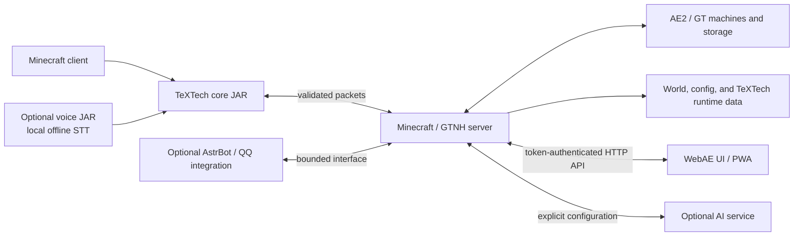

<p align="center">
  
</p>

<p align="center">
  <strong>English</strong> · <a href="README.md">简体中文</a> ·
  <a href="https://github.com/ImgoodWK/TeXTech-GTNH/wiki">Wiki</a> ·
  <a href="https://github.com/ImgoodWK/TeXTech-GTNH/releases">Releases</a> ·
  <a href="https://github.com/ImgoodWK/TeXTech-GTNH/discussions">Discussions</a>
</p>

<p align="center">
  <a href="https://github.com/ImgoodWK/TeXTech-GTNH/actions/workflows/ci.yml"></a>
  <a href="https://github.com/ImgoodWK/TeXTech-GTNH/actions/workflows/codeql.yml"></a>
  <a href="https://github.com/ImgoodWK/TeXTech-GTNH/releases"></a>
  <a href="LICENSE"></a>
  
  
</p>

# TeXTech / 铽丝科技

> *Weaving reality from the torrent of data, stitching matter with threads of binary.*
> 从数据洪流中编织现实，用二进制之线缝合物与质。

TeXTech is a Minecraft 1.7.10 community mod for **GregTech: New Horizons**. It unifies AE2 network observation, in-world data visualization, the WebAE browser console, data weaving, advanced planning, AI/voice assistance, and base-experience systems into an endgame toolchain.

The current public candidate is **`v3.0.0-rc.3`**. Alongside validating the 3.0 feature set, split installation artifacts, and upgrade path, it hardens web-search input boundaries and voice-model archive extraction and updates the optional AstrBot dependency set; stable users can remain on **`v2.0.0`**, which continues to carry the Latest stable marker during the RC period.

<p align="center">
  <a href="docs/en/README.md"></a>
</p>

<p align="center">
  <strong>An observable, weaveable, conversational, mobile-ready endgame toolchain</strong><br>
  Start with the visual tour, then jump to the guide that matches your role.
</p>

<table>
  <tr>
    <td width="25%" valign="top"><strong>👁 See the data</strong><br><sub>Monitors, AE2, and WebAE charts</sub></td>
    <td width="25%" valign="top"><strong>🧵 Weave matter</strong><br><sub>Data dust, forms, fluids, and essentia</sub></td>
    <td width="25%" valign="top"><strong>💬 Automate by dialogue</strong><br><sub>AI assistant, Planner, and optional voice</sub></td>
    <td width="25%" valign="top"><strong>✦ Legend and experience</strong><br><sub>Grapples, Dimensional Pockets, and lore</sub></td>
  </tr>
</table>

## Version and compatibility at a glance

| Item | Current contract |
|---|---|
| Minecraft / Forge | `1.7.10` / `10.13.4.1614` |
| GTNH | `2.9.0-beta-2+`; 2.8.x is unsupported |
| Mod ID | `textech`; `advancedatamonitor` remains only as a migration identifier |
| Current release | `v3.0.0-rc.3` Pre-release |
| Build / bytecode | Built with JDK 17, targeting JVM 8-compatible bytecode |
| License | MIT, `Copyright (c) 2025-2026 ImgoodWK` |

See the [English compatibility guide](docs/en/developer/gtnh-version-compatibility.md) or [中文说明](docs/zh/developer/GTNH版本兼容说明.md).

## Four core systems

### 1. See the data

- Advance Data Monitors map TileEntity, AE2 storage, and crafting state onto in-world line charts, bar charts, pie charts, progress bars, gauges, and data tables.
- Network, crafting, and advanced storage linkers bind sources; the Data Imprint Tool carries reusable binding fingerprints.
- WebAE covers storage, patterns, CPU history/capacity, topology, P2P, world maps, diagnostics, alerts, server console, and mobile views.

### 2. Weave matter

- Dust, Form, Flow, Tide, and Source Data Loom Cells turn AE2 type records into dusts, items, fluids, or essentia.
- Weave Amplifiers, the advanced storage link, and the Matter Ball Decompressor complete higher-throughput automation paths.
- Data weaving is implemented gameplay as well as the brand story. Future altars and dimensional weaving described in design documents remain vision—not RC functionality.

### 3. Conversational automation

- The text assistant can query AE2 storage, find craftable recipes, submit or cancel crafting, and produce plans and operations briefings.
- The optional voice JAR adds local Chinese offline speech recognition. The core mod has no hard dependency when it is absent.
- Advance Planner, HUDs, the WebAE AI surface, QQ/AstrBot integration, and alert channels connect in-game operation with external administration.

### 4. Legend and experience

- Grapple Anchors and Grapple Hooks provide visible, configurable travel routes through large industrial bases.
- Dimensional Pockets provide player-bound persistent personal storage.
- Super Orange and Empyrean Holy Judgment preserve a distinctive legendary streak alongside TeXTech's engineering systems.

## Visual signal cards

These cards recompose repository-owned block/item textures with sanitized WebAE demo surfaces into a lightweight visual language. They orient the reader; they do not replace in-game captures or the canonical feature documentation.

<table>
  <tr>
    <td width="50%" valign="top">
      <br>
      <strong>See the data · 看见数据</strong>
    </td>
    <td width="50%" valign="top">
      <br>
      <strong>Weave matter · 编织物质</strong>
    </td>
  </tr>
  <tr>
    <td width="50%" valign="top">
      <br>
      <strong>Automate by dialogue · 对话自动化</strong>
    </td>
    <td width="50%" valign="top">
      <br>
      <strong>Legend and experience · 传奇与体验</strong>
    </td>
  </tr>
</table>

## WebAE gallery

These five images come from the real React frontend using local demonstration API data. They contain **no token, API key, QQ secret, player UUID, public address, or player-private data**. Click an image to view its original size. This release does not fabricate in-game screenshots; sanitized in-game captures remain an RC follow-up.

<table>
  <tr>
    <td width="50%" valign="top">
      <strong>Custom dashboard · See the data</strong><br>
      <a href="docs/assets/webae/dashboard.png"></a><br>
      <sub>Put storage, CPU, and alerts on one readable control surface.</sub>
    </td>
    <td width="50%" valign="top">
      <strong>AE storage browser · Track matter</strong><br>
      <a href="docs/assets/webae/storage.png"></a><br>
      <sub>Inspect items and fluids from a browser or mobile view.</sub>
    </td>
  </tr>
  <tr>
    <td width="50%" valign="top">
      <strong>Pattern workbench · Orchestrate crafting</strong><br>
      <a href="docs/assets/webae/patterns.png"></a><br>
      <sub>Review patterns, materials, and crafting readiness.</sub>
    </td>
    <td width="50%" valign="top">
      <strong>Network topology · Understand the links</strong><br>
      <a href="docs/assets/webae/topology.png"></a><br>
      <sub>Use topology to locate nodes, links, and network boundaries.</sub>
    </td>
  </tr>
  <tr>
    <td width="50%" valign="top">
      <strong>Server diagnostics · Guard the boundary</strong><br>
      <a href="docs/assets/webae/diagnostics.png"></a>
    </td>
    <td width="50%" valign="middle">
      <strong>Keep exploring</strong><br>
      The gallery uses local demo data; the <a href="docs/en/webae/user-guide.md">WebAE User Guide</a> remains authoritative for behavior and security boundaries.
    </td>
  </tr>
</table>

WebAE also includes recipe search, crafting orders, GT machines, power/steam, fluids and essentia, quest-book integration, link scanning, planner, alerts, Spark profiling, chat/player information, AI assistant, QQ Bot gateway, screenshot sharing, and PWA/mobile layouts. The [WebAE User Guide](docs/en/webae/user-guide.md) is the behavior authority.

## Download and installation

Download matching-version assets from [GitHub Releases](https://github.com/ImgoodWK/TeXTech-GTNH/releases):

| Release asset | Side | Required | Location and purpose |
|---|---|---:|---|
| `textech-v3.0.0-rc.3.jar` | Client + server | Yes | Put in `mods/`; the core mod excludes WebAE pages and the large offline speech model |
| `textech-v3.0.0-rc.3-voice.jar` | Clients needing offline voice | Optional | Put in client `mods/`; version must match the core JAR |
| `textech-v3.0.0-rc.3-webae.zip` | Server | Optional | Extract at the instance root; verify `TeXTech/WebAE/ui/index.html` |
| `textech-v3.0.0-rc.3-sources.jar` | Developers | Optional | Source reference; do not put it in a player's `mods/` directory |

Back up worlds and configuration before upgrading. The RC specifically validates upgrades from `v2.0.0`; production servers should first test startup, storage, and WebAE login against a copy.

### WebAE quick start and security boundary

1. Extract the WebAE ZIP at the server instance root.
2. Set `enabled=true` in `[webConsole]` inside `config/textech/textech.cfg`, then restart.
3. Run `/textech web issue` in game to obtain a login token.
4. Bind to loopback or a trusted private interface. Use a correctly configured HTTPS reverse proxy and access control before any public exposure.

WebAE is disabled by default. Treat its token as an administrative credential: never place it in screenshots, issues, logs, frontend source, or Git; rotate it immediately if exposed. Do not commit AI keys, QQ secrets, or real player data. Read the [WebAE security guidance](docs/en/webae/user-guide.md) and [`SECURITY.md`](SECURITY.md).

## Typical use cases

- Display AE storage trends, CPU queues, power, and fault state together on a machine-room wall.
- Inspect patterns, topology, alerts, and crafting tasks from a browser or phone.
- Query inventory in natural language, decompose a large crafting goal, and submit it safely.
- Traverse production lines with grapples, maintain milestones in Planner, and keep personal tools in a Dimensional Pocket.
- Expose bounded, auditable interfaces to server operators, pack authors, and optional bots.

## System boundaries



The Card Battle client, Node service, rules, and assets live in the separate [TeXTech: Overclocked Arcana](https://github.com/ImgoodWK/TeXTech-Overclocked-Arcana) repository. This repository retains only the Minecraft bridge contract; item rewards remain disabled until an allowlist and idempotent world-side ledger exist.

## Documentation by audience

| Audience | Start here |
|---|---|
| Players | [Player Guide](docs/en/player/player-guide.md) · [feature index](docs/en/README.md#player) |
| Server operators | [WebAE User Guide](docs/en/webae/user-guide.md) · [Security Policy](SECURITY.md) · [Support](SUPPORT.md) |
| Pack authors | [GTNH compatibility](docs/en/developer/gtnh-version-compatibility.md) · [installation details](docs/en/player/player-guide.md#2-environment-and-installation) |
| Mod developers | [Technical Documentation](docs/en/developer/technical-documentation.md) · [Gradle Workflow](docs/en/developer/gradle-workflow.md) |
| WebAE developers | [Developer Guide](docs/en/webae/developer-guide.md) · [`webae-frontend/`](webae-frontend/) |
| AI / voice developers | [AI Assistant Development Guide](docs/en/ai-assistant/development-guide.md) · [AstrBot integration](integrations/astrbot/README.md) |

The full bilingual portal is [`docs/README.md`](docs/README.md); the navigation-only mirror is the [GitHub Wiki](https://github.com/ImgoodWK/TeXTech-GTNH/wiki). Repository `docs/` remains the single source of truth, while Wiki pages only route readers to canonical documents.

## Project history

TeXTech uses a dual-track, verifiable narrative:

- **Git facts:** GitHub repository metadata begins on 2025-04-28, and the earliest retained commit, [`e04bde7`](https://github.com/ImgoodWK/TeXTech-GTNH/commit/e04bde7), is dated 2025-04-29. Later history preserves `v1.0.0`, the TeXTech / `textech` brand migration, and `v2.0.0`.
- **Author's account:** The project was conceived in spring 2025 and formed its complete **AdvanceDataMonitor** direction in May. Suggestions from a few enthusiasts helped it evolve. Work became private and public development paused later in 2025 due to other responsibilities; surgery and recovery extended that pause in early 2026. Reorganization toward a new public form began in April 2026, followed by AI-assisted development and the gradual rename to **TeXTech**.

Exact dates and public chronology can be verified through commit SHAs, signed tags, releases, and the [full bilingual timeline](docs/en/project/timeline.md).

## Implemented, RC limitations, and roadmap

### Implemented

- Core, optional offline voice, and WebAE installation surfaces are separated.
- Data monitors, AE2 linking, data weaving, Planner, AI assistant, grapples, Dimensional Pockets, and core WebAE surfaces have code, documentation, and automated tests.
- WebAE/AstrBot updates, packet boundaries, world-map versions/annotations, CPU history, and network diagnostics enter the 3.0 release line in this RC.

### Under RC validation / known limitations

- `v3.0.0-rc.3` is a pre-release and does not replace `v2.0.0` as Latest stable.
- Promotion still requires full client, dedicated-server, optional-voice, WebAE, and v2 world/config upgrade smoke tests in GTNH.
- GTNH 2.8.x is unsupported; WebAE pages come from a separate ZIP; clients that do not need speech models should omit the voice JAR.
- Card Battle item rewards remain disabled. This README uses real WebAE demo captures only; in-game captures remain an RC follow-up.

### Roadmap

- Observe the RC for at least seven days with no unresolved P0/P1 defect, security leak, artifact-integrity failure, or severe compatibility regression.
- Add sanitized client/server and key-gameplay screenshots, upgrade records, and compatibility reports.
- When promotion criteria pass, create a new signed `v3.0.0` tag, rebuild and verify all artifacts, and mark that release as GitHub Latest.

See [`CHANGELOG.md`](CHANGELOG.md) and [Releases](https://github.com/ImgoodWK/TeXTech-GTNH/releases).

## Build and verification

```bash
# Java / Gradle (official sources and GTNH Nexus by default)
./gradlew spotlessCheck test build

# Explicit opt-in for China mirrors; default and CI remain false
./gradlew -Ptextech.useChinaMirrors=true build

# WebAE
cd webae-frontend
npm ci
npm test -- --run
npm exec tsc -- --noEmit
npm run build

# AstrBot and documentation
cd ..
python -m unittest discover -s integrations/astrbot/tests -p "test_*.py"
python tools/doc-check/doc-consistency-check.py
```

Candidate artifacts are written under `build/libs/`. The tag workflow rebuilds from a clean tag, generates `SHA256SUMS`, and requests GitHub Artifact Attestations. Read [`CONTRIBUTING.md`](CONTRIBUTING.md) before submitting changes.

## Contributing, support, and security

- Reproducible bugs and concrete requests: use the [Issue Forms](https://github.com/ImgoodWK/TeXTech-GTNH/issues/new/choose).
- Usage questions, ideas, and showcases: use [Discussions](https://github.com/ImgoodWK/TeXTech-GTNH/discussions) and [`SUPPORT.md`](SUPPORT.md).
- Contribution process and conduct: [`CONTRIBUTING.md`](CONTRIBUTING.md) · [`CODE_OF_CONDUCT.md`](CODE_OF_CONDUCT.md).
- Vulnerabilities, tokens, or leaked credentials: do not open a public issue; follow [`SECURITY.md`](SECURITY.md) and GitHub Private Vulnerability Reporting.

## License, citation, and provenance

TeXTech is released under the [MIT License](LICENSE). MIT permits use, copying, modification, and distribution when copyright and license notices are retained; this project does not describe normal MIT-permitted derivative work as unlawful.

Use [`CITATION.cff`](CITATION.cff) for citation metadata, and [`AUTHORS.md`](AUTHORS.md) plus [`NOTICE.md`](NOTICE.md) for authorship and third-party scope. The visible provenance identifier is:

```text
TT-GTNH-PROVENANCE-2025-04-29-E04BDE7
```

The verification chain combines public Git history, signed commits, a signed annotated tag, release commit SHA, SHA-256 checksums, and GitHub Artifact Attestations. The repository contains no hidden prompt injection, tracking pixel, covert callback, malicious trap, or non-consensual telemetry. Public code monitoring provides human-review leads only and never automatically accuses or contacts a matched repository's author.
