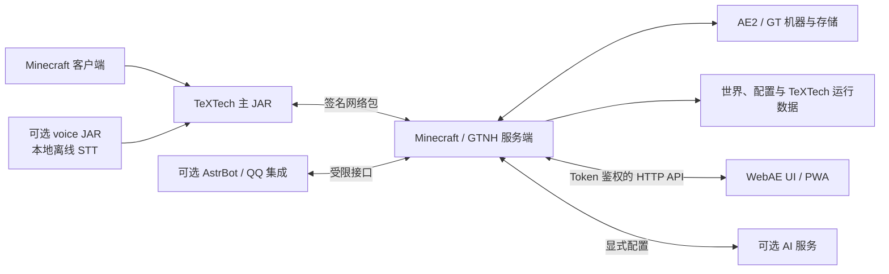

<p align="center">
  
</p>

<p align="center">
  <a href="README.en.md">English</a> · <strong>简体中文</strong> ·
  <a href="https://github.com/ImgoodWK/TeXTech-GTNH/wiki">Wiki</a> ·
  <a href="https://github.com/ImgoodWK/TeXTech-GTNH/releases">Releases</a> ·
  <a href="https://github.com/ImgoodWK/TeXTech-GTNH/discussions">Discussions</a>
</p>

<p align="center">
  <a href="https://github.com/ImgoodWK/TeXTech-GTNH/actions/workflows/ci.yml"></a>
  <a href="https://github.com/ImgoodWK/TeXTech-GTNH/actions/workflows/codeql.yml"></a>
  <a href="https://github.com/ImgoodWK/TeXTech-GTNH/releases"></a>
  <a href="LICENSE"></a>
  
  
</p>

# TeXTech / 铽丝科技

> 从数据洪流中编织现实，用二进制之线缝合物与质。<br>
> *Weaving reality from the torrent of data, stitching matter with threads of binary.*

TeXTech 是面向 **GregTech: New Horizons** 的 Minecraft 1.7.10 社区模组：它把 AE2 网络监控、世界内数据可视化、WebAE 浏览器控制台、数据编织、高级计划、AI/语音助手与基地体验系统组合成一套连贯的终局工具链。

当前公开候选版本是 **`v3.0.0-rc.1`**。它用于验证 3.0 功能、安装拆分和升级路径；稳定用户可继续使用仍标记为 Latest stable 的 **`v2.0.0`**。

## 版本与兼容速览

| 项目 | 当前约定 |
|---|---|
| Minecraft / Forge | `1.7.10` / `10.13.4.1614` |
| GTNH | `2.9.0-beta-2+`；不支持 2.8.x |
| Mod ID | `textech`；`advancedatamonitor` 仅保留迁移兼容语义 |
| 当前发布 | `v3.0.0-rc.1` Pre-release |
| 构建 / 字节码 | JDK 17 构建，面向 JVM 8 兼容字节码 |
| 许可 | MIT，`Copyright (c) 2025-2026 ImgoodWK` |

完整兼容说明见[中文文档](docs/zh/developer/GTNH版本兼容说明.md)或 [English guide](docs/en/developer/gtnh-version-compatibility.md)。

## 四个核心系统

### 1. 看见数据

- 高级数据监视器可把 TileEntity、AE2 存储与合成状态映录到世界中的折线图、柱状图、饼图、进度条、仪表和数据表。
- 网络、合成与高级存储链接器负责绑定数据源；数据映录器用于携带与复用绑定指纹。
- WebAE 提供存储、样板、CPU 历史与容量、网络拓扑、P2P、世界地图、诊断、告警、服务器控制台和移动端视图。

### 2. 编织物质

- 数据织尘、织形、涌流、织潮与织源元件把 AE2 中的类型记录转化为粉尘、物品、流体或源质。
- 编织增幅卡与超级编织增幅卡提供进阶吞吐；高级存储链接与物质球解压器补齐自动化链路。
- “数据编织”是品牌叙事，也是已经实现的玩法系统；设计文档中的未来祭坛、维度编织等仍属于愿景，不会伪装成 RC 现有功能。

### 3. 对话自动化

- 文字 AI 助手可查询 AE2 存储、检索可合成配方、下单或取消合成，并生成计划与操作简报。
- 可选 voice JAR 提供本地中文离线语音识别；没有安装它时主模组不会产生硬依赖错误。
- 高级计划器、HUD、WebAE AI 页面、QQ/AstrBot 集成与告警通道把游戏内操作和外部管理连接起来。

### 4. 传奇与体验

- 挂索节点与挂索器为大型工业基地提供可视、可配置的移动路线。
- 次元口袋提供与玩家绑定的持久化私人存储。
- 超能砂糖桔、至高天圣裁等内容保留了 TeXTech 在严肃工程系统之外的传奇感与作者个性。

## WebAE 功能画廊

以下 5 张图片来自仓库中的真实 React 前端与本地演示 API 数据，**不包含 Token、API Key、QQ secret、玩家 UUID、公网地址或玩家隐私**。本次发布不生成或伪装游戏内实机截图；RC 观察期会补充经过脱敏的真实游戏内截图。

| 自定义仪表盘 | AE 存储浏览 |
|---|---|
|  |  |

| 样板工作台 | 网络拓扑 |
|---|---|
|  |  |


除此之外，WebAE 还包括配方搜索、合成下单、GT 机器、电力/蒸汽、流体与源质、任务书、链接扫描、计划器、告警、Spark 性能分析、聊天/玩家信息、AI 助手、QQ Bot 网关、截图分享和 PWA/移动布局。当前行为以 [WebAE 用户手册](docs/zh/webae/用户手册.md)为准。

## 下载与安装

从 [GitHub Releases](https://github.com/ImgoodWK/TeXTech-GTNH/releases) 下载**同一版本**的附件：

| 发布资产 | 适用端 | 是否必需 | 安装位置与用途 |
|---|---|---:|---|
| `textech-v3.0.0-rc.1.jar` | 客户端 + 服务端 | 必需 | 放入 `mods/`；主模组，不内置 WebAE 页面与大型离线语音模型 |
| `textech-v3.0.0-rc.1-voice.jar` | 需要离线语音的客户端 | 可选 | 放入客户端 `mods/`；必须与主 JAR 版本一致 |
| `textech-v3.0.0-rc.1-webae.zip` | 服务端 | 可选 | 解压到实例根目录，确认 `TeXTech/WebAE/ui/index.html` 存在 |
| `textech-v3.0.0-rc.1-sources.jar` | 开发者 | 可选 | 源码参考，不要放入玩家 `mods/` |

升级前备份世界与配置。RC 重点验证从 `v2.0.0` 的世界/配置升级路径；生产服应先在副本中完成启动、存储与 WebAE 登录烟测。

### WebAE 快速启用与安全边界

1. 解压 WebAE ZIP 到服务端实例根目录。
2. 在 `config/textech/textech.cfg` 的 `[webConsole]` 中设置 `enabled=true`，然后重启。
3. 在游戏内执行 `/textech web issue` 获取登录 Token。
4. 优先绑定回环或可信内网地址；对公网开放时使用经过正确配置的 HTTPS 反向代理和访问控制。

WebAE 默认关闭。Token 等同于管理凭据：不要放入截图、Issue、日志、前端源码或 Git；泄漏后应立即轮换。不要把服务直接绑定到公网，也不要把 AI Key、QQ secret 或真实玩家数据提交到仓库。完整说明见 [WebAE 安全章节](docs/zh/webae/用户手册.md)与 [`SECURITY.md`](SECURITY.md)。

## 典型使用场景

- 在机房墙面同时显示 AE 存储趋势、CPU 队列、电力与故障状态。
- 在浏览器或手机上检查样板、拓扑、告警与合成任务，而无需一直停留在终端前。
- 用自然语言查询库存、拆解大型合成目标并安全地下单。
- 用挂索穿过大型生产线，用计划器维护阶段目标，用次元口袋保存个人工具。
- 为服主、整合包作者和外部机器人提供有边界、可审计的接口。

## 系统边界



Card Battle 的游戏端、Node 服务、规则与资产位于独立仓库 [TeXTech: Overclocked Arcana](https://github.com/ImgoodWK/TeXTech-Overclocked-Arcana)。本仓库只保留 Minecraft 桥接契约；奖励物品发放在白名单和世界侧幂等账本完成前保持禁用。

## 按角色进入文档

| 你是谁 | 建议入口 |
|---|---|
| 玩家 | [用户手册](docs/zh/player/用户手册.md) · [游戏内功能概览](docs/zh/README.md#玩家向) |
| 服主 | [WebAE 用户手册](docs/zh/webae/用户手册.md) · [安全策略](SECURITY.md) · [支持入口](SUPPORT.md) |
| 整合包作者 | [GTNH 2.9.0 安装说明](docs/zh/player/整合包安装-GTNH-2.9.0.md) · [兼容说明](docs/zh/developer/GTNH版本兼容说明.md) |
| Mod 开发者 | [技术文档](docs/zh/developer/技术文档.md) · [Gradle 工作流](docs/zh/developer/Gradle工作流.md) |
| WebAE 开发者 | [开发者手册](docs/zh/webae/开发者手册.md) · [`webae-frontend/`](webae-frontend/) |
| AI / 语音开发者 | [AI 助手开发指南](docs/zh/ai-assistant/开发指南.md) · [AstrBot 集成](integrations/astrbot/README.md) |

完整双语入口见 [`docs/README.md`](docs/README.md)，导航型 Wiki 见 [GitHub Wiki](https://github.com/ImgoodWK/TeXTech-GTNH/wiki)。仓库内 `docs/` 是唯一事实源；Wiki 只负责把读者带到 canonical 文档，不复制整篇技术说明。

## 项目历史

TeXTech 的时间线采用“双轨可验证叙事”：

- **Git 事实：** GitHub 仓库元数据始于 2025-04-28，现有最早提交 [`e04bde7`](https://github.com/ImgoodWK/TeXTech-GTNH/commit/e04bde7) 日期为 2025-04-29；后续历史保留了 `v1.0.0`、TeXTech / `textech` 品牌迁移和 `v2.0.0` 等节点。
- **作者叙述：** 项目在 2025 年春季酝酿，并于 5 月形成 **AdvanceDataMonitor** 的完整方向；少数爱好者的建议帮助它逐步发展。2025 年后期因事务繁忙，项目阶段性转为私有并暂停公开；2026 年初因手术与恢复继续暂停。2026 年 4 月开始重新整理并准备新的公开形态，随后引入 AI 辅助开发，并逐步改名为 **TeXTech**。

精确日期与公开先后关系可通过提交 SHA、签名 Tag、Release 记录和[完整双语时间线](docs/zh/project/timeline.md)核验。

## 当前实现、RC 限制与 Roadmap

### 已实现

- 主模组、可选离线语音、WebAE 前端三类安装面已拆分。
- 数据监视器、AE2 链接、数据编织、计划器、AI 助手、挂索、次元口袋与 WebAE 核心页面已有代码、文档和自动化测试覆盖。
- WebAE、AstrBot、网络包边界、世界地图版本/标注、CPU 历史与网络诊断等 3.0 改动进入 RC。

### RC 验证中 / 已知限制

- `v3.0.0-rc.1` 是预发布版，不替代 Latest stable 的 `v2.0.0`。
- 正式晋升前仍需完成客户端、专用服务器、可选 voice、WebAE、v2 世界/配置升级的完整 GTNH 烟测。
- GTNH 2.8.x 不受支持；WebAE 页面必须从独立 ZIP 安装；voice JAR 不应部署到不需要语音模型的客户端。
- Card Battle 奖励物品交付保持禁用；本次 README 只使用真实 WebAE 演示截图，游戏内实机截图留待 RC 观察期补充。

### Roadmap

- RC 至少观察 7 天，并清零未解决的 P0/P1、安全泄漏、资产校验或严重兼容回归。
- 补充脱敏的客户端/专服与关键玩法实机截图、升级记录和兼容报告。
- 满足晋升条件后发布新的签名 Tag `v3.0.0`，重新构建、校验并设为 GitHub Latest。

详见 [`CHANGELOG.md`](CHANGELOG.md) 与 [Releases](https://github.com/ImgoodWK/TeXTech-GTNH/releases)。

## 从源码构建与验证

```bash
# Java / Gradle（默认使用官方源与 GTNH Nexus）
./gradlew spotlessCheck test build

# 国内网络可显式启用镜像；默认和 CI 均为 false
./gradlew -Ptextech.useChinaMirrors=true build

# WebAE
cd webae-frontend
npm ci
npm test -- --run
npm exec tsc -- --noEmit
npm run build

# AstrBot 与文档
cd ..
python -m unittest discover -s integrations/astrbot/tests -p "test_*.py"
python tools/doc-check/doc-consistency-check.py
```

构建产生的候选发布物位于 `build/libs/`；Tag 发布工作流会从干净 Tag 重新构建、生成 `SHA256SUMS` 并为资产生成 GitHub Artifact Attestations。提交改动前请阅读 [`CONTRIBUTING.md`](CONTRIBUTING.md)。

## 贡献、支持与安全

- 可复现缺陷与明确功能请求：使用 [Issue Forms](https://github.com/ImgoodWK/TeXTech-GTNH/issues/new/choose)。
- 用法问题、想法与展示：使用 [Discussions](https://github.com/ImgoodWK/TeXTech-GTNH/discussions) 和 [`SUPPORT.md`](SUPPORT.md)。
- 贡献流程与行为规范：[`CONTRIBUTING.md`](CONTRIBUTING.md) · [`CODE_OF_CONDUCT.md`](CODE_OF_CONDUCT.md)。
- 漏洞、Token 或密钥泄漏：不要公开 Issue；按 [`SECURITY.md`](SECURITY.md) 使用 GitHub Private Vulnerability Reporting。

## 许可、引用与来源证明

TeXTech 按 [MIT License](LICENSE) 发布。MIT 允许在保留版权和许可声明的前提下使用、复制、修改和分发；本项目不会把许可允许的正常派生开发描述成违法行为。

推荐引用信息见 [`CITATION.cff`](CITATION.cff)，作者与第三方范围见 [`AUTHORS.md`](AUTHORS.md) 和 [`NOTICE.md`](NOTICE.md)。本项目的可见来源证明 ID 为：

```text
TT-GTNH-PROVENANCE-2025-04-29-E04BDE7
```

来源证明由公开 Git 历史、签名提交、签名 annotated Tag、发布 commit SHA、SHA-256 校验和与 GitHub Artifact Attestations共同组成。仓库不包含隐藏 prompt injection、跟踪像素、隐蔽外呼、恶意陷阱或未经同意的遥测。公开代码监测只提供人工调查线索，不会自动指控或联系命中仓库的作者。
