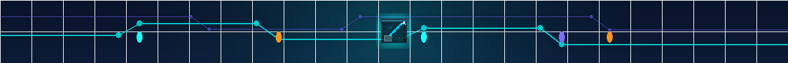

# TeXTech wiki / README media pack

这组媒体为 GitHub README、Wiki 主页、功能详情页和章节分隔使用。画面故意不放固定语言文字，方便在图片上方或旁边叠加中英文标题；工业科幻的深色底、青色数据线和少量紫/橙状态色与 ADM / WebAE 的界面风格保持一致。

## 最终文件

| 文件 | 尺寸 / 格式 | 推荐位置 | 说明 |
| --- | --- | --- | --- |
| `wiki-hero-1600x420.png` | 800 × 420 · RGBA PNG | README 顶部、Wiki 首页 banner | 保留原文件名以维持已有链接；画面仅保留原图右半的脱敏 WebAE 演示界面、ADM GUI 线框和仓库内方块纹理。 |
| `feature-monitor-640x360.png` | 640 × 360 · RGBA PNG | WebAE / 数据监控功能卡片 | 使用 `dashboard.png` 与 `adv_data_monitor.png`。 |
| `feature-weave-640x360.png` | 640 × 360 · RGBA PNG | Data Weave / AE2 数据编织章节 | 使用 `data_weave.png`、网络链接和存储链接方块纹理。 |
| `feature-assistant-640x360.png` | 640 × 360 · RGBA PNG | 助手、诊断或自动化章节 | 使用 `diagnostics.png` 与真实 `adv_crafting_link.png` 纹理。 |
| `feature-journey-640x360.png` | 640 × 360 · RGBA PNG | 入门流程、拓扑或进阶路线 | 使用 `topology.png` 与 `grapple_anchor.png` 纹理；底部进度轨道可对应章节顺序。 |
| `data-divider-1200x96.png` | 1200 × 96 · RGBA PNG | Wiki 章节之间、README 功能分组之间 | 细长的可重复视觉分隔条；中心徽记是 `data_weave.png` 的像素纹理。 |

文件名均为稳定的 ASCII 小写命名。每个文件远低于 1 MB，便于 GitHub Wiki 和仓库首页快速加载。

## 引用示例

README（仓库根目录）可以直接使用：

```html
<p align="center">
  
</p>
```

Wiki 页面如果在仓库文档中预览，可以按仓库根路径引用；发布到独立 Wiki 仓库时使用 `raw.githubusercontent.com` 绝对地址：

```markdown



```

```text
https://raw.githubusercontent.com/ImgoodWK/TeXTech-GTNH/master/docs/assets/promo/wiki/feature-monitor-640x360.png
```

GitHub Wiki 独立仓库也可以将 `docs/assets/promo/wiki/` 中的最终文件复制到 Wiki 的 `images/`，再把链接改为 `images/feature-*.png`。建议为每张图保留表格中的可读 `alt` 文本；图片本身不承载必要说明。

## 来源与生成记录

- ADM 方块 / 物品纹理：`src/main/resources/assets/textech/textures/blocks/adv_*.png`、`grapple_anchor.png`、`src/main/resources/assets/textech/textures/items/data_weave.png`。
- ADM GUI 线框：`src/main/resources/assets/textech/textures/gui/background_AdvanceDataMonitor_Main.png`。
- WebAE 界面截图：`docs/assets/webae/dashboard.png`、`diagnostics.png`、`topology.png`。这些是仓库内已有的脱敏 React/演示 API 界面素材，并非生成的游戏截图。
- 初始组合、调色和缩放由 Pillow 本地脚本完成；当前 hero 又以 `x=800..1600` 做无插值右半裁切（脚本和缩略图属于临时工作物，不提交）。没有下载外部素材、第三方凭据或 Meowa 中间稿。

检查时，在仓库根目录运行：

```powershell
python tools/agent-image-thumb.py docs/assets/promo/wiki/wiki-hero-1600x420.png
```

验收重点是实际尺寸、颜色模式、透明通道和文件大小。不要把 `.workspace/agent-image-thumbs/`、contact sheet、`final_outputs.json` 或其他中间稿复制到发布目录。
