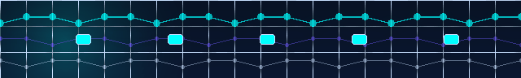

# TeXTech Documentation (English)

> Mod ID: `textech` · Minecraft 1.7.10 / GTNH · TeXTech 3.0 RC 3 · Last synced: 2026-08

中文文档: [docs/zh/README.md](../zh/README.md) · Index: [docs/README.md](../README.md) · [Project home](../../README.en.md)

TeXTech `v3.0.0-rc.3` targets GTNH `2.9.0-beta-2+`. Releases provide the required core mod JAR, optional offline-voice JAR, and optional WebAE ZIP separately. To use WebAE, extract its ZIP at the server instance root and verify `TeXTech/WebAE/ui/index.html`; users who do not need WebAE only download the core JAR.

## Visual tour

  

  

<strong>See the signal first, then choose a documentation route</strong> 先看信号，再选择与你角色匹配的手册。

<table>
  <tr>
    <td width="50%" valign="top">
       
      <strong>See the data · 看见数据</strong>
    </td>
    <td width="50%" valign="top">
       
      <strong>Weave matter · 编织物质</strong>
    </td>
  </tr>
  <tr>
    <td width="50%" valign="top">
       
      <strong>Automate by dialogue · 对话自动化</strong>
    </td>
    <td width="50%" valign="top">
       
      <strong>Legend and experience · 传奇与体验</strong>
    </td>
  </tr>
</table>

<table>
  <tr>
    <td width="50%" valign="top">
       
      <strong>Dashboard · See the data</strong> 
      Build a readable global view from storage, CPU history, and alerts.
    </td>
    <td width="50%" valign="top">
       
      <strong>Storage browser · Track matter</strong> 
      Inspect items and fluids in an AE2 network from a browser or mobile view.
    </td>
  </tr>
  <tr>
    <td width="50%" valign="top">
       
      <strong>Pattern workbench · Orchestrate crafting</strong> 
      Review patterns, materials, and crafting readiness before reading the player guide.
    </td>
    <td width="50%" valign="top">
       
      <strong>Network topology · Understand the links</strong> 
      Trace nodes, links, and boundaries, then continue with the WebAE-specific docs.
    </td>
  </tr>
  <tr>
    <td width="50%" valign="top">
       
      <strong>Server diagnostics · Guard the boundary</strong>
    </td>
    <td width="50%" valign="middle">
      These images come from the repository's WebAE React frontend and local demo API data, not in-game captures. The <a href="webae/user-guide.md">WebAE User Guide</a> remains authoritative for behavior and security boundaries.
    </td>
  </tr>
</table>

Start with the visual tour, then choose a documentation path by audience. For repository context, the installation matrix, and build commands, return to the [project home](../../README.en.md).

---

## Documentation layers

| Layer | Role | Paths |
|-------|------|-------|
| L0 Machine-readable | Agent / CI source of truth | `ConfigDescriptions.java`, `LoaderNetwork.java`, `.cursor/rules/` |
| L1 Developer specs | Contributor design | `developer/`, WebAE developer guide, `ai-assistant/` |
| L2 Player / admin | Tutorials | `player/`, WebAE user guide, `assets/textech/manual/` |
| L3 Vision / design | **Not implementation spec** | `design/` |

Maintenance map: [documentation-map.md](developer/documentation-map.md)

---

## By audience

| You are | Start here |
|---------|------------|
| **New player** | [Player Guide §0 Quick Overview](player/player-guide.md#0-quick-overview) |
| **Planner user** | [Player Guide §19 Advance Planner](player/player-guide.md#19-advance-planner) |
| **Server / pack author** | [Player Guide §2 Environment](player/player-guide.md#2-environment-and-installation) · [§11 Config](player/player-guide.md#11-configuration-reference) · [WebAE User Guide](webae/user-guide.md) |
| **New contributor** | [Technical Documentation](developer/technical-documentation.md) · [Gradle Workflow](developer/gradle-workflow.md) |
| **AI assistant work** | [AI Assistant Development Guide](ai-assistant/development-guide.md) · `.cursor/rules/ai-assistant.mdc` |
| **Grapple system** | [Grapple System Design](subsystems/grapple-system-design.md) |
| **Planner code** | [Technical Documentation §5.11](developer/technical-documentation.md#511-advance-planner) |

---

## Document tree

### Player

| Doc | Description |
|-----|-------------|
| [player/player-guide.md](player/player-guide.md) | Install, blocks/items, monitors, AE2, AI/voice, config, FAQ, Advance Planner |

### WebAE Console

| Doc | Description |
|-----|-------------|
| [webae/user-guide.md](webae/user-guide.md) | Enable, tokens, feature pages, commands, security notes |
| [webae/developer-guide.md](webae/developer-guide.md) | Architecture, REST API, network packets, frontend build, subsystems |
| [webae/oc-integration.md](webae/oc-integration.md) | OpenComputers Internet Card read-only OC integration API |

### Developer

| Doc | Description |
|-----|-------------|
| [developer/technical-documentation.md](developer/technical-documentation.md) | Structure, Forge registration, modules, data flow (Advance Planner API: §5.11) |
| [developer/documentation-map.md](developer/documentation-map.md) | Which docs/rules to update per feature |
| [developer/ui-framework.md](developer/ui-framework.md) | Container GUI 9-slice framework, `ADM_UiContainer`, debug status table |
| [developer/new-feature-checklist.md](developer/new-feature-checklist.md) | New-feature checklist (base classes, packets, lang sync) |
| [developer/gradle-workflow.md](developer/gradle-workflow.md) | Build / migration / FAQ |
| [developer/temporary-textures.md](developer/temporary-textures.md) | Missing/placeholder block & item texture audit; **temporary** procedural art |
| [developer/gtnh-version-compatibility.md](developer/gtnh-version-compatibility.md) | v2 stable and v3 RC require GTNH 2.9.0-beta-2+; 2.8.x is unsupported |
| [developer/ae-compat-290.md](developer/ae-compat-290.md) | GTNH 2.9.0-beta-2 NativeFluid integration and legacy-source boundary |

### AI assistant

| Doc | Description |
|-----|-------------|
| [ai-assistant/development-guide.md](ai-assistant/development-guide.md) | Architecture, file index, STT (full English) |

### Subsystems

| Doc | Description |
|-----|-------------|
| [subsystems/grapple-system-design.md](subsystems/grapple-system-design.md) | Grapple Anchor / Grapple Hook design |

### Design drafts

| Doc | Description |
|-----|-------------|
| [design/brand-visual-design-guide.md](design/brand-visual-design-guide.md) | Mod name, lore, color palette, promo asset specs, AI image prompts |
| [design/future-development-vision.md](design/future-development-vision.md) | Long-term feature vision and architecture drafts (not current implementation spec) |

---

## Naming convention

In-game display names follow `lang/en_US.lang`, e.g.:

- **Advance Data Monitor**, **Data Imprint Tool**
- **Network Linker**, **Crafting Linker**, **Advanced Storage Linker**, **Advanced Storage Link Cell**, **Matter Ball Decompressor**
- **Grapple Anchor** / **Grapple Hook**, **Advance Planner**, **Super Orange**, **Empyrean Holy Judgment**
- **TeXTech Manual** (item `manual`)

---

## Project history and governance

| Doc | Description |
|-----|-------------|
| [project/timeline.md](project/timeline.md) | Git-verifiable milestones and the author's project-origin story |
| [project/provenance.md](project/provenance.md) | Public-monitor limits, human review, and evidence-preservation workflow |
| [../../NOTICE.md](../../NOTICE.md) | Project identity, provenance, attribution, and public-monitoring boundaries |
| [../../CONTRIBUTING.md](../../CONTRIBUTING.md) | Contribution workflow and verification expectations |
| [../../SECURITY.md](../../SECURITY.md) | Private vulnerability reporting and secret-handling policy |
| [../../SUPPORT.md](../../SUPPORT.md) | Support routing by audience |
| [../../CHANGELOG.md](../../CHANGELOG.md) | v1.0.0, v2.0.0, and the v3.0.0 RC release summaries |
| [../wiki/README.md](../wiki/README.md) | Repository source for navigation-only GitHub Wiki pages |
