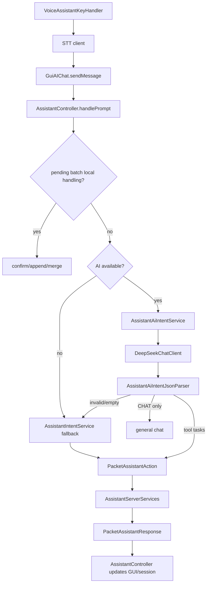

# AdvanceDataMonitor Developer Technical Documentation

> Audience: developers · Last synced: 2026-06  
> Player guide: [Player Guide](../player/player-guide.md) · AI details: [AI Assistant Development Guide](../ai-assistant/development-guide.md) · Build: [Gradle Workflow](Gradle-workflow.md)

---

## Table of Contents

- [1. Project Overview](#1-project-overview)
- [2. Build and Runtime Environment](#2-build-and-runtime-environment)
- [3. Source Directory Structure](#3-source-directory-structure)
- [4. Forge Lifecycle and Registration Flow](#4-forge-lifecycle-and-registration-flow)
- [5. Blocks, Items, and TileEntities](#5-blocks-items-and-tileentities)
  - [5.1 Advance Data Monitor](#51-advance-data-monitor)
  - [5.2 Data Imprint Tool](#52-data-imprint-tool)
  - [5.3 Network Linker](#53-network-linker)
  - [5.4 Advanced Storage Linker](#54-advanced-storage-linker)
  - [5.5 Crafting Linker](#55-crafting-linker)
  - [5.6 Super Orange](#56-super-orange)
  - [5.7 Grapple System](#57-grapple-system)
  - [5.8 Data Loom Cells](#58-data-loom-cells)
  - [5.9 Empyrean Holy Judgment](#59-empyrean-holy-judgment)
  - [5.10 Manual System](#510-manual-system)
  - [5.11 Advance Planner](#511-advance-planner)
  - [5.12 Dimensional Pocket](#512-dimensional-pocket)
- [6. GUI and Interaction](#6-gui-and-interaction)
- [7. Network Packets](#7-network-packets)
- [8. AI Assistant Architecture](#8-ai-assistant-architecture)
- [9. General AI Chat and Configuration](#9-general-ai-chat-and-configuration)
- [10. Voice Assistant](#10-voice-assistant)
- [11. Rendering System](#11-rendering-system)
- [12. Persistence and Data Files](#12-persistence-and-data-files)
- [13. Testing and Verification](#13-testing-and-verification)
- [14. Common Development Task Index](#14-common-development-task-index)
- [15. Development Notes](#15-development-notes)
- [16. Debugging and Contributing](#16-debugging-and-contributing)

---

## 1. Project Overview

`AdvanceDataMonitor` is a utility mod for Minecraft `1.7.10` / Forge `10.13.4.1614` in the GTNH environment. Mod id: `advancedatamonitor`. Core capabilities fall into three layers:

- In-world monitors: `TileEntityAdvanceDataMonitor` samples target TileEntities / AE2 linker data; client TESR renders charts, text, crafting status, or storage item lists.
- AE2 linker blocks: Network Linker, Advanced Storage Linker, and Crafting Linker connect to the AE2 network, providing storage capacity, marked-item counts, crafting CPU status, and auto-crafting support.
- AI / voice assistant: the client parses natural language into structured intents, then uses Forge packets on the server to query AE2, submit crafting jobs, withdraw items to inventory, or manage plans; the voice entry runs STT first, then reuses the text assistant pipeline.

The project still largely follows the GTNH ExampleMod build skeleton, but business code is concentrated under `com.imgood.advancedatamonitor`.

## 2. Build and Runtime Environment

Key configuration:

- `build.gradle.kts`: applies only `com.gtnewhorizons.gtnhconvention`; most build behavior comes from the GTNH convention plugin.
- `gradle.properties`: defines `modName`, `modId`, `modGroup`, MC/Forge/MCP versions, Jabel, shadow, publishing, and proxy settings.
- `dependencies.gradle`: declares runtime/compile dependencies. Shadow deps include Vosk/JNA, PinIn (manual pinyin search), plus GTNH, AE2 Fluid Craft, GT5, ArchitectureCraft, BlockRenderer6343, and other dev dependencies.
- `repositories.gradle`: supplemental dependency repositories.
- `libs/`: local dev jars.

Common commands:

```powershell
.\gradlew.bat build
.\gradlew.bat runClient
.\gradlew.bat runServer
.\gradlew.bat test
```

On Unix-like shells, use `./gradlew` instead. Jabel allows some modern Java syntax, but output still targets JVM 8; avoid APIs that do not exist at Java 8 runtime.

## 3. Source Directory Structure

The project uses **dual-axis package organization**: standard Forge layering (`blocks/`, `items/`, `entity/`, etc.) plus feature packages (`assistant/`, `items/cell/`, `handler/`, `voice/`). Shared logic for complex subsystems lives in feature packages; Block/Item/Entity/Handler/Render still register in standard packages via centralized `loader/` registration.

Main directories:

- `src/main/java/com/imgood/advancedatamonitor/`: mod entry, proxy, config, and business packages.
- `blocks/`: five block implementations (including grapple node `BlockGrappleAnchor`); creates TileEntities, opens GUIs, placement facing, basic interaction.
- `items/`: `ItemDataImprint`, `ItemAdvanceStorageLinkCell`, `ItemAdvancePlanner`, `ItemManual`, `ItemSuperOrange`, `ItemGrappleHook`, `ItemStarryCosmosSword`, `ItemDimensionalPocket` (+ `ItemSpaceUpgradeCard` / `ItemPageUpgradeCard` / `ItemStackUpgradeCard` / `ItemInfiniteStackUpgradeCard`); Data Loom cells live in `items/cell/` (items also in `items/cell/`, unlike handler/manual items/ pattern).
- `tileentity/`: monitor, three AE2 Linkers, and grapple node server state, NBT persistence, AE2 network access, and sync logic.
- `gui/`: Forge GUI handler (`GuiHandler`, includes `GRAPPLE_HOOK_GUI_ID`), containers, custom GUI widgets, and all client config screens.
- `renders/`: TESR, item rendering, monitor content renderers, HUD, manual page rendering (`ManualPageRenderer`).
- `network/`: SimpleNetworkWrapper packets and handlers.
- `loader/`: centralized registration entry points during Forge lifecycle.
- `handler/`: tick handler, Super Orange ability handler, loot handler, player join handler, grapple server logic (node index, player state, anchor positions, travel queue), Empyrean Holy Judgment shared utilities (damage source, motion, impact point, constants, sounds), Dimensional Pocket server logic (state, store, inventory, upgrade rules); includes `HandlerTick` / `HandlerSuperOrange` / `HandlerLoot` / `HandlerPlayerJoin` / `HandlerGrapple` / `HandlerStarryCosmosSword` / `HandlerDataLoomCell` etc.
- `entity/`: `EntitySuperOrangeDrone`, grapple slide entity, Empyrean Holy Judgment skill entities (6); no Render classes.
- `client/`: voice hotkey, key bindings, grapple client input (`HandlerGrappleClient`), grapple client cache and selection (`GrappleClientCache`, `GrappleSelectionUtil`), Dimensional Pocket overlay and client cache.
- `gui/manual/`: manual chapter/page model and JSON loading (moved into `gui/` sub-package); `ItemManual` in `items/`, `GuiManual` in `gui/guiscreen/`.
- `assistant/`: AI assistant intent, controller, server execution, formatting, preference memory, and local plan storage.
- `assistant/ai/`: OpenAI-compatible chat client, request options, provider profiles, stream listener (assistant sub-package).
- `voice/`: recording, STT, embedded Vosk model.
- `items/cell/`: Data Loom Cells — implement `ICellWorkbenchItem` + `ICellHandler`; weave marked items/fluids/essentia over time in ME drives/chests; accept only Weave Amplifier cards (default 4×/16× per card, multiplicative); tooltip caches effective rates.
- `utils/`: NBT parsing, binding data model, TileEntity type detection, network validation, AE2 crafting templates, and other helpers.
- `mixin/`: client-side Mixins (NEI tooltip/layout, GUI container hooks); config in `mixins.advancedatamonitor.json`.
- `src/main/resources/assets/advancedatamonitor/`: lang, textures, AI lexicon, embedded Vosk model manifest.
- `src/test/java/test/AssistantIntentParserSuite.java`: regression tests for assistant rule parser and AI JSON parser.

Note a few historical naming typos, e.g. `RenderAdvanceDataMonitor`, `gui/custom/`. When maintaining, check for external references or registered names before renaming for aesthetics.

Configuration: `Config.java` is the public facade; section loaders live in `config/Config*Loader.java`; all debug switches default to `false` (see `[debug]`, `[ai] debugLogging`, `[dataLoomCell] debugLogging`).

Rendering: `entity/` holds Entity classes only; all Render/TESR/HUD code is in `renders/`, registered via `LoaderRender`.

## 4. Forge Lifecycle and Registration Flow

Entry class: `AdvanceDataMonitor`:

- `preInit()`: calls `proxy.preInit()` to load config, then registers blocks, items, handlers, TileEntities; client additionally registers renderers.
- `init()`: calls `proxy.init()`, then registers GUI handler.
- `postInit()`: calls `proxy.postInit()`, then registers SimpleNetworkWrapper packets.
- `serverStarting()`: delegates command registration to proxy.

`CommonProxy.preInit()` calls `Config.synchronizeConfiguration()` to read Forge config. `ClientProxy.init()` registers `/admai`, `/admassistant`, voice hotkey, and hotkey event objects on client; server registers only `CommandAssistant`.

Centralized loader classes:

- `LoaderBlock` registers `advDataMonitor`, `advNetworkLinkBlock`, `advStorageLink`, `advCraftingLink`, `grappleAnchor`.
- `LoaderItem` registers `data_imprint`, `advance_storage_link_cell`, Data Loom cells, `grapple_hook`, etc., and declares the Advanced Storage Link Cell as supporting AE2 `FUZZY`, `INVERTER`, and `ORE_FILTER` upgrades.
- `LoaderTileEntity` registers five TileEntities (including `TileEntityGrappleAnchor`).
- `LoaderRender` binds TESR / item renderers and registers `line`, `crafting`, `storage` content renderers in `RenderController`.
- `LoaderGui` registers `GuiHandler`.
- `LoaderHandler` registers `HandlerTick`, `HandlerLoot`, `HandlerPlayerJoin`, `HandlerSuperOrange`, `HandlerGrapple`. `HandlerTick` runs server deferred task queue, plan reminder scans, and Super Orange drone spawn/remove logic. `HandlerSuperOrange` handles projectile immunity and mining drop multipliers. `HandlerGrapple` handles grapple tick, immobilization, and node index backfill on chunk load.

- `LoaderNetwork` registers all packets, discriminators `0`–`21` (full ID table in `.cursor/rules/network-packets.mdc` and `LoaderNetwork.java`).

When adding registrations, keep using centralized loader entry points.

## 5. Blocks, Items, and TileEntities

In-game display names below come from `assets/advancedatamonitor/lang/` (Chinese / English). Class header `Display names` comments match this table.

| Class (primary) | Chinese | English | lang key |
|-----------------|---------|---------|----------|
| `BlockAdvanceDataMonitor` | 高级数据监视器 | Advance Data Monitor | `tile.advDataMonitor.name` |
| `BlockAdvanceCraftingLink` | 合成链接器 | Crafting Linker | `tile.CraftingMonitorBlock.name` |
| `BlockAdvanceStorageLink` | 高级存储链接器 | Advanced Storage Linker | `tile.StorageLinkBlock.name` |
| `BlockAdvanceNetworkLink` | 网络链接器 | Network Linker | `tile.NetworkLinkBlock.name` |
| `BlockGrappleAnchor` | 挂索节点 | Grapple Anchor | `tile.grappleAnchor.name` |
| `ItemDataImprint` | 数据映录器 | Data Imprint Tool | `item.dataImprint.name` |
| `ItemAdvanceStorageLinkCell` | 高级存储链接元件 | Advanced Storage Link Cell | `item.advanceStorageLinkCell.name` |
| `ItemAdvancePlanner` | 高级计划器 | Advance Planner | `item.advancePlanner.name` |
| `ItemManual` | 高级数据监视器手册 | AdvanceDataMonitor Manual | `item.manual.name` |
| `ItemSuperOrange` | 超能砂糖桔 | Super Orange | `item.orange.name` |
| `ItemGrappleHook` | 挂索器 | Grapple Hook | `item.grappleHook.name` |
| `ItemStarryCosmosSword` | 至高天圣裁 | Empyrean Holy Judgment | `item.starryCosmosSword.name` |
| `ItemDimensionalPocket` | 次元口袋 | Dimensional Pocket | `item.dimensionalPocket.name` |
| `ItemSpaceUpgradeCard` | 空间升级卡 | Space Upgrade Card | `item.spaceUpgradeCard.name` |
| `ItemPageUpgradeCard` | 翻页升级卡 | Page Upgrade Card | `item.pageUpgradeCard.name` |
| `ItemStackUpgradeCard` | 堆叠升级卡 | Stack Upgrade Card | `item.stackUpgradeCard.name` |
| `ItemInfiniteStackUpgradeCard` | 无尽堆叠升级卡 | Infinite Stack Upgrade Card | `item.infiniteStackUpgradeCard.name` |
| `ItemDataDustLoomCell` | 数据织尘元件 | Data Dust Loom Cell | `item.dataDustLoomCell.name` |
| `ItemDataFormLoomCell` | 数据织形元件 | Data Form Loom Cell | `item.dataFormLoomCell.name` |
| `ItemDataFlowCell` | 数据涌流元件 | Data Flow Cell | `item.dataFlowCell.name` |
| `ItemDataTideLoomCell` | 数据织潮元件 | Data Tide Loom Cell | `item.dataTideLoomCell.name` |
| `ItemDataSourceLoomCell` | 数据织源元件 | Data Source Loom Cell | `item.dataSourceLoomCell.name` |
| `ItemWeaveAmplifier` | 编织增幅卡 | Weave Amplifier Card | `item.weaveAmplifier.name` |
| `ItemSuperWeaveAmplifier` | 超级编织增幅卡 | Super Weave Amplifier Card | `item.superWeaveAmplifier.name` |

Unreferenced lang keys: [unreferenced-lang-keys.md](unreferenced-lang-keys.md) · [中文清单](../../zh/developer/未引用lang键清单.md).

### 5.1 Advance Data Monitor

Key classes:

- `BlockAdvanceDataMonitor`
- `TileEntityAdvanceDataMonitor`
- `GuiMainAdvanceDataMonitor` and multiple `GuiSub*` config pages
- `RenderAdvanceDataMonitor`
- `RenderController` / `IADMRender`

`TileEntityAdvanceDataMonitor` holds `dataBoundList`; each index is an `NBTTagCompound` display entry storing target coordinates, field name, sample interval, color, scale, rotation, data type, etc. Server `updateEntity()` samples per entry `interval`:

1. Resolve bound coordinates.
2. Find target TileEntity.
3. If target is Crafting Linker, write `lines` or `networkLines` and set `dataType=crafting`.
4. If target is Advanced Storage Linker, write `storageItems` and set `dataType=storage`.
5. If target is Network Linker, read AE2 network stats by field; optionally convert to percentage.
6. For ordinary TileEntities, read the specified numeric field from target NBT.
7. Update local data and sync to client rendering via `syncData()` / `PacketSynTileEntity` / vanilla description packet.

Client rendering dispatches by display entry `dataType` or renderer type to `LineChartRenderer`, `CraftingInfoRenderer`, `StorageInfoRenderer`. To add a display type, typically:

1. Define display entry NBT fields and GUI edit entry.
2. Write stable data structures in sampling logic.
3. Implement `IADMRender`.
4. Register type in `LoaderRender.registerRenderers()`.

### 5.2 Data Imprint Tool

Key classes: `ItemDataImprint`, `GuiHandler`, `GuiNbtViewer`, NBT utility classes.

`ItemDataImprint` imprints target blocks and saves TileEntity NBT snapshots, then binds them to the Advance Data Monitor. Unlike Data Loom cells (Data Dust/Form/Flow), the imprint tool only observes and records — it does not weave matter from the AE network. GUI handler `NBT_VIEWER_GUI_ID` reads `boundTE` on the held item, converts via `NBTJsonParserHelper`, and opens the NBT viewer.

### 5.3 Network Linker

Key classes: `BlockAdvanceNetworkLink`, `TileEntityAdvanceNetworkLink`.

`TileEntityAdvanceNetworkLink` extends AE2 `AENetworkTile`, requires a channel, connection type `SMART`. It traverses the AE2 grid over `TileDrive` / `TileChest` and similar storage devices, counting:

- Item total bytes, used bytes, total types, used types.
- Fluid total bytes, used bytes, total types, used types.

It subscribes to `MENetworkCellArrayUpdate` and `MENetworkStorageEvent` to refresh cache, syncs via NBT / description packet. When bound to a monitor, these fields can display as charts or percentages.

### 5.4 Advanced Storage Linker

Key classes: `BlockAdvanceStorageLink`, `TileEntityAdvanceStorageLink`, `ContainerAdvanceStorageLink`, `GuiAdvanceStorageLink`, `ItemAdvanceStorageLinkCell`.

`TileEntityAdvanceStorageLink` is also an AE2 `AENetworkTile` implementing `IInventory`. It has 36 slots accepting only `ItemAdvanceStorageLinkCell`. Each cell stores a set of AE2 partition-marked items, optionally with Fuzzy / Inverter / Ore Filter upgrades, plus NBT fluid markers:

> **Difference from Data Loom cells**: Advanced Storage Linker counts only aggregated quantities in the AE network for items/fluids/essentia marked by **Advanced Storage Link Cell** partitions. Internal `dataLoomItemAccum` / `dataLoomFluidAccum` in Data Loom cells (Data Dust/Form/Flow/Data Source) are **not** included in Advanced Storage Linker statistics and do not appear as separate entries in the Advanced Storage Linker GUI or monitor storage display.

- Normal mode: exact-match count of marked items on the AE2 network (`isItemEqual`, avoids AE2FC droplet confusion).
- Fuzzy mode: AE2 fuzzy rules (`FuzzyMode.PERCENT_25`, etc.) via `findFuzzy()`.
- Inverter mode: iterate network items, exclude partition matches.
- Ore Filter mode: match all ores by dictionary name via `OreDictionary.getOres()`.
- Fluid Marker mode: read `fluidMarkers` from NBT, query fluid stock via `IStorageGrid.getFluidInventory()` (exact ID match).

`createStorageItemsSnapshot()` assembles each slot's matches, counts, display names, and item NBT into `NBTTagList` by priority (Ore > Fluid > normal/Fuzzy/Inverter) for monitor `StorageInfoRenderer`. `sampleStorageDeltasIfNeeded()` samples every 20 ticks and computes deltas (`countDelta`); rendering sorts by `itemCountOrder` / `itemDeltaOrder` / `itemNameOrder`, enabled entries first.

### 5.5 Crafting Linker

Key classes: `BlockAdvanceCraftingLink`, `TileEntityAdvanceCraftingLink`, `GuiSubAEAdvanceCraftingLink`, `AssistantServerServices`.

`TileEntityAdvanceCraftingLink` connects to the AE2 crafting grid, counting CPUs, busy CPUs, total/used storage, co-processors, and per-CPU snapshots. Subscribes to `MENetworkCraftingCpuChange`. The main monitor can show network summary or per-CPU/template crafting status.

AI assistant server execution also depends on a Crafting Linker within 32 blocks: query craftable candidates, pattern details, submit crafting, batch submit, and cancel server jobs all enter the AE2 network from here. Withdraw operations depend on an Advanced Storage Linker within 32 blocks, searching and extracting via `IStorageGrid`.

### 5.6 Super Orange

Key classes: `ItemSuperOrange`, `EntitySuperOrangeDrone`, `HandlerSuperOrange`, `HandlerTick`, `HandlerLoot`.

`HandlerTick` calls `EntitySuperOrangeDrone.spawnForPlayer()` on player tick; when item NBT disables the drone or server `droneEnabled=false`, removes all drones for that player.

`EntitySuperOrangeDrone` has three entity states:

1. **Original (`isOriginal`)**: floats randomly within 3 blocks of the player each second, intercepts projectiles and spawns combat clones.
2. **Combat clone**: locks hostile targets and deals damage; despawns after standby when no enemies.
3. **Interceptor drone**: predicts trajectory and destroys projectiles.

Configuration is under `[superOrange]`. See [Player Guide §3.10](../player/player-guide.md#310-super-orange).

### 5.7 Grapple System

Key classes: `BlockGrappleAnchor`, `TileEntityGrappleAnchor`, `ItemGrappleHook`, `handler/*`, `client/GrappleClientCache`, `HandlerGrappleClient`, `HandlerGrapple`, `GrappleHudRenderer`.

Full design: see `docs/subsystems/` (subsystem design doc; English translation pending). Player guide: [Player Guide §3.7–3.8](../player/player-guide.md#37-grapple-anchor).

### 5.8 Data Loom Cells

Key classes: `cell/ItemDataDustLoomCell.java`, `cell/ItemDataFormLoomCell.java`, `cell/ItemDataFlowCell.java`, `cell/ItemDataTideLoomCell.java`, `cell/ItemDataSourceLoomCell.java`, `cell/DataLoomCellHandler.java`, `cell/DataLoomWeaveEngine.java`, `cell/DataLoomCellTooltipCache.java`, `cell/ItemWeaveAmplifier.java`.

**Overview**: AE digitizes matter; Data Loom cells reverse-weave matter/fluids/essentia from network data. Placed in ME drives or ME chests, `DataLoomWeaveEngine` schedules server-side ticks to output workbench-marked targets into the AE2 network.

**Five cell types**:

| Cell | Channel | Marker restrictions | Default rate config |
|------|---------|---------------------|---------------------|
| Data Dust Loom Cell | ITEMS | GT dust prefix only; **cannot mark this mod's items** | `[dataDustLoomCell] itemRatePerSecond` (default 1/s) |
| Data Form Loom Cell | ITEMS | any item; **cannot mark this mod's items** | `[dataFormLoomCell] itemRatePerSecond` (default 1/s) |
| Data Flow Cell | FLUIDS | any fluid; **this mod's items cannot be used as markers**; 5 types | `[dataFlowCell] fluidRatePerSecond` (default 1000 mB/s) |
| Data Tide Loom Cell | FLUIDS | same as Data Flow Cell; **63 types**; enchantment glint | same rate as `[dataFlowCell]` |
| Data Source Loom Cell | FLUIDS | Thaumcraft essentia aspect fluids only | `[dataSourceLoomCell] essentiaRatePerSecond` (default 1000 mB/s) |

**Registration flow**:

1. `LoaderItem.registerItems()` registers five cells and two amplifier cards.
2. `AdvanceDataMonitor.postInit()` calls `DataLoomCellHandler.register()`.
3. After AE2 recognition, cells fit drive/chest channel slots.

**Time-based generation**:

- `DataLoomWeaveEngine` runs independent server scheduling (not dependent on AE polling `getAvailableItems`).
- Settles every `[dataLoomCell] syncIntervalSeconds`; total = base rate/s × amplifier multiplier × interval seconds.
- NBT: `dataLoomItemAccum` / `dataLoomFluidAccum` / `dataLoomNextWeaveTick`.

**Weave Amplifier Card / Super Weave Amplifier Card**:

- Only `ItemWeaveAmplifier` / `ItemSuperWeaveAmplifier` (`IWeaveAmplifierCard`) accepted; **not** AE `SPEED` or other upgrade cards.
- Default 4×/card normal, 16×/card super (`[dataLoomCell] weaveAmplifierRateMultiplier` / `superWeaveAmplifierRateMultiplier`); multipliers **multiply** across cards, max 8 cards.
- Multipliers written to `DataLoomAmplifierRates` static fields at `Config.load()`, read at runtime.

**Tooltip cache**:

- No durability bar; capacity/type lines still read NBT live.
- Amplifier info and effective output rate stored in `dataLoomTooltip` NBT, refreshed only when workbench **markers change** or **amplifier cards added/removed** (`DataLoomCellConfig` / `FlowLoomCellConfig` / `DataLoomCellUpgrades.markDirty`).
- Common tooltip notes: internal `dataLoomItemAccum` / `dataLoomFluidAccum` **excluded** from Advanced Storage Linker (`TileEntityAdvanceStorageLink`) monitoring.

**Relationship to Advanced Storage Linker**:

- Advanced Storage Linker counts network stock via `IStorageGrid` using Advanced Storage Link Cell partition markers.
- Data Loom internal accumulation is independent; monitors bound to Advanced Storage Linker do not reflect fill level inside loom cells.

**Energy**: shared `[dataLoomCell] energyDrainPerTick` (default 999999 AE/t).

**Config keys**:

- `dataDustLoomCell.itemRatePerSecond` — float, default 1.0
- `dataFormLoomCell.itemRatePerSecond` — float, default 1.0
- `dataFlowCell.fluidRatePerSecond` — int, default 1000 (mB/s)
- `dataSourceLoomCell.essentiaRatePerSecond` — int, default 1000 (mB/s)
- `dataLoomCell.syncIntervalSeconds` — int, default 5
- `dataLoomCell.energyDrainPerTick` — float, default 999999
- `dataLoomCell.weaveAmplifierRateMultiplier` — float, default 4.0
- `dataLoomCell.superWeaveAmplifierRateMultiplier` — float, default 16.0

### 5.9 Empyrean Holy Judgment

Registry name `starry_cosmos_sword` (lang: `item.starryCosmosSword.name`). Left-click instant kill + crescent slash wave; right-click straight throw + 5s sword rain on impact; Shift+right-click mini judgment swords on mobs in 3×3 chunks (lang: `adm.tooltip.starry_cosmos_sword`).

Key classes: `ItemStarryCosmosSword`, `HandlerStarryCosmosSword`, `handler/*`, six `EntityStarrySword*` entities, multiple `RenderStarrySword*` and `CosmicStarryCosmosSwordRenderer`. Item implements `ICosmicRenderItem` cosmic shader. See [Player Guide §3.11](../player/player-guide.md#311-empyrean-holy-judgment).

### 5.10 Manual System

Registry name `manual` (lang: `item.manual.name` — AdvanceDataMonitor Manual).

Key classes: `ItemManual`, `gui/manual/ManualDataLoader`, `ManualChapter`, `ManualPage`, `GuiManual`, `renders/ManualPageRenderer`; search/highlight: `ManualSearchIndex`, `ManualSearchUtil` (PinIn + optional NEC `NecharUtils` reflection), `ManualTextHighlighter`.

JSON under `assets/advancedatamonitor/manual/`; `HandlerPlayerJoin` grants the manual on first join.

`GuiManual` layout: top search field, scrollable chapter sidebar (scrollbar with top/bottom jump buttons), paginated content pane. Search indexes chapter titles and all page bodies (`ManualSearchIndex`); space-separated AND keywords; pinyin via shadowed **PinIn 1.6.0**, delegating to **NotEnoughCharacters** `NecharUtils.contain` when that mod is loaded. See [Player Guide §3.12](../player/player-guide.md#312-advancedatamonitor-manual).


### 5.11 Advance Planner

> Player guide: [Player Guide §19 Advance Planner](../player/player-guide.md#19-advance-planner)

#### Architecture Overview

The **Advance Planner** (`item.advancePlanner.name`) consists of:

| Layer | Class | Responsibility |
|-------|-------|----------------|
| **Data** | `PlannerEntry` | Single plan entry model |
| **Data** | `PlannerMergeMode` | Merge strategy enum |
| **Business** | `ItemAdvancePlanner` | Item class; all NBT read/write API and merge logic |
| **Presentation** | `GuiAdvancePlanner` | Main GUI (list, edit, checkboxes) |
| **Presentation** | `GuiPlannerMergeConfirm` | Merge confirmation GUI (mode selection, execute merge) |
| **Registration** | `LoaderItem` | Registers item with Forge |

##### Data Flow

```
Player action (right-click / click)
    │
    ▼
ItemAdvancePlanner.onItemRightClick()
    │
    ├─ Sneak → setHudEnabled() → modify NBT
    │
    └─ Normal → openPlannerGui() → GuiAdvancePlanner
                                         │
                                         ├─ Checkbox → ItemAdvancePlanner.toggleCompleted()
                                         ├─ Edit → ItemAdvancePlanner.setEntry()
                                         ├─ Add → ItemAdvancePlanner.addEntry()
                                         └─ Merge → GuiPlannerMergeConfirm
                                                        │
                                                        └─ Confirm → ItemAdvancePlanner.mergeMultiplePlanners()
                                                                      │
                                                                      ├─ Consume other planner items
                                                                      └─ Replace current item with merge result
```

---

#### Class Relationship Diagram

```
Item (net.minecraft.item.Item)
  └── ItemAdvancePlanner
        ├── uses PlannerEntry (data model)
        ├── uses PlannerMergeMode (enum)
        ├── depends on GuiAdvancePlanner (client GUI)
        └── all static methods are public; callable from anywhere

ADM_GuiScreen (custom GUI base)
  ├── GuiAdvancePlanner
  │     ├── uses ItemAdvancePlanner (read/write)
  │     ├── uses PlannerEntry (display)
  │     └── navigates → GuiPlannerMergeConfirm
  └── GuiPlannerMergeConfirm
        ├── uses ItemAdvancePlanner (merge logic)
        ├── uses PlannerMergeMode (mode selection)
        └── navigates → GuiAdvancePlanner (back / done)

LoaderItem
  └── instantiates ItemAdvancePlanner and registers via GameRegistry
```

---

#### NBT Data Structure

All Advance Planner data lives in the item stack’s NBT tag.

##### 3.1 Top-Level Structure

```
ItemStack
  └── TagCompound (root)
        ├── "plannerEntries" : TagList (type=10, TagCompound list)
        │     ├── [0] TagCompound → PlannerEntry
        │     ├── [1] TagCompound → PlannerEntry
        │     └── ...
        ├── "nextSlotIndex" : int (next available slotIndex)
        ├── "hudEnabled" : boolean (HUD on/off)
        └── "hudMaxDisplay" : int (HUD max visible entries)
```

##### 3.2 Single PlannerEntry NBT

```
TagCompound (one entry)
  ├── "slotIndex"   : int     → unique entry id (monotonic, not recycled on delete)
  ├── "text"        : String  → entry text
  ├── "timestamp"   : long    → creation time (Unix ms)
  └── "completed"   : boolean → done flag
```

##### 3.3 NBT Key Constants

| Constant | Value | Type | Description |
|----------|-------|------|-------------|
| `NBT_KEY_ENTRIES` | `"plannerEntries"` | TagList | All entries |
| `NBT_KEY_NEXT_SLOT` | `"nextSlotIndex"` | int | Next slot index |
| `NBT_KEY_HUD_ENABLED` | `"hudEnabled"` | boolean | HUD toggle |
| `NBT_KEY_HUD_MAX_DISPLAY` | `"hudMaxDisplay"` | int | HUD max display count |
| `DEFAULT_HUD_MAX_DISPLAY` | `5` | int | Default HUD max |

##### 3.4 Storage Notes

- **Monotonic slotIndex:** Deleting entries does not recycle indices; new entries use `nextSlotIndex` then increment.
- **Lookup:** Iterate `plannerEntries` and match `slotIndex` — not array-index random access.
- **timestamp default:** If missing (legacy data), `PlannerEntry.fromNBT()` uses `System.currentTimeMillis()`.

---

#### PlannerEntry Data Class

**Package:** `com.imgood.advancedatamonitor.items.PlannerEntry`

##### 4.1 Fields

| Field | Type | Default | Description |
|-------|------|---------|-------------|
| `slotIndex` | `int` | `0` | Unique entry id |
| `text` | `String` | `""` | Entry text (null-safe → empty string in ctor) |
| `timestamp` | `long` | `System.currentTimeMillis()` | Creation time (ms) |
| `completed` | `boolean` | `false` | Completed flag |

##### 4.2 Constructors

```java
// Default (slotIndex=0, text="", timestamp=now, completed=false)
public PlannerEntry()

// slotIndex + text (timestamp = now)
public PlannerEntry(int slotIndex, String text)

// Full constructor
public PlannerEntry(int slotIndex, String text, long timestamp, boolean completed)
```

##### 4.3 Methods

| Signature | Returns | Description |
|-----------|---------|-------------|
| `getSlotIndex()` | `int` | Entry id |
| `setSlotIndex(int slotIndex)` | `void` | Set id |
| `getText()` | `String` | Text |
| `setText(String text)` | `void` | Set text (null → "") |
| `getTimestamp()` | `long` | Timestamp |
| `setTimestamp(long timestamp)` | `void` | Set timestamp |
| `isCompleted()` | `boolean` | Completed? |
| `setCompleted(boolean completed)` | `void` | Set completed |
| `toggleCompleted()` | `void` | Flip completed |
| `getFormattedTime()` | `String` | `yyyy-MM-dd HH:mm` |
| `toNBT()` | `NBTTagCompound` | Serialize |
| `fromNBT(NBTTagCompound tag)` | `PlannerEntry` (static) | Deserialize; null tag → null |
| `copy()` | `PlannerEntry` | Deep copy |
| `toString()` | `String` | Debug string |

---

#### PlannerMergeMode Enum

**Package:** `com.imgood.advancedatamonitor.items.PlannerMergeMode`

```java
public enum PlannerMergeMode {
    BY_TIME,   // sort by timestamp ascending
    BY_INDEX   // sort by slotIndex ascending
}
```

| Value | Sort key | Merge behavior |
|-------|----------|----------------|
| `BY_TIME` | `PlannerEntry.timestamp` | All entries merged ascending by time; renumbered from 1 |
| `BY_INDEX` | `PlannerEntry.slotIndex` | Keep first planner’s entries, append second’s (reassign slotIndex), sort by index |

---

#### ItemAdvancePlanner Public API

**Package:** `com.imgood.advancedatamonitor.items.ItemAdvancePlanner`

All data methods are **`public static`**. First parameter is always `ItemStack stack`.

##### 6.1 Core Data Operations

###### `getOrCreatePlannerNBT(ItemStack stack) → NBTTagCompound`

Ensures planner NBT exists on the stack and returns root TagCompound. If stack is null, returns a new empty TagCompound (nothing is modified).

```java
public static NBTTagCompound getOrCreatePlannerNBT(ItemStack stack)
```

###### `getEntriesTagList(ItemStack stack) → NBTTagList`

Returns the raw `plannerEntries` TagList reference.

```java
public static NBTTagList getEntriesTagList(ItemStack stack)
```

###### `getAllEntries(ItemStack stack) → List<PlannerEntry>`

Deserializes all entries into a **new** list (mutations do not affect NBT).

```java
public static List<PlannerEntry> getAllEntries(ItemStack stack)
```

###### `getEntry(ItemStack stack, int slotIndex) → PlannerEntry`

Find entry by slotIndex; null if missing.

```java
public static PlannerEntry getEntry(ItemStack stack, int slotIndex)
```

###### `getNextSlotIndex(ItemStack stack) → int`

Next available slotIndex.

```java
public static int getNextSlotIndex(ItemStack stack)
```

###### `setEntry(ItemStack stack, int slotIndex, String text, boolean completed) → void`

Update existing or add new entry for slotIndex.

```java
public static void setEntry(ItemStack stack, int slotIndex, String text, boolean completed)
```

###### `addEntry(ItemStack stack, String text) → int`

Add incomplete entry; auto-assign slotIndex. Returns assigned index.

```java
public static int addEntry(ItemStack stack, String text)
```

###### `removeEntry(ItemStack stack, int slotIndex) → void`

Remove by slotIndex. Does **not** recycle slotIndex; `nextSlotIndex` unchanged.

```java
public static void removeEntry(ItemStack stack, int slotIndex)
```

###### `toggleCompleted(ItemStack stack, int slotIndex) → void`

Flip completed flag.

```java
public static void toggleCompleted(ItemStack stack, int slotIndex)
```

###### `clearAllEntries(ItemStack stack) → void`

Clear all entries; reset `nextSlotIndex` to 1.

```java
public static void clearAllEntries(ItemStack stack)
```

###### `getEntryCount(ItemStack stack) → int`

Entry count.

```java
public static int getEntryCount(ItemStack stack)
```

###### `hasEntry(ItemStack stack, int slotIndex) → boolean`

Whether slotIndex exists.

```java
public static boolean hasEntry(ItemStack stack, int slotIndex)
```

##### 6.2 Query API

###### `getCompletedCount(ItemStack stack) → int`

Completed entry count.

```java
public static int getCompletedCount(ItemStack stack)
```

###### `getPendingCount(ItemStack stack) → int`

Pending (incomplete) count.

```java
public static int getPendingCount(ItemStack stack)
```

###### `getEntriesSorted(ItemStack stack, PlannerMergeMode mode) → List<PlannerEntry>`

Copy of entries sorted by mode.

```java
public static List<PlannerEntry> getEntriesSorted(ItemStack stack, PlannerMergeMode mode)
```

##### 6.3 HUD API

###### `isHudEnabled(ItemStack stack) → boolean`

HUD enabled?

```java
public static boolean isHudEnabled(ItemStack stack)
```

###### `setHudEnabled(ItemStack stack, boolean enabled) → void`

Set HUD toggle.

```java
public static void setHudEnabled(ItemStack stack, boolean enabled)
```

###### `getHudMaxDisplay(ItemStack stack) → int`

HUD max lines; unset or 0 → default 5.

```java
public static int getHudMaxDisplay(ItemStack stack)
```

###### `setHudMaxDisplay(ItemStack stack, int maxDisplay) → void`

Set HUD max lines, clamped to `[1, 20]`.

```java
public static void setHudMaxDisplay(ItemStack stack, int maxDisplay)
```

##### 6.4 Sort / Move API

###### `swapEntries(ItemStack stack, int slotA, int slotB) → void`

Swap two entries’ slotIndex values. No-op if either missing.

```java
public static void swapEntries(ItemStack stack, int slotA, int slotB)
```

###### `moveEntryToTop(ItemStack stack, int slotIndex) → void`

Move entry to list front (slotIndex 1); renumber others.

```java
public static void moveEntryToTop(ItemStack stack, int slotIndex)
```

##### 6.5 Merge API

###### `mergePlanners(ItemStack source1, ItemStack source2, PlannerMergeMode mode) → ItemStack`

Merge two planners into a **new** ItemStack; sources unchanged. If one is null, returns copy of the other.

```java
public static ItemStack mergePlanners(ItemStack source1, ItemStack source2, PlannerMergeMode mode)
```

###### `mergeMultiplePlanners(List<ItemStack> stacks, PlannerMergeMode mode) → ItemStack`

Merge many planners pairwise from first element. Empty list → null; one element → copy.

```java
public static ItemStack mergeMultiplePlanners(List<ItemStack> stacks, PlannerMergeMode mode)
```

##### 6.6 Inventory Query API

###### `getPlannerStacksInInventory(EntityPlayer player) → List<ItemStack>`

All Advance Planner stacks in player inventory.

```java
public static List<ItemStack> getPlannerStacksInInventory(EntityPlayer player)
```

###### `countPlannersInInventory(EntityPlayer player) → int`

Planner item count in inventory.

```java
public static int countPlannersInInventory(EntityPlayer player)
```

###### `countPlannerEntriesInInventory(EntityPlayer player) → int`

Total entries across all planners in inventory.

```java
public static int countPlannerEntriesInInventory(EntityPlayer player)
```

---

#### GUI System

##### 7.1 GuiAdvancePlanner

**Package:** `com.imgood.advancedatamonitor.gui.guiscreen.GuiAdvancePlanner`

Extends `ADM_GuiScreen`.

###### Core Fields

| Field | Type | Default | Description |
|-------|------|---------|-------------|
| `plannerStack` | `ItemStack` | ctor arg | Current planner stack |
| `player` | `EntityPlayer` | ctor arg | Current player |
| `entries` | `List<PlannerEntry>` | refreshed | Entry cache |
| `entryMap` | `Map<Integer, PlannerEntry>` | refreshed | slotIndex → entry |
| `scrollOffset` | `int` | `0` | Scroll offset (rows) |
| `visibleRows` | `int` | `8` | Visible row count |
| `totalDisplayRows` | `int` | `50` | Total display rows (incl. empty) |
| `rowHeight` | `int` | `20` | Row height (px) |
| `editingField` | `ADM_GuiTextField` | `null` | Active text field |
| `editingSlotIndex` | `int` | `-1` | Editing slot (-1 = none) |
| `isAddingNew` | `boolean` | `false` | New entry edit mode |

###### Interaction Flow

1. **`initGui`**: Refresh cache, layout, Merge + Exit buttons.
2. **`mouseClicked`**: Checkbox → `toggleCompleted()`; text area → `startEditing()` + confirm/cancel buttons.
3. **`keyTyped`**: Enter → `commitEdit()`; Esc → `cancelEdit()`; else pass to text field.
4. **`handleMouseInput`**: Adjust `scrollOffset`.
5. **`drawScreen`**: Title, stats, list (checkbox, text, timestamp, scrollbar), tooltips.
6. **`onGuiClosed`**: Auto-commit pending edit; disable key repeat.

###### Edit State Machine

```
Idle
  │ click text area
  ▼
Editing (editingSlotIndex >= 0, editingField != null)
  │
  ├─ Enter / Add button → commitEdit() → save → Idle
  ├─ Esc / X button     → cancelEdit() → discard → Idle
  ├─ click other row text → commitEdit() → startEditing() new row
  ├─ click other checkbox → commitEdit() → toggleCompleted()
  └─ Merge / Exit       → commitEdit() → navigate
```

###### Color Scheme

| Use | Value | Note |
|-----|-------|------|
| Default text | `0x00FFFF` | Cyan |
| Hover text | `0x0055FF` | Blue |
| Completed text | `0x55FF55` | Green |
| Pending text | `0xFFFFFF` | White |
| Index / stats | `0x888888` | Gray |
| Timestamp | `0x666666` | Dark gray |
| Confirm button | `0x00FF00` / `0x55FF55` | Green |
| Cancel button | `0xFF5555` / `0xFF0000` | Red |

##### 7.2 GuiPlannerMergeConfirm

**Package:** `com.imgood.advancedatamonitor.gui.guiscreen.GuiPlannerMergeConfirm`

###### Core Fields

| Field | Type | Description |
|-------|------|-------------|
| `currentStack` | `ItemStack` | Open planner |
| `player` | `EntityPlayer` | Current player |
| `plannerStacks` | `List<ItemStack>` | All planners in inventory (initGui scan) |
| `totalPlanners` | `int` | Planner count |
| `totalEntries` | `int` | Total entries across planners |
| `selectedMode` | `PlannerMergeMode` | Selected mode (default BY_TIME) |

###### Button IDs

| ID | Constant | Action |
|----|----------|--------|
| 200 | `buttonTimeId` | Select merge by time |
| 201 | `buttonIndexId` | Select merge by index |
| 202 | `buttonConfirmId` | Execute merge |
| 203 | `buttonCancelId` | Cancel → main GUI |

###### Merge Execution (`executeMerge`)

1. Require `totalPlanners >= 2`.
2. `ItemAdvancePlanner.mergeMultiplePlanners()` → merged stack.
3. Remove **non-current** planner items from inventory (`setInventorySlotContents(i, null)`).
4. Replace current slot with merged result.
5. `detectAndSendChanges()` sync to server.
6. Open `GuiAdvancePlanner` with merged stack.

---

#### Registration Flow

**File:** `LoaderItem.java`

```java
public class LoaderItem {
    public static Item advancePlanner;

    public static void registerItems() {
        // 1. Instantiate, unlocalized name, texture
        advancePlanner = new ItemAdvancePlanner()
            .setUnlocalizedName("advancePlanner")
            .setTextureName("advancedatamonitor:advance_planner");

        // 2. Forge registry
        GameRegistry.registerItem(advancePlanner, "advance_planner");
    }
}
```

**Registration chain:**

1. `ItemAdvancePlanner` constructor:
   - `setMaxStackSize(1)` — not stackable
   - `setCreativeTab(CreativeTabs.tabTools)` — Tools creative tab
2. `LoaderItem.registerItems()`:
   - `setUnlocalizedName("advancePlanner")` → lang key `item.advancePlanner.name`
   - `setTextureName("advancedatamonitor:advance_planner")` → `textures/items/advance_planner.png`
3. `GameRegistry.registerItem()` completes Forge registration.

**Access registered item:**

```java
ItemStack plannerStack = new ItemStack(LoaderItem.advancePlanner);
```

---

#### Usage Examples

##### 9.1 Create Planner and Add Entries

```java
import com.imgood.advancedatamonitor.items.ItemAdvancePlanner;
import com.imgood.advancedatamonitor.loader.LoaderItem;

ItemStack planner = new ItemStack(LoaderItem.advancePlanner);

int slot1 = ItemAdvancePlanner.addEntry(planner, "Gather 64 iron ingots");
int slot2 = ItemAdvancePlanner.addEntry(planner, "Build storage room");
int slot3 = ItemAdvancePlanner.addEntry(planner, "Craft diamond pickaxe");

ItemAdvancePlanner.toggleCompleted(planner, slot1);
```

##### 9.2 Read Planner Data

```java
List<PlannerEntry> entries = ItemAdvancePlanner.getAllEntries(planner);
for (PlannerEntry entry : entries) {
    System.out.println(String.format(
        "[%s] #%d: %s",
        entry.isCompleted() ? "✓" : " ",
        entry.getSlotIndex(),
        entry.getText()
    ));
}

int total = ItemAdvancePlanner.getEntryCount(planner);
int done = ItemAdvancePlanner.getCompletedCount(planner);
int pending = ItemAdvancePlanner.getPendingCount(planner);
```

##### 9.3 Find Planners in Player Inventory

```java
import net.minecraft.entity.player.EntityPlayer;

EntityPlayer player = /* obtain player */;

List<ItemStack> planners = ItemAdvancePlanner.getPlannerStacksInInventory(player);
System.out.println("Planners in inventory: " + planners.size());

int totalEntries = ItemAdvancePlanner.countPlannerEntriesInInventory(player);
```

##### 9.4 Merge Multiple Planners

```java
import com.imgood.advancedatamonitor.items.PlannerMergeMode;

List<ItemStack> planners = ItemAdvancePlanner.getPlannerStacksInInventory(player);

if (planners.size() >= 2) {
    ItemStack merged = ItemAdvancePlanner.mergeMultiplePlanners(
        planners, PlannerMergeMode.BY_TIME);

    System.out.println("Merged entry count: "
        + ItemAdvancePlanner.getEntryCount(merged));
}
```

##### 9.5 HUD Control

```java
ItemStack planner = /* obtain planner */;

boolean hudOn = ItemAdvancePlanner.isHudEnabled(planner);
ItemAdvancePlanner.setHudEnabled(planner, true);
ItemAdvancePlanner.setHudMaxDisplay(planner, 10);
```

##### 9.6 Sort and Move

```java
List<PlannerEntry> byTime = ItemAdvancePlanner.getEntriesSorted(
    planner, PlannerMergeMode.BY_TIME);

ItemAdvancePlanner.swapEntries(planner, 1, 3);
ItemAdvancePlanner.moveEntryToTop(planner, 5);
```

##### 9.7 Programmatic Access (No GUI)

```java
ItemAdvancePlanner.setEntry(planner, 99, "Code-added entry", false);
boolean exists = ItemAdvancePlanner.hasEntry(planner, 99); // true
ItemAdvancePlanner.removeEntry(planner, 99);
ItemAdvancePlanner.clearAllEntries(planner);
```

---

#### Extension Guide

##### 10.1 New Entry Fields

Example: priority, category tag.

1. **Extend `PlannerEntry`**: new field, update ctors, `toNBT()` / `fromNBT()` / `copy()`, getters/setters.
2. **Backward compatibility**: `tag.hasKey("priority")` with defaults for old saves.
3. **GUI**: update `GuiAdvancePlanner.drawListArea()` if displayed.

##### 10.2 New Merge Mode

1. Add enum value to `PlannerMergeMode` (e.g. `BY_PRIORITY`).
2. Implement `private static List<PlannerEntry> mergeByXxx(...)` in `ItemAdvancePlanner`.
3. Add cases in `mergePlanners()` and `getEntriesSorted()` switches.
4. Update `GuiPlannerMergeConfirm`: button, id, `actionPerformed()`, highlight in `drawScreen()`.
5. Add lang entries.

##### 10.3 HUD Rendering

HUD API exists (`isHudEnabled`, `setHudEnabled`, `getHudMaxDisplay`, `setHudMaxDisplay`). Rendering is in `renders/PlannerHudRenderer.java` (client overlay when HUD enabled).

Example pattern:

```java
@SubscribeEvent
public void onRenderGameOverlay(RenderGameOverlayEvent.Post event) {
    if (event.type != RenderGameOverlayEvent.ElementType.ALL) return;

    EntityPlayer player = Minecraft.getMinecraft().thePlayer;
    ItemStack heldItem = player.getHeldItem();

    if (heldItem != null && heldItem.getItem() instanceof ItemAdvancePlanner
        && ItemAdvancePlanner.isHudEnabled(heldItem)) {

        int maxDisplay = ItemAdvancePlanner.getHudMaxDisplay(heldItem);
        List<PlannerEntry> entries = ItemAdvancePlanner.getAllEntries(heldItem);

        int y = 10;
        int count = 0;
        for (PlannerEntry entry : entries) {
            if (count >= maxDisplay) break;
            String prefix = entry.isCompleted() ? "[x] " : "[ ] ";
            // fontRenderer.drawString(prefix + entry.getText(), 10, y, 0xFFFFFF);
            y += 12;
            count++;
        }
    }
}
```

##### 10.4 New GUI Interactions

Drag reorder, batch delete, etc.:

1. Extend mouse handlers in `GuiAdvancePlanner`.
2. Use existing APIs (`swapEntries`, `removeEntry`).
3. Call `refreshEntries()` after `commitEdit()` / `cancelEdit()`.

##### 10.5 Notes

- **Thread safety:** NBT and GUI run on main/client threads; synchronize if calling from other threads.
- **Null safety:** `getOrCreatePlannerNBT(null)` returns empty tag without modifying null stack; ensure stack non-null.
- **NBT size:** No hard limit, but large lists hurt sync; keep entry counts reasonable.
- **slotIndex not recycled:** By design; external references stay stable.

---

#### Language File Format

##### 11.1 File Locations

- Chinese: `src/main/resources/assets/advancedatamonitor/lang/zh_CN.lang`
- English: `src/main/resources/assets/advancedatamonitor/lang/en_US.lang`

##### 11.2 Format

```
key=value
```

- One pair per line, `=` separator
- `#` lines are comments
- `§` = Minecraft format codes (`§l` bold, etc.)
- `%s`, `%d` = `String.format` placeholders

##### 11.3 Advance Planner Lang Keys

```properties
# Item name (setUnlocalizedName → item.advancePlanner.name)
item.advancePlanner.name=Advance Planner

# GUI title
adm.planner.title=§lAdvance Planner

# Buttons
adm.planner.add=Add
adm.planner.delete=Delete
adm.planner.merge=§lMerge
adm.planner.confirm_merge=§lConfirm Merge
adm.planner.cancel=§lCancel
adm.planner.exit=§lExit

# Merge confirmation
adm.planner.merge_confirm_title=§lMerge Confirmation
adm.planner.merge_by_time=§lMerge by Time
adm.planner.merge_by_index=§lMerge by Index
adm.planner.merge_prompt=Found %s planner(s) in inventory with %s total entries to merge

# Entry state
adm.planner.empty_slot=Click to add...
adm.planner.completed=Completed
adm.planner.pending=Pending
adm.planner.mark_complete=Mark as completed
adm.planner.mark_incomplete=Mark as incomplete

# Stats (%s = total, done, pending)
adm.planner.stats=Total %s | Done %s | Pending %s

# Merge confirmation details
adm.planner.planner_detail=Planner #%s: %s entries
adm.planner.current=(current)
adm.planner.selected_mode=Selected mode:
adm.planner.merge_tooltip=Merge all planner items in inventory

# HUD (add if missing in lang files)
# adm.planner.hud_enabled=HUD enabled
# adm.planner.hud_disabled=HUD disabled
```

##### 11.4 Adding New Lang Entries

1. Add zh_CN pair.
2. Add matching en_US pair.
3. Reference via `I18n.format("adm.planner.xxx")`.
4. Pass format args for `%s` placeholders.

---

### 5.12 Dimensional Pocket

> Player-facing summary: [Player Guide §3.13](../player/player-guide.md#313-dimensional-pocket)

#### Architecture Overview

| Layer | Class | Role |
|-------|-------|------|
| State / persistence | `PocketState` / `PocketStore` / `PocketInventory` | Per-player UUID slots and upgrades; JSON at `config/advancedatamonitor/pocket-<uuid>.json` |
| Shared interaction | `PocketSlotInteraction` | Left/right click and Shift quick-withdraw (one stack batch at a time) shared by GUI and overlay |
| GUI | `ContainerPocketStorage` / `GuiPocketStorage` | Main storage UI; `slotClick` / `transferStackInSlot` delegate to `PocketSlotInteraction` |
| Overlay | `PocketOverlayHandler` / `GuiPocketOverlay` | Shift+right-click toggle; tooltips via `GuiScreenTooltipAccess` → Forge `renderToolTip` |
| Client cache | `PocketClientCache` | Applies `PacketPocketSync` for overlay rendering |
| Network | `PacketPocketAction` / `PacketPocketSync` | C→S deposit/withdraw/page/overlay toggle; S→C state sync |
| Stack badge | `PocketStackSizeFormat` / `PocketStackOverlayRenderer` / `MixinPocketDrawSlotOverlay` | K/M/G formatting for large counts (aligned with GT Not Leisure portable infinity chest approach) |

**GUI open rule:** storage and upgrade config GUIs must be opened via **server-side** `player.openGui`; otherwise `openContainer` stays on `ContainerPlayer` and clicks hit the wrong container.

#### Known Issues (unfixed, 2026-06)

Confirmed after recent pocket interaction/overlay work; **not yet fixed**. Use the table below when debugging.

| # | Symptom | Scope | Initial investigation |
|---|---------|-------|------------------------|
| 1 | After **world reload / save restart**, pocket item **stack sizes reset to 1** | Persisted data; affects storage GUI and JSON on disk | Whether `PocketStore` JSON read/write drops or truncates `stackSize`; load path in `PocketState` / `PocketInventory` vs save path |
| 2 | **Overlay slot badge always shows 0** regardless of actual pocket quantity | Overlay only; right-click storage GUI counts are correct | Whether `PocketClientCache` holds correct `stackSize` after `PacketPocketSync`; whether `GuiPocketOverlay` / `PocketStackOverlayRenderer` sees null stacks or count 0 at draw time |

---

> This document is based on AdvanceDataMonitor source. If code changes, prefer the actual source as authority.

## 6. GUI and Interaction

`GuiHandler` currently defines eight Forge GUI ids:

- `0` (`NBT_VIEWER_GUI_ID`): NBT Viewer — client only.
- `1` (`ADM_MAIN_GUI_ID`): main monitor GUI.
- `2` (`ADM_STORAGELINK_ID`): Advanced Storage Linker GUI — server returns `ContainerAdvanceStorageLink`, client returns `GuiAdvanceStorageLink`.
- `3` (`MANUAL_GUI_ID`): mod manual `GuiManual`.
- `4` (`GRAPPLE_ANCHOR_GUI_ID`): grapple anchor config `GuiGrappleAnchorConfig`.
- `5` (`GRAPPLE_HOOK_GUI_ID`): grapple hook config `GuiGrappleHookConfig`.
- `6` (`POCKET_CONFIG_GUI_ID`): dimensional pocket upgrade config `GuiDimensionalPocketConfig` (must open via server `openGui`).
- `7` (`POCKET_STORAGE_GUI_ID`): dimensional pocket storage `GuiPocketStorage` (must open via server `openGui`; right-click pocket main entry).

Main monitor GUI entry is `GuiMainAdvanceDataMonitor`; sub-pages configure bind targets, AE2 Network Linker, Crafting Linker, Advanced Storage Linker, colors, and display transforms. AI chat and AI settings are separate `GuiScreen`s opened from main UI buttons, commands, or voice hotkey.

When GUIs modify TileEntities, respect side: client edits UI and sends packets; server applies trusted state and calls `markDirty()` / `markBlockForUpdate()`. Do not modify client-only TileEntity state — it will be lost on world reload or server sync.

## 7. Network Packets

All packets share `AdvanceDataMonitor.ADMCHANEL`, registered in `LoaderNetwork` (full table in `.cursor/rules/network-packets.mdc`):

| ID | Packet | Direction | Purpose |
|----|--------|-----------|---------|
| 0 | `PacketItemNBT` | SERVER | Data Imprint Tool NBT interaction |
| 1 | `PacketSynTileEntity` | CLIENT | monitor TE sync to client |
| 2 | `PacketSynTileEntity` | SERVER | client submits monitor config |
| 3 | — | — | unused |
| 4 | `PacketRequestItemCountSync` | SERVER | request Advanced Storage Linker counts |
| 5 | `PacketItemCountSync` | CLIENT | return Advanced Storage Linker counts |
| 6 | `PacketAssistantAction` | SERVER | AI assistant actions |
| 7 | `PacketAssistantResponse` | CLIENT | AI assistant responses |
| 8–9 | `PacketPlannerSync` | SERVER / CLIENT | planner NBT up/down |
| 10 | `PacketPlannerMerge` | SERVER | planner merge |
| 11–12 | `PacketGrappleAction` / `PacketGrappleSync` | SERVER / CLIENT | grapple action/state sync |
| 13–14 | `PacketGrappleHookConfig` / `PacketGrappleAnchorConfig` | SERVER (14 bidirectional) | hook/anchor config |
| 15 | `PacketMonitorRecord` | SERVER | monitor coordinate registration |
| 16 | `PacketLinkScannerAction` | SERVER + CLIENT | link scanner action/sync |
| 17–18 | `PacketGrapplePathAction` / `PacketGrapplePathSync` | SERVER / CLIENT | grapple path save/sync |
| 19–20 | `PacketPocketAction` | SERVER / CLIENT | dimensional pocket C→S / response placeholder |
| 21 | `PacketPocketSync` | CLIENT | dimensional pocket state/inventory sync |

`PacketAssistantAction` currently supports 11 actions (1–7 crafting/query, 8–11 withdraw), carrying parameters in payload NBT.

Maintenance notes:

- 1.7.10 `SimpleNetworkWrapper` discriminators must match on both sides; do not reuse IDs for new packets.
- Consider NBT payload size and trust boundaries; client NBT must not become authoritative without validation.
- World/TileEntity changes in server handlers must run on server thread; `PacketAssistantAction` currently uses `HandlerTick.enqueueServerTask()` to defer assistant tool actions to server tick.

## 8. AI Assistant Architecture

AI assistant: client parsing, server execution. Main path:



Key classes:

- `GuiAIChat`: chat window, general chat requests, assistant text entry.
- `AssistantController`: client orchestrator — pending sessions, AI/fallback switching, plan execution, candidate confirmation, server responses.
- `AssistantAiIntentService`: builds system prompt, calls OpenAI-compatible chat API for structured JSON.
- `AssistantAiIntentJsonParser`: extracts and validates `{ tasks: [...] }`.
- `AssistantIntentService`: rule parser, mainly fallback when AI unavailable or output invalid.
- `PacketAssistantAction` / `PacketAssistantResponse`: tool action requests and server results.
- `AssistantServerServices`: server AE2 query, candidate building, craft submit, batch order, job cancel, plan query.
- `AssistantSession`: client pending candidate state.
- `WithdrawSubmitOutcome`: AE2 withdraw server result — `SUCCESS` / `FAILURE` / `PARTIAL_CONFIRM` plus requested amount, inventory capacity, storage amount, etc.
- `PlayerInventoryUtil`: inventory space calculation and item insertion.
- `OrderMemoryStore`: candidate preference memory.
- `PlanStore`: simple local plan storage.

AI JSON schema allows only a single JSON object with `tasks` array. Allowed task types: `QUERY_RECIPE`, `QUERY_STORAGE`, `QUERY_POWER`, `ORDER_ITEM`, `WITHDRAW_ITEM`, `CONFIRM_OPTION`, `PLAN_CREATE`, `PLAN_LIST`, `PLAN_COMPLETE`, `CANCEL`, `CHAT`. `ORDER_BATCH` and `WITHDRAW_BATCH` are not returned by the model; the controller aggregates multiple `ORDER_ITEM` / `WITHDRAW_ITEM` tasks.

Adding assistant capabilities usually requires:

1. Add type in `AssistantIntentType`.
2. Extend `AssistantIntentTask` and JSON parser validation/conversion.
3. Update prompt schema in `AssistantAiIntentService`.
4. Fallback rules in `AssistantIntentService` and `assistant-lexicon.json`.
5. Map in `AssistantController.executeTask()` to packet or local action.
6. `PacketAssistantAction` / `AssistantServerServices` / `PacketAssistantResponse`.
7. Regression cases in `AssistantIntentParserSuite`.

## 9. General AI Chat and Configuration

`DeepSeekChatClient` is the OpenAI-compatible HTTP client; general chat and AI intent extraction both use it. Config in `Config`, main categories:

- `ai`: base URL, API key, model, network enabled, web search, streaming, timeout, max tokens, temperature, privacy flag, debug logging.
- `voice`: enabled, privacy flag, STT mode, STT URL/key/model, timeout.
- `assistant`: max order quantity, craft job timeout, concurrent job count.

Configuration entry points:

- Forge config file via `Config.synchronizeConfiguration()`.
- In-game `GuiAISettings`.
- Client command `CommandAIConfig`.
- Environment variable fallback for AI key / voice STT key.

Do not commit API keys to source, docs, or test fixtures. Keep debug logs sanitized.

## 10. Voice Assistant

Voice entry: `VoiceAssistantKeyHandler`. After client hotkey registration, key toggles recording; `VoiceCaptureService` captures PCM, then by config:

- `embedded-vosk`: `VoskSpeechToTextClient`, `EmbeddedVoiceModelManager`, `StandaloneVoskTranscriber`.
- `http`: `HttpSpeechToTextClient` or `SpeechToTextClient`, OpenAI-compatible `/v1/audio/transcriptions`.

On STT success, text goes to `GuiAIChat.submitAssistantPrompt()`, reusing the assistant flow. For voice development: recording is client-only; privacy confirmation before sending audio/text externally; Vosk/JNA are shadow dependencies — verify jar size and native library behavior in client builds.

## 11. Rendering System

Two rendering categories:

- Block / item appearance: `RenderAdvanceDataMonitor`, `RenderAdvanceNetworkLink`, item renderers — bound in `LoaderRender`.
- Monitor content: implement `IADMRender`, dispatched by type via `RenderController`.

`IADMRender.render(NBTTagCompound nbt, double x, double y, double z, int facing)` consumes display entry NBT directly; contract between renderer and sampling is NBT field names. Renaming fields requires syncing GUI defaults, TileEntity sampling, NBT persistence, sync packets, and renderer.

1.7.10 TESR is sensitive to GL state pollution. New renderers should push/pop matrix pairs, restore color/texture/lighting/blend, and avoid per-frame heavy allocation or server-only class access.

## 12. Persistence and Data Files

Main persistence locations:

- TileEntity NBT: monitor display entries, AE2 linker cache, Advanced Storage Linker inventory.
- ItemStack NBT: Data Imprint snapshots, Advanced Storage Link Cell partitions and upgrade info.
- Forge config: AI, voice, assistant settings.
- Assistant data files: `AssistantDataFiles` locates paths; `OrderMemoryStore` / `PlanStore` save preferences and plans.
- Resources: `assets/advancedatamonitor/config/assistant-lexicon.json` is fallback parser lexicon.

Maintenance: provide defaults and backward-compatible reads for new fields; do not change NBT keys or semantics for blocks/items already in player worlds without migration.

## 13. Testing and Verification

Primary automated coverage: `AssistantIntentParserSuite` for rule parser and AI JSON parser. When changing assistant code, at minimum run:

```powershell
.\gradlew.bat test
```

If IDE/Gradle does not run the main suite automatically, run `test.AssistantIntentParserSuite` in the IDE. Before release builds:

```powershell
.\gradlew.bat build
```

Suggested manual verification by module:

- Monitor: place Advance Data Monitor, bind ordinary TileEntity fields, confirm GUI save, world reload, client rendering.
- Network Linker: connect AE2 network, insert/remove storage cells, confirm capacity and percentage refresh.
- Advanced Storage Linker: configure partitions, Fuzzy, Inverter; confirm monitor counts match AE2 network.
- Crafting Linker: trigger AE2 auto-crafting; confirm CPU status and monitor text refresh.
- AI assistant: no-key fallback, valid-key JSON plan, candidate confirm, batch order, batch withdraw, partial withdraw confirm, cancel, general chat routing.
- Voice assistant: local Vosk and HTTP STT — hotkey, privacy confirm, transcription submit.

## 14. Common Development Task Index

**New block**: edit `blocks/`, `LoaderBlock`, `LoaderTileEntity`, lang, texture/model or renderer; if GUI needed, `GuiHandler` and `LoaderGui`.

**New monitor display type**: define display entry NBT schema, GUI defaults, extend `TileEntityAdvanceDataMonitor.processTileEntityData()` or adjacent sampling, implement `IADMRender`, register in `LoaderRender`.

**New network packet**: add class under `network/packet` or `network/handler`, update `LoaderNetwork`, pick new discriminator, verify both sides and thread context.

**New assistant tool**: follow section 8 seven-step checklist and sync tests. Withdraw tools also need `PlayerInventoryUtil` space calculation, `WithdrawSubmitOutcome` three-state handling, and `WITHDRAW_PARTIAL_CONFIRM` client confirmation flow.

**New AI provider**: extend `AiProviderProfiles`, `GuiAISettings`, and `DeepSeekChatClient` request options; avoid hardcoding provider logic in GUI.

**New STT mode**: extend `Config` voice mode normalization, settings UI, `VoiceAssistantKeyHandler` client selection, and privacy prompt text.

## 15. Development Notes

- Separate client/server side. GUI, TESR, Minecraft client classes are client-only; shared classes must not depend on `net.minecraft.client.*`.
- AE2 grid access may throw `GridAccessException` or return null; server execution should surface understandable player messages.
- Large AE2 network traversal is expensive; prefer caching with event/tick refresh, not per-frame grid access in renderers. `LineChartRenderer` and similar per-frame paths should avoid creating/destroying heavy GL resources frequently.
- Keep packet payloads small and stable; do not trust client-submitted data reconstructible on server.
- NBT keys in worlds/items are compatibility boundaries; renames need migration.
- Shadow dependencies affect jar size and class loading; test Vosk/JNA changes with client startup and voice features.
- [AI Assistant Development Guide](../ai-assistant/development-guide.md) is the detailed assistant handoff doc; update it when changing the main assistant pipeline. [Local STT service](../ai-assistant/development-guide.md#c1-local-stt-service) supplements local transcription debugging.

## 16. Debugging and Contributing

### 16.1 Debug Switches

All debug switches live in `config/advancedatamonitor/advancedatamonitor.cfg`, **default false**:

| Config key | Purpose |
|------------|---------|
| `[debug] general` | General debug |
| `[debug] guiNetworkLink` | Network Linker GUI debug |
| `[ai] debugLogging` | AI assistant trace |
| `[dataLoomCell] debugLogging` | Data Loom cell trace |

When enabled, logs go through `AdvanceDataMonitor.LOG`.

### 16.2 Performance Notes

- AE2 network traversal is expensive; prefer event/tick caching, avoid per-frame grid access in renderers
- TESR: push/pop GL state in pairs
- Keep packet payloads small and stable

### 16.3 Contribution Workflow

1. Fork the repo, branch from latest `master`
2. Follow existing package structure and loader registration conventions
3. Sync `en_US.lang` + `zh_CN.lang` for any new/changed text
4. Run `AssistantIntentParserSuite` / `./gradlew.bat test` when changing assistant code
5. Open a PR describing how you tested
