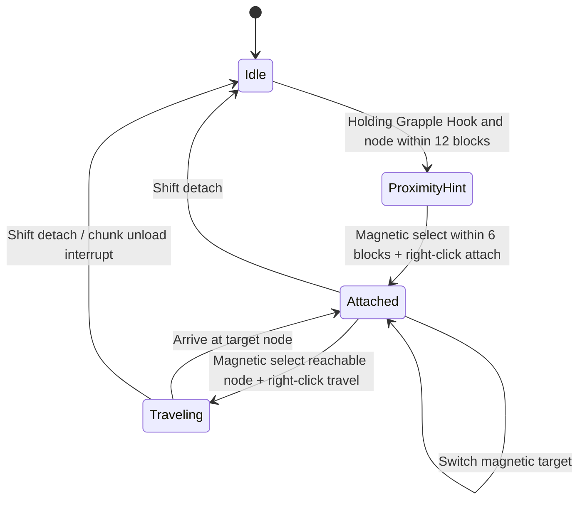
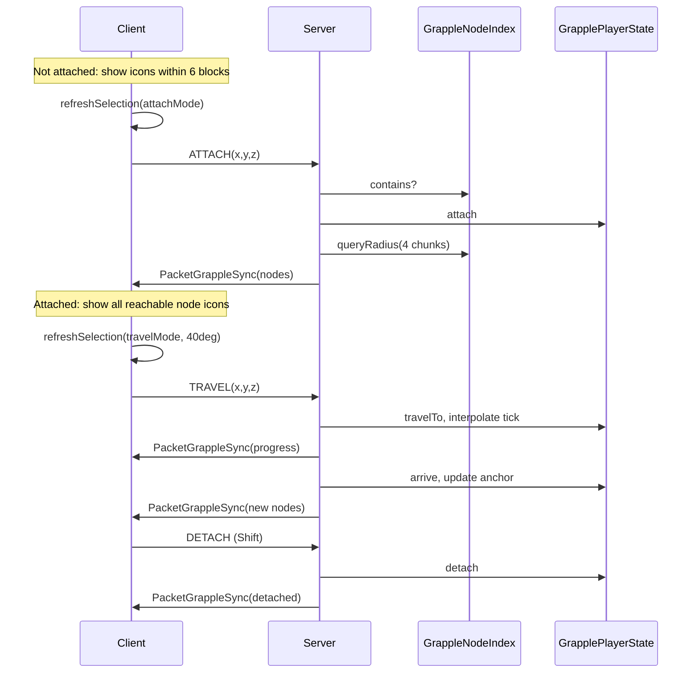

# Grapple System — Complete Design Document

> **Project**: AdvanceDataMonitor (GTNH 1.7.10 / Forge)  
> **Code names**: `GrappleAnchor` (block) / `GrappleHook` (item)  
> **Display names (en_US)**: Grapple Anchor / Grapple Hook  
> **Status**: Implemented and compiles; models/textures are placeholders; final naming may still change  
> **Player guide**: [Player Guide §3.7–3.8](../player/player-guide.md#37-grapple-anchor) · [§3.8 Grapple Hook](../player/player-guide.md#38-grapple-hook)  
> **Developer overview**: [Technical Documentation](../developer/technical-documentation.md)

---

## Table of Contents

- [0. Design Intent](#0-design-intent)
- [1. Feature Overview](#1-feature-overview)
- [2. State Machine](#2-state-machine)
- [3. Interaction & HUD Rules](#3-interaction--hud-rules)
  - [3.1 Not Attached (Proximity Mode)](#31-not-attached-proximity-mode)
  - [3.2 Attached (Navigation Mode)](#32-attached-navigation-mode)
  - [3.3 Magnetic Selection Algorithm](#33-magnetic-selection-algorithm-grappleselectionutil)
- [4. Block Design](#4-block-design)
- [5. TileEntity Design](#5-tileentity-design)
- [6. Item Design](#6-item-design)
- [7. Core Logic (`handler/`) & Client (`client/`)](#7-core-logic-grapple--client-client)
- [8. Event Handlers](#8-event-handlers)
- [9. HUD / Rendering](#9-hud--rendering)
- [10. Network Packets](#10-network-packets)
- [11. Config Keys](#11-config-keys)
- [12. Registration & Load Chain](#12-registration--load-chain)
- [13. Localization](#13-localization)
- [14. Complete File List](#14-complete-file-list)
- [15. Data Flow](#15-data-flow)
- [16. Placeholder Assets (To Replace)](#16-placeholder-assets-to-replace)
- [17. Naming TBD](#17-naming-tbd)
- [18. Known Limitations & Notes](#18-known-limitations--notes)
- [19. Test Checklist](#19-test-checklist)
- [20. Quick Entry for New Agents](#20-quick-entry-for-new-agents)

---

## 0. Design Intent

We often spend enormous effort making beautiful bases and production lines, yet daily travel still defaults to **flying, sprinting, or teleporting** — flying and sprinting tie up movement keys, and teleporting skips the scenery entirely. Carefully arranged spaces get bypassed when rushing between points.

**Grapple Anchor** and **Grapple Hook** aim for a balance between **getting there fast** and **seeing the journey**:

- Place **Grapple Anchor** nodes along factory corridors, scenic bridges, production tour routes, multi-floor shafts, and other key paths;
- Hold the **Grapple Hook**, magnetically attach, then **glide smoothly** along the cable between nodes;
- While gliding, **both hands remain free** (inventory, tools, etc.) — movement itself becomes part of exploration.

This does not replace teleport or flight; it offers a more experiential way to travel paths worth seeing slowly.

---

## 1. Feature Overview

A **Grapple Anchor + Grapple Hook** gameplay loop:

1. **Grapple Anchor block**: Face-mountable on all 6 faces (wall/ceiling/floor), thin plate on the support surface  
2. **Grapple Hook item**: Interact with anchors while held  
3. **Proximity hint**: On-screen text when a node is within range (default **12 blocks**)  
4. **Attach**: Magnetic selection within interact range (default **6 blocks**) + right-click → player is “hung” on the node (immobilized, can look around)  
5. **Navigation HUD**: While attached, all reachable nodes show **world-space** billboard icons (visible through walls)  
6. **Magnetic selection**: No precise aim required — view cone + screen-pixel dual-mode snapping  
7. **Glide travel**: While attached, magnetic-select a target node + right-click → smooth straight-line movement at hang height  
8. **Detach**: Shift  

---

## 2. State Machine



| State | Description |
|-------|-------------|
| `Idle` | Normal walking |
| `ProximityHint` | Node in hint range; text + icons for nodes in interact range |
| `Attached` | Immobilized at current node hang point; all reachable node icons shown |
| `Traveling` | Interpolating along straight line between nodes |

---

## 3. Interaction & HUD Rules

### 3.1 Not Attached (Proximity Mode)

| Item | Rule |
|------|------|
| Text hint range | `grappleHintRange` / cfg `hintRange` (default **12 blocks**) |
| Icon display range | **Interact range only** (`grappleInteractRange` / `interactRange`, default **6 blocks**) |
| Icon render position | Block center `(x+0.5, y+0.5, z+0.5)`, world-space billboard |
| Icon occlusion | **Not occluded** (depth test disabled) |
| Magnetic selection | View cone **22°** + screen pixels **72px** |
| Attach | Magnetic target in interact range → **right-click** (`keyBindUseItem` / `PlayerInteractEvent`) → send `ATTACH` packet |
| Text hints | Node nearby: `Grapple anchor nearby` (`adm.hint.grapple.nearby`); selected in range: `Right-click to attach to selected node` (`adm.hint.grapple.attach`) |

### 3.2 Attached (Navigation Mode)

| Item | Rule |
|------|------|
| Icon display | Server-synced **all reachable nodes** (excluding current anchor) |
| Reach range | Centered on current anchor, `grappleScanChunkRadius` / `scanChunkRadius` (default **4 chunks** = 64 blocks) |
| Icon rendering | Same as above: world billboard, through walls |
| Magnetic selection | View cone **40°** (wider) + screen pixels **144px** (72×2) |
| Selection feedback | Magnetic target icon **turns green + scales up** (lerp animation) |
| Travel | Magnetic target → **right-click** → send `TRAVEL` packet |
| Text hint | Bottom of screen: `Press Shift to detach grapple` (`adm.hint.grapple.detach`); right-click travels to selected node |

### 3.3 Magnetic Selection Algorithm (`GrappleSelectionUtil`)

**Attach mode** (`pickAttachTarget`):

1. Primary: `pickByLookAlignment` — look angle ≤ `grappleAttachSnapDegrees` (22°), pick max dot product  
2. Fallback: `pickByScreenDistance` — crosshair pixel distance ≤ `grappleSnapRadiusPx` (72px)

**Travel mode** (`pickTravelTarget`):

1. Primary: `pickByLookAlignment` — angle ≤ `grappleTravelSnapDegrees` (40°)  
2. Fallback: screen pixels ≤ `grappleSnapRadiusPx × 2` (144px)

Selection refreshes every **tick** and every **render frame** (`HandlerGrappleClient` + `GrappleHudRenderer`).

---

## 4. Block Design

### 4.1 `BlockGrappleAnchor`

**Path**: `src/main/java/com/imgood/advancedatamonitor/blocks/BlockGrappleAnchor.java`

| Property | Value |
|----------|-------|
| Base class | `BlockContainer` |
| Registry name | `grappleAnchor` |
| Unlocalized name | `grappleAnchor` |
| Creative tab | `CreativeTabs.tabRedstone` |
| Rendering | `getRenderType() == -1` + TESR |
| Placeholder texture | `textures/items/AdvanceDataMonitor.png` |

**Face mounting**:

- `canPlaceBlockOnSide`: adjacent block face must be `isSideSolid`  
- `onBlockPlaced`: metadata = attached face `ForgeDirection.ordinal()`  
- `onBlockPlacedBy`: writes TE `attachFace`  
- `setBlockBoundsBasedOnState`: thin plate hitbox per face (`PLATE = 0.28125F`)

**Lifecycle**:

- `onBlockAdded` → `GrappleNodeIndex.addNode`  
- `breakBlock` → `GrappleNodeIndex.removeNode` + `GrapplePlayerState.onAnchorBroken` (force detach players on that node)

**Interaction**:

- `onBlockActivated` (server): holding Grapple Hook + distance ≤ interactRange → `GrapplePlayerState.attach`  
- Client attach also via `PacketGrappleAction.ATTACH` (magnetic + right-click, more reliable)

---

## 5. TileEntity Design

### 5.1 `TileEntityGrappleAnchor`

**Path**: `src/main/java/com/imgood/advancedatamonitor/tileentity/TileEntityGrappleAnchor.java`

| Field | Description |
|-------|-------------|
| `attachFace` | `ForgeDirection`, persisted in NBT |

**Hang point** `getHangPosition()`:

```
outward = attachFace.getOpposite()
x = blockX + 0.5 + outward.offsetX * 0.55
y = blockY + 0.5 + outward.offsetY * 0.55 + 0.5  // extra half-block height
z = blockZ + 0.5 + outward.offsetZ * 0.55
```

---

## 6. Item Design

### 6.1 `ItemGrappleHook`

**Path**: `src/main/java/com/imgood/advancedatamonitor/items/ItemGrappleHook.java`

| Property | Value |
|----------|-------|
| Registry name | `grapple_hook` |
| Unlocalized name | `grappleHook` |
| maxStackSize | 1 |
| Placeholder texture | `advancedatamonitor:advance_planner` |

**Static methods**:

- `isHoldingHook(player)` — main hand holds hook  
- `hasHookAnywhere(player)` — hook anywhere in inventory (fallback)

Attach is **not** handled in `onItemUse`; unified flow is magnetic selection + right-click / block `onBlockActivated`.

---

## 7. Core Logic (`handler/`) & Client (`client/`)

`handler/` holds server/dual-side logic (index, player state, anchor positions, travel queue). Client cache and magnetic selection live in `client/GrappleClientCache`, `client/GrappleSelectionUtil`; input in `client/HandlerGrappleClient`.

Grapple config GUIs (`GuiGrappleAnchorConfig`, `GuiGrappleHookConfig`) open via `GuiHandler.openGui` (`GRAPPLE_ANCHOR_GUI_ID = 4`, `GRAPPLE_HOOK_GUI_ID = 5`), not direct `displayGuiScreen`.

### 7.1 `GrappleNodeIndex` (server singleton)

**Path**: `handler/GrappleNodeIndex.java`

```
Map<dimId, Map<ChunkCoordIntPair, List<BlockPos>>> index
```

| Operation | When | Complexity |
|-----------|------|------------|
| `addNode` | Block placed / chunk load scan | O(1) |
| `removeNode` | Block broken | O(1) |
| `queryRadius(dim, cx, cz, chunkRadius)` | Reachable nodes while attached | O((2r+1)²) chunk buckets, **no world block scan** |
| `contains` | Server validation | O(1) |

**Chunk load backfill**: `HandlerGrapple.onChunkLoad` scans new chunks for `grappleAnchor` blocks and adds them to the index (fixes index loss after restart).

**Index change notification**: `addNode`/`removeNode` → `GrapplePlayerState.onNodeIndexChanged` → resync if attached player’s candidate set changed.

---

### 7.2 `GrapplePlayerState` (server authority)

**Path**: `handler/GrapplePlayerState.java`

```
Map<UUID, State> STATES
```

**State fields**:

| Field | Type | Description |
|-------|------|-------------|
| `attached` | boolean | Attached to a node |
| `traveling` | boolean | Currently gliding |
| `dimId` | int | Dimension |
| `anchorX/Y/Z` | int | Current anchor block |
| `travelStartX/Y/Z` | double | Glide start |
| `travelEndX/Y/Z` | double | Glide end |
| `travelDistance` | double | Total glide distance |
| `travelProgress` | float | 0.0 ~ 1.0 |
| `travelTargetX/Y/Z` | int | Target node |
| `nearbyNodes` | List\<BlockPos\> | Reachable candidate list |

**Key methods**:

| Method | Description |
|--------|-------------|
| `attach(player, dim, x, y, z)` | Validate hook + index → immobilize → refreshNearby → sync |
| `detach(player)` | Clear state → sync detached |
| `travelTo(player, tx, ty, tz)` | Validate attached + not traveling + index + distance ≤ maxTravel → start interpolation |
| `tick(player)` | Each tick: snap if not traveling; advance interpolation if traveling |
| `onAnchorBroken` | Node broken → force detach attached players |
| `onNodeIndexChanged` | Index changed → refresh nearby → resync |

**Glide interpolation**:

```
progress += grappleMoveSpeed / travelDistance   // per tick
pos = lerp(start, end, progress)
EntityPlayerMP.setPositionAndUpdate(x, y, z)
```

On arrival: update anchor to target node, stay attached, refreshNearby, resync.

**Immobilization**: `HandlerGrapple` (server tick) + `HandlerGrappleClient` (client LivingUpdate) zero motion.

**Interrupt conditions**: unloaded chunk on glide path → detach; no longer holding Grapple Hook → detach.

---

### 7.3 `GrappleClientCache` (client mirror)

**Path**: `client/GrappleClientCache.java` (`@SideOnly CLIENT`)

Written from `PacketGrappleSync`:

- `attached`, `traveling`, `anchorX/Y/Z`, `travelProgress`
- `nearbyNodes` list
- `selectedTarget` (client-local)
- `iconScales` (animation `Map<BlockPos, Float>`)

---

### 7.4 `GrappleSelectionUtil` (client magnetic selection)

**Path**: `client/GrappleSelectionUtil.java` (`@SideOnly CLIENT`)

| Method | Description |
|--------|-------------|
| `buildCandidateNodes(player, attached)` | Not attached → interact-range scan; attached → `GrappleClientCache.getNearbyNodes()` |
| `refreshSelection(...)` | Refresh and write `GrappleClientCache.selectedTarget` |
| `pickTravelTarget` / `pickAttachTarget` | See Section 3 |
| `pickByLookAlignment` | View-cone snap |
| `pickByScreenDistance` | Screen-pixel snap |
| `projectToScreen` | FOV projection (`gameSettings.fovSetting`) |
| `findNodesInRange` | Client world scan (proximity hint only) |

---

## 8. Event Handlers

### 8.1 `HandlerGrapple` (server + Forge bus)

**Path**: `handler/HandlerGrapple.java`

| Event | Role |
|-------|------|
| `PlayerTickEvent` (server END) | `GrapplePlayerState.tick` |
| `LivingUpdateEvent` (server) | Zero motion while attached |
| `ChunkEvent.Load` | Backfill nodes into `GrappleNodeIndex` |

Registration: `LoaderHandler.registerHandlers()` → `MinecraftForge.EVENT_BUS`

---

### 8.2 `HandlerGrappleClient` (client only)

**Path**: `client/HandlerGrappleClient.java` (`@SideOnly CLIENT`)

| Event | Role |
|-------|------|
| `PlayerTickEvent` (client END) | Refresh magnetic selection each tick; detect Shift / right-click |
| `PlayerInteractEvent` (HIGHEST) | Right-click attach/travel (`setCanceled(true)` blocks vanilla use) |
| `LivingUpdateEvent` (client) | Zero motion while attached |

**Right-click detection**: `mc.gameSettings.keyBindUseItem.getIsKeyPressed()` (not raw mouse button)

Registration: `ClientProxy.init()` → FML bus + Forge bus

---

## 9. HUD / Rendering

### 9.1 `GrappleHudRenderer` (client only)

**Path**: `renders/GrappleHudRenderer.java`

| Event | Content |
|-------|---------|
| `RenderWorldLastEvent` | World billboard icons + magnetic selection + scale animation |
| `RenderGameOverlayEvent.Post` (TEXT) | Text hints only |

**Billboard rendering**:

- Position: node center  
- Always faces camera (`playerViewY` / `playerViewX` rotation)  
- `GL_DEPTH_TEST` off → visible through walls  
- `RenderItem.renderItemIntoGUI` with Grapple Hook item icon  
- Selected: green tint + scale up (lerp `0.18`)

Registration: `ClientProxy.init()` → Forge bus

---

### 9.2 `RenderGrappleAnchor` (TESR placeholder)

**Path**: `renders/RenderGrappleAnchor.java`

- Model: `model/AdvanceDataMonitor2.obj`  
- Texture: `textures/model/AdvanceDataMonitor.png`  
- Rotated by `attachFace`, scale 0.45  

Registration: `LoaderRender.registerRenderers()`

---

## 10. Network Packets

| ID | Packet | Direction | Purpose |
|----|--------|-----------|---------|
| **11** | `PacketGrappleAction` | C→S | `DETACH(0)` / `TRAVEL(1)` / `ATTACH(2)` |
| **12** | `PacketGrappleSync` | S→C | State + nearby node list + travelProgress |

**Paths**:

- `network/packet/PacketGrappleAction.java`
- `network/packet/PacketGrappleSync.java`

**Registration**: `LoaderNetwork.registerNetWorks()` (postInit)

**Server handling**: `HandlerTick.enqueueServerTask` ensures main thread

### `PacketGrappleAction` payload

```
byte action
int targetX, targetY, targetZ   // TRAVEL / ATTACH
```

### `PacketGrappleSync` payload

```
boolean attached, traveling
int anchorX, anchorY, anchorZ
float travelProgress
short nodeCount
[nodeCount × (int x, int y, int z)]
```

---

## 11. Config Keys

**Category**: `grapple` (in `config/advancedatamonitor/advancedatamonitor.cfg`)

| Key | Default (design doc) | Description |
|-----|----------------------|-------------|
| `hintRange` | 12 | Text hint range (blocks) |
| `interactRange` | 6 | Attach interact distance (blocks) |
| `scanChunkRadius` | 4 | Node list radius while attached (chunks) |
| `maxTravelChunkRadius` | 4 | Max glide distance (chunks, ×16 = blocks) |
| `moveSpeed` | 0.8 | Glide speed (blocks/tick) |
| `snapRadiusPx` | 72 | Screen-pixel magnetic radius |
| `travelSnapDegrees` | 40 | Travel view-cone snap angle |
| `attachSnapDegrees` | 22 | Attach view-cone snap angle |

**Code**: static fields on `Config.java` (`grappleHintRange`, etc.) loaded by `config/ConfigGrappleLoader.java`. Runtime defaults in `Config.java` may differ from the table above; treat the cfg file and `Config.java` as source of truth after load.

---

## 12. Registration & Load Chain

```
preInit:
  LoaderBlock.registerBlocks()        → grappleAnchor
  LoaderItem.registerItems()          → grappleHook
  LoaderTileEntity.registerTileEntities() → TileEntityGrappleAnchor
  LoaderHandler.registerHandlers()    → HandlerGrapple
  LoaderRender.registerRenderers()    → RenderGrappleAnchor TESR (client)

init:
  ClientProxy.init()                  → HandlerGrappleClient + GrappleHudRenderer

postInit:
  LoaderNetwork.registerNetWorks()    → packet IDs 11, 12
```

**Loader static fields**:

- `LoaderBlock.grappleAnchor`
- `LoaderItem.grappleHook`

---

## 13. Localization

**zh_CN / en_US** keys:

| Key | English (`en_US.lang`) |
|-----|------------------------|
| `tile.grappleAnchor.name` | Grapple Anchor |
| `item.grappleHook.name` | Grapple Hook |
| `adm.tooltip.grappleAnchor` | Face-mountable grapple anchor… |
| `adm.tooltip.grappleHook` | Interact with grapple anchors… |
| `adm.hint.grapple.nearby` | Grapple anchor nearby |
| `adm.hint.grapple.attach` | Right-click to attach to selected node |
| `adm.hint.grapple.detach` | Press Shift to detach grapple |

---

## 14. Complete File List

### New files (14)

```
blocks/BlockGrappleAnchor.java
tileentity/TileEntityGrappleAnchor.java
items/ItemGrappleHook.java
handler/GrappleNodeIndex.java
handler/GrapplePlayerState.java
client/GrappleClientCache.java
client/GrappleSelectionUtil.java
handler/HandlerGrapple.java
client/HandlerGrappleClient.java
renders/GrappleHudRenderer.java
renders/RenderGrappleAnchor.java
network/packet/PacketGrappleAction.java
network/packet/PacketGrappleSync.java
```

### Modified files

```
loader/LoaderBlock.java
loader/LoaderItem.java
loader/LoaderTileEntity.java
loader/LoaderRender.java
loader/LoaderHandler.java
loader/LoaderNetwork.java
ClientProxy.java
Config.java
assets/.../lang/zh_CN.lang
assets/.../lang/en_US.lang
.cursor/rules/project-structure.mdc
.cursor/rules/network-packets.mdc
```

---

## 15. Data Flow



---

## 16. Placeholder Assets (To Replace)

| Asset | Current placeholder |
|-------|---------------------|
| Block TESR | `AdvanceDataMonitor2.obj` + texture |
| Item icon | `advance_planner` |
| HUD icon | Same item via `RenderItem` |
| Crafting recipe | Creative tab only (no workbench recipe) |

---

## 17. Naming TBD

Final display names are not locked. Current placeholders:

| | Class | Registry | Display (en_US) |
|--|-------|----------|-----------------|
| Block | `BlockGrappleAnchor` | `grappleAnchor` | Grapple Anchor |
| Item | `ItemGrappleHook` | `grapple_hook` | Grapple Hook |

Candidate alternatives (reference only):

- A: Weave Anchor / Weave Tether (`WeaveAnchor` / `WeaveTether`)
- B: Data Grapple Anchor / Grapple Hook (`DataGrappleAnchor` / `GrappleHook`)
- C: Anchor Monitor / Anchor Link (`AnchorMonitor` / `AnchorLink`)

---

## 18. Known Limitations & Notes

1. **No native smooth movement on 1.7.10**: Server tick interpolation + `setPositionAndUpdate`; feel depends on tick rate  
2. **Player state not persisted**: Attach/glide state is in-memory only; disconnect/rejoin clears it  
3. **Node index relies on chunk events**: Existing worlds need chunk load before index is complete  
4. **Immobilization while attached**: Motion zeroed; view rotation allowed  
5. **Dedicated server safety**: `HandlerGrappleClient`, `GrappleClientCache`, `GrappleSelectionUtil` are `@SideOnly CLIENT` — do not reference from server-only classes  
6. **Corrupt level.dat errors are unrelated**: Gzip corruption in saves, not caused by this feature  
7. **No workbench crafting recipe yet**  
8. Manual JSON chapter for Grapple Anchor / Grapple Hook added under Advance Data Monitor manual “Blocks & Items”  

---

## 19. Test Checklist

- [ ] Creative: obtain Grapple Anchor + Grapple Hook  
- [ ] Wall/ceiling/floor placement, correct hitbox  
- [ ] Text hint within 12 blocks  
- [ ] Icons within 6 blocks, rough aim turns green  
- [ ] Right-click attach, player immobilized  
- [ ] While attached, distant node icons (through walls)  
- [ ] Rough aim at distant node turns green, right-click glide  
- [ ] Shift detach  
- [ ] Break node while attached → forced detach  
- [ ] Multiplayer: independent per-player state  

---

## 20. Quick Entry for New Agents

| Task | Start here |
|------|------------|
| Magnetic / selection | `client/GrappleSelectionUtil.java` |
| HUD icon rendering | `renders/GrappleHudRenderer.java` |
| Glide / immobilization | `handler/GrapplePlayerState.java` + `handler/HandlerGrapple.java` |
| Right-click interaction | `client/HandlerGrappleClient.java` |
| Range / speed | `Config.java` + `config/ConfigGrappleLoader.java` |
| Face mounting | `blocks/BlockGrappleAnchor.java` + `tileentity/TileEntityGrappleAnchor.java` |
| Networking | `network/packet/PacketGrapple*.java` + `LoaderNetwork.java` |
| Replace model | `renders/RenderGrappleAnchor.java` + asset files |
| Display names | `lang/zh_CN.lang` + `lang/en_US.lang` |
