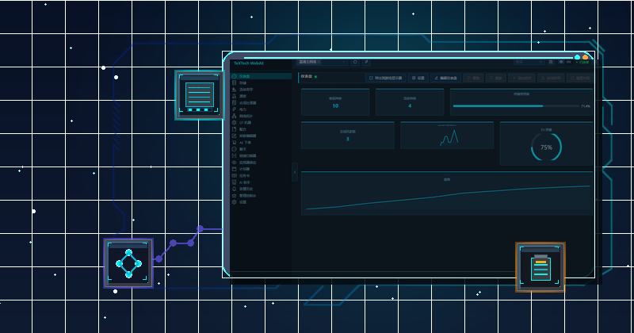
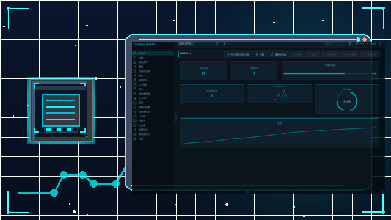
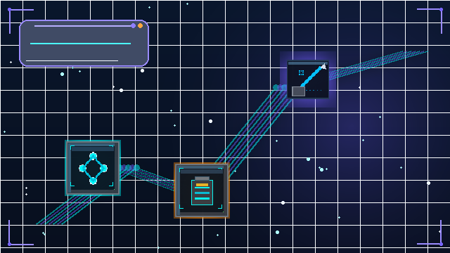
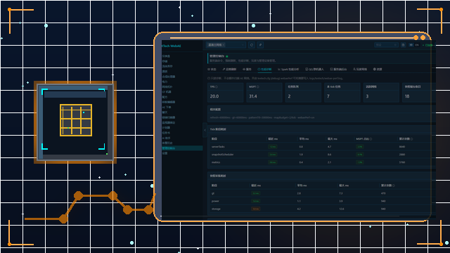
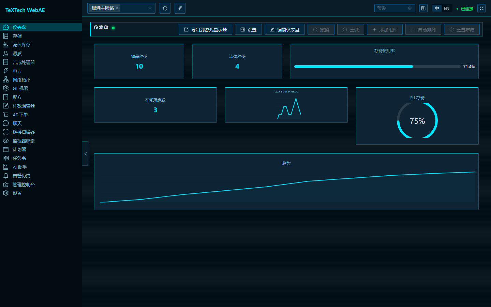
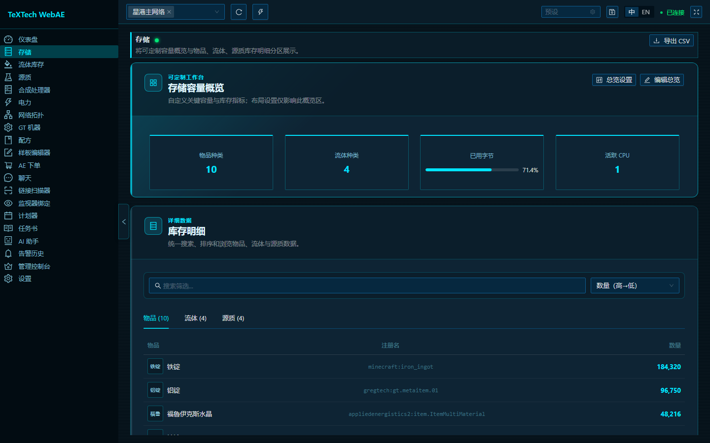
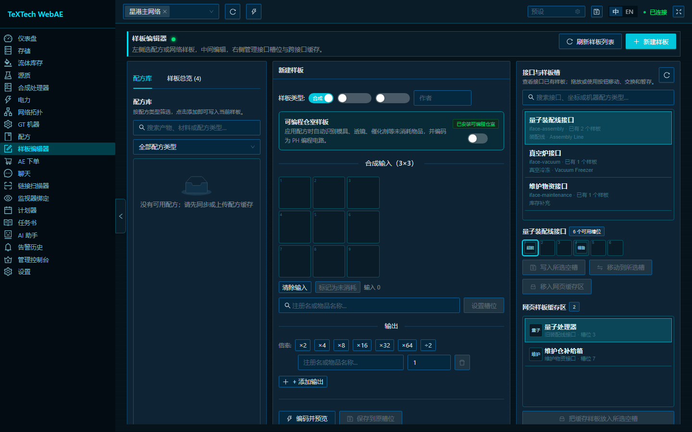
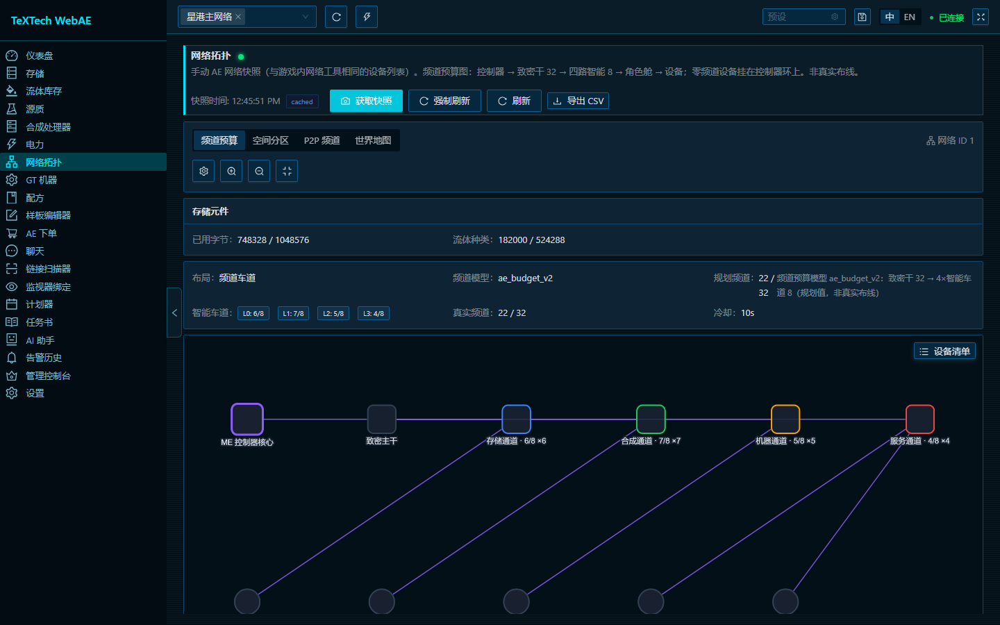
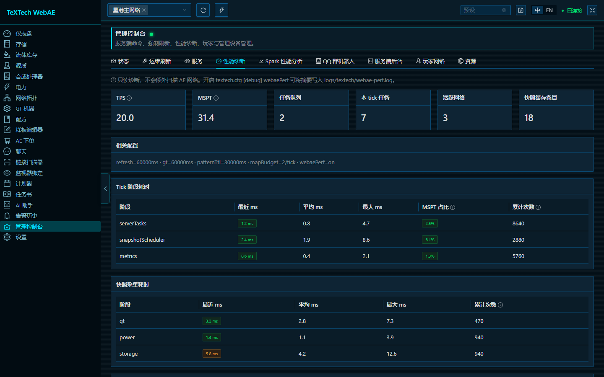

# TeXTech 文档中心（中文）

> Mod ID: `textech` · Minecraft 1.7.10 / GTNH · TeXTech 3.0 RC 3 · 最后同步：2026-08

English docs: [docs/en/README.md](../en/README.md) · 总索引：[docs/README.md](../README.md) · [项目首页](../../README.md)

TeXTech `v3.0.0-rc.3` 面向 GTNH `2.9.0-beta-2+`。Release 的主模组 JAR、可选离线语音 JAR 与可选 WebAE ZIP 分开发布；使用 WebAE 时把 ZIP 解压到服务端实例根目录，并确认 `TeXTech/WebAE/ui/index.html` 存在。不使用 WebAE 时只下载主 JAR 即可。

## 视觉导览

  

  

<strong>先看信号，再选择文档路线</strong> See the signal first, then choose the guide that matches your role.

<table>
  <tr>
    <td width="50%" valign="top">
       
      <strong>看见数据 · See the data</strong>
    </td>
    <td width="50%" valign="top">
       
      <strong>编织物质 · Weave matter</strong>
    </td>
  </tr>
  <tr>
    <td width="50%" valign="top">
       
      <strong>对话自动化 · Automate by dialogue</strong>
    </td>
    <td width="50%" valign="top">
       
      <strong>传奇与体验 · Legend and experience</strong>
    </td>
  </tr>
</table>

<table>
  <tr>
    <td width="50%" valign="top">
       
      <strong>仪表盘 · 看见数据</strong> 
      从存储、CPU 到告警，先在一块清晰的面板上建立全局视图。
    </td>
    <td width="50%" valign="top">
       
      <strong>存储浏览 · 追踪物质</strong> 
      用浏览器或移动端检查 AE2 网络中的物品与流体。
    </td>
  </tr>
  <tr>
    <td width="50%" valign="top">
       
      <strong>样板工作台 · 编排合成</strong> 
      查看样板、材料与合成准备状态，再进入玩家手册学习配置。
    </td>
    <td width="50%" valign="top">
       
      <strong>网络拓扑 · 理解连接</strong> 
      通过节点、链路与边界关系定位问题，随后查阅 WebAE 专项文档。
    </td>
  </tr>
  <tr>
    <td width="50%" valign="top">
       
      <strong>服务诊断 · 守住边界</strong>
    </td>
    <td width="50%" valign="middle">
      图片来自仓库中的 WebAE React 前端与本地演示 API 数据，不是游戏内实机截图；功能和安全约束以 <a href="webae/用户手册.md">WebAE 用户手册</a> 为准。
    </td>
  </tr>
</table>

先看画面，再按受众选择文档；若需要完整的仓库背景、安装矩阵与构建命令，可回到[项目首页](../../README.md)。

---

## 文档层级

| 层级 | 作用 | 路径 |
|------|------|------|
| L0 机器可读 | Agent / CI 事实源 | `ConfigDescriptions.java`、`LoaderNetwork.java`、`.cursor/rules/` |
| L1 开发者规格 | 贡献者设计文档 | `developer/`、`webae/开发者手册.md`、`ai-assistant/` |
| L2 玩家/服管 | 教程与操作 | `player/`、`webae/用户手册.md`、`assets/textech/manual/` |
| L3 愿景/设计 | **非实现规格** | `design/` |

维护地图：[documentation-map.md](developer/documentation-map.md)

---

## 按受众选择

| 你是谁 | 从这里开始 |
|--------|-----------|
| **新玩家** | [用户手册 §0 快速了解](player/用户手册.md#0-快速了解) |
| **计划器用户** | [用户手册 §19 高级计划器](player/用户手册.md#19-高级计划器) |
| **服管 / 整合包作者** | [整合包安装-GTNH-2.9.0](player/整合包安装-GTNH-2.9.0.md) · [用户手册 §2](player/用户手册.md#2-环境与安装) · [§11 配置](player/用户手册.md#11-配置文件详解) · [WebAE 用户手册](webae/用户手册.md) |
| **新贡献开发者** | [开发者技术文档](developer/技术文档.md) · [Gradle 工作流](developer/Gradle工作流.md) |
| **改 AI 助手** | [AI 助手开发指南](ai-assistant/开发指南.md) · `.cursor/rules/ai-assistant.mdc` |
| **改挂索** | [挂索节点系统设计](subsystems/挂索节点系统设计.md) |
| **改计划器代码** | [开发者技术文档 §5.11](developer/技术文档.md#511-advance-planner高级计划器) |

---

## 文档树

### 玩家向

| 文档 | 说明 |
|------|------|
| [player/用户手册.md](player/用户手册.md) | 安装、方块物品、监视器/AE2 教程、AI/语音助手、配置、FAQ、高级计划器 |
| [player/整合包安装-GTNH-2.9.0.md](player/整合包安装-GTNH-2.9.0.md) | 2.9.0 整合包作者：该装哪个 jar、软附属拆分、检查清单 |

### WebAE 控制台

| 文档 | 说明 |
|------|------|
| [webae/用户手册.md](webae/用户手册.md) | WebAE 启用、Token、各功能页面、命令与安全注意事项 |
| [webae/开发者手册.md](webae/开发者手册.md) | 架构、REST API、网络包、前端构建、子系统设计 |
| [webae/oc-integration.md](webae/oc-integration.md) | OpenComputers Internet Card 只读 OC 集成 API |

### 开发者向

| 文档 | 说明 |
|------|------|
| [developer/技术文档.md](developer/技术文档.md) | 项目结构、Forge 注册、核心模块、数据流（高级计划器 API：§5.11） |
| [developer/documentation-map.md](developer/documentation-map.md) | 改功能应更新哪些文档/规则 |
| [developer/ui-framework.md](developer/ui-framework.md) | 容器 GUI 9-slice 框架、`ADM_UiContainer`、调试状态表 |
| [developer/new-feature-checklist.md](developer/new-feature-checklist.md) | 新功能开发决策清单（基类选型、网络包、lang 同步） |
| [developer/Gradle工作流.md](developer/Gradle工作流.md) | ExampleMod 模板、构建迁移、FAQ |
| [developer/临时材质清单.md](developer/临时材质清单.md) | 缺失/占位方块与物品材质审计；**临时**程序化贴图说明 |
| [developer/GTNH版本兼容说明.md](developer/GTNH版本兼容说明.md) | v2 稳定版与 v3 RC 以 GTNH 2.9.0-beta-2 为最低目标；不支持 2.8.x |
| [developer/ae-compat-290.md](developer/ae-compat-290.md) | GTNH 2.9.0-beta-2 NativeFluid 集成与遗留源码边界 |

### AI 助手专项

| 文档 | 说明 |
|------|------|
| [ai-assistant/开发指南.md](ai-assistant/开发指南.md) | Part A 架构 · Part B 必改文件 · Part C 本地 STT |

### 子系统

| 文档 | 说明 |
|------|------|
| [subsystems/挂索节点系统设计.md](subsystems/挂索节点系统设计.md) | 挂索状态机、磁吸、网络包、Config |

### 设计草案

| 文档 | 说明 |
|------|------|
| [design/品牌视觉设计指南.md](design/品牌视觉设计指南.md) | 模组名称、世界观、配色、宣传图规格与 AI 生图提示词 |
| [design/logo-概念设计-v1.md](design/logo-概念设计-v1.md) | B6 正式 Logo 方向的概念筛选与定稿记录 |
| [design/未来开发愿景.md](design/未来开发愿景.md) | 长期功能愿景与架构草案（非当前实现规格） |

### 归档

| 文档 | 说明 |
|------|------|
| [archive/GoldenThrone_GT_Multiblock_移植指南.md](archive/GoldenThrone_GT_Multiblock_移植指南.md) | 黄金王座 GT 多方块移植手册（已从本模组剥离，仅供历史参考） |

---

## 命名规范

文档中的方块/物品显示名以 `lang/zh_CN.lang` 为准，例如：

- **高级数据监视器**、**数据映录器**
- **网络链接器**、**合成链接器**、**高级存储链接器**、**高级存储链接元件**、**物质球解压器**
- **挂索节点** / **挂索器**、**高级计划器**、**超能砂糖桔**、**至高天圣裁**
- **铽丝科技手册**（物品 `manual`）

---

## 项目历史与协作治理

| 文档 | 说明 |
|------|------|
| [project/timeline.md](project/timeline.md) | Git 可验证节点与作者项目经历 |
| [project/provenance.md](project/provenance.md) | 公开来源监测边界、人工复核与证据保存流程 |
| [../../NOTICE.md](../../NOTICE.md) | 项目身份、溯源、署名与公开监测边界 |
| [../../CONTRIBUTING.md](../../CONTRIBUTING.md) | 贡献流程与验证要求 |
| [../../SECURITY.md](../../SECURITY.md) | 私密漏洞报告与密钥处理规则 |
| [../../SUPPORT.md](../../SUPPORT.md) | 按受众分类的支持入口 |
| [../../CHANGELOG.md](../../CHANGELOG.md) | v1.0.0、v2.0.0 与 v3.0.0 RC 发布摘要 |
| [../wiki/README.md](../wiki/README.md) | GitHub Wiki 导航页的仓库内事实源 |
