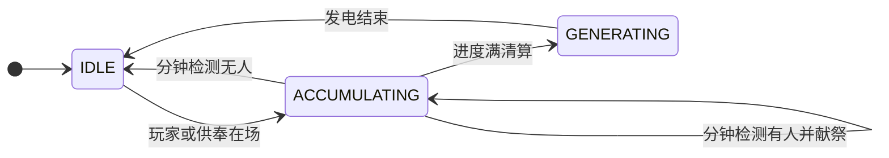

> **已归档** — 本文档已过时，仅供历史参考。请参阅 [docs/README.md](../README.md)。

# 黄金王座（Golden Throne）GT 多方块发电机 — 移植指南

> 本文档从 AdvanceDataMonitor 模组剥离，供在 **另一 GTNH 社区模组** 中完整复现「黄金王座」仪式发电机。  
> 目标平台：Minecraft 1.7.10 / Forge / GT5-Unofficial 5.09.x + StructureLib。  
> 参考写法：GT5U 官方多方块 + [Twist Space Technology](https://github.com/Nxer/Twist-Space-Technology-Mod) 社区模组。

---

## 目录

1. [机器概述](#1-机器概述)
2. [依赖与 Mod 声明](#2-依赖与-mod-声明)
3. [推荐包结构与文件清单](#3-推荐包结构与文件清单)
4. [MTE ID 与注册](#4-mte-id-与注册)
5. [多方块结构 GoldenThroneStructure](#5-多方块结构-goldenthronestructure)
6. [主控制器 MTETGoldenThrone](#6-主控制器-mtetgoldenthrone)
7. [仪式逻辑 GoldenThroneLogic](#7-仪式逻辑-goldenthronelogic)
8. [辅助类](#8-辅助类)
9. [配置系统](#9-配置系统)
10. [本地化 Lang](#10-本地化-lang)
11. [Tooltip 与 NEI 结构全息](#11-tooltip-与-nei-结构全息)
12. [配方](#12-配方)
13. [Waila / 死亡源](#13-waila--死亡源)
14. [状态机与数据流](#14-状态机与数据流)
15. [移植时需替换的耦合点](#15-移植时需替换的耦合点)
16. [常见坑与调试](#16-常见坑与调试)
17. [检查清单](#17-检查清单)

---

## 1. 机器概述

**类型**：GregTech 多方块 **发电机**（仅动力输出仓，无能量输入 / 维护 / 流体仓）。

**玩法循环**：

1. 玩家在主机周围 **3×3×3 仪式圣域**内站立（或放入「供奉物品」视为在场）。
2. **积攒阶段**：每 tick 推进进度；每隔 N 秒检测是否仍「在场」。
3. **分钟献祭**：检测通过时，抹杀与主机 **同区块** 的所有生物，按 HP 换算 **发电增幅秒数**；**首名进入圣域的玩家**在献祭中豁免。
4. **清算**：积攒满 M 秒后，对首名玩家结算（有护符免死，否则击杀）；进入 **发电阶段**。
5. **发电**：持续 `baseGeneration + 曲线(献祭增幅)` 秒，每 tick 输出配置 EU/t；期间不再积攒。

**Lore**：隐晦 net a 战锤 40K「黄金王座 / 帝皇 / 灵魂献祭」——文案见 Lang 模板。

---

## 2. 依赖与 Mod 声明

### 2.1 Gradle（`dependencies.gradle` 或等价）

```gradle
compileOnly "com.github.GTNewHorizons:GT5-Unofficial:5.09.51.470:dev"
compileOnly "com.github.GTNewHorizons:StructureLib:1.3.1:dev"

// 开发运行（可选，不参与发布）
devOnlyNonPublishable "com.github.GTNewHorizons:GT5-Unofficial:5.09.51.470:dev"
devOnlyNonPublishable "com.github.GTNewHorizons:StructureLib:1.3.1:dev"
```

### 2.2 @Mod 依赖

```java
@Mod(
    modid = "yourmodid",
    // ...
    dependencies = "required-after:gregtech;required-after:structurelib")
```

### 2.3 注册时机

| 内容 | Forge 阶段 |
|------|------------|
| `new MTETGoldenThrone(...)` | `FMLInitializationEvent`（init） |
| 装配线配方 | `FMLPreInitializationEvent` 或 init（与项目惯例一致） |

使用 `@Optional.Method(modid = "gregtech")` 包裹 GT 注册代码，避免无 GT 环境硬崩（若你的 mod 强依赖 GT 可省略）。

---

## 3. 推荐包结构与文件清单

将 `{root}` 替换为你的根包名（如 `com.example.mygtaddon`）。

```
src/main/java/{root}/gt/goldenthrone/
├── MTETGoldenThrone.java          # MTE 主类
├── GoldenThroneStructure.java     # StructureLib 蓝图（可单独替换外观）
├── GoldenThroneLogic.java         # 状态机（与结构解耦）
├── GoldenThroneState.java         # IDLE / ACCUMULATING / GENERATING
├── GoldenThronePlayerZone.java    # 3×3×3 仪式区判定
├── GoldenThroneBonusCurve.java    # HP → 增幅 + Michaelis-Menten
└── DamageSourceGoldenThrone.java  # 自定义死亡原因

src/main/java/{root}/config/
└── ConfigGoldenThroneLoader.java  # [goldenThrone] 配置加载

src/main/java/{root}/loader/
└── LoaderMetaTileEntity.java      # MTE 注册入口

# 还需改动（非 goldenthrone 包内）：
# - Config.java          字段 + synchronizeConfiguration 调用 loader
# - ConfigDescriptions.java  双语 cfg 注释
# - YourModMain.java       init 中 LoaderMetaTileEntity.register()
# - LoaderRecipe.java      装配线配方（可选）
# - assets/{modid}/lang/en_US.lang + zh_CN.lang
```

---

## 4. MTE ID 与注册

### 4.1 选择 ID

- 原 ADM 实现使用 **`31000`**（`GregTechAPI.sBlockMachines` meta）。
- **移植时必须确认**目标整合包 / ID 表无冲突；建议查阅 GTNH 社区 ID 分配或自测 NEI。

### 4.2 LoaderMetaTileEntity

```java
package {root}.loader;

import {root}.YourMod;
import {root}.gt.goldenthrone.MTETGoldenThrone;
import cpw.mods.fml.common.Optional;

public final class LoaderMetaTileEntity {
    private LoaderMetaTileEntity() {}

    @Optional.Method(modid = "gregtech")
    public static void register() {
        new MTETGoldenThrone(
            MTETGoldenThrone.MTE_ID,
            "YourMod_GoldenThrone",   // 内部名 → lang: gt.blockmachines.YourMod_GoldenThrone.name
            "Golden Throne");           // GTLanguageManager 英文回退
        YourMod.LOG.info("Registered MTE Golden Throne id={}", MTETGoldenThrone.MTE_ID);
    }
}
```

### 4.3 主类 init

```java
public void init(FMLInitializationEvent event) {
    // ...
    LoaderMetaTileEntity.register();
}
```

---

## 5. 多方块结构 GoldenThroneStructure

### 5.1 布局说明（调试占位 15×15×3）

| 元素 | 说明 |
|------|------|
| 尺寸 | 15 × 15 × 3（宽 × 深 × 高） |
| 主机 | 中间层 (Y=1) 正中心，字符 `'~'`（StructureLib 内置，无需 addElement） |
| 圣域 | 三层中心 3×3×3 留空，字符 `' '` → `isAir()` |
| 外壳 | `'C'` → `GregTechAPI.sBlockCasings4, 0`（坚固机器外壳） |
| 动力仓 | 仅 **底层** 四边中点 + 四角共 8 处 `'D'` |

**checkPiece 锚点**：`CENTER = 7`（0-based），调用 `checkPiece(PIECE_MAIN, 7, 1, 7)`。

### 5.2 完整结构定义（关键：`.dot(1)`）

```java
package {root}.gt.goldenthrone;

import static com.gtnewhorizon.structurelib.structure.StructureUtility.isAir;
import static com.gtnewhorizon.structurelib.structure.StructureUtility.ofBlock;
import static com.gtnewhorizon.structurelib.structure.StructureUtility.transpose;
import static gregtech.api.enums.HatchElement.Dynamo;
import static gregtech.api.util.GTStructureUtility.buildHatchAdder;

import com.gtnewhorizon.structurelib.structure.IStructureDefinition;
import com.gtnewhorizon.structurelib.structure.StructureDefinition;
import gregtech.api.GregTechAPI;

public final class GoldenThroneStructure {

    public static final String PIECE_MAIN = "main";
    public static final int SIZE = 15;
    public static final int CENTER = 7;
    public static final int CASING_TEXTURE_INDEX = 48;

    private static IStructureDefinition<MTETGoldenThrone> structureDefinition;

    private GoldenThroneStructure() {}

    public static IStructureDefinition<MTETGoldenThrone> getDefinition() {
        if (structureDefinition == null) {
            structureDefinition = StructureDefinition.<MTETGoldenThrone>builder()
                .addShape(PIECE_MAIN, transpose(buildShape()))
                .addElement(' ', isAir())
                .addElement('C', ofBlock(GregTechAPI.sBlockCasings4, 0))
                .addElement(
                    'D',
                    buildHatchAdder(MTETGoldenThrone.class).atLeast(Dynamo)
                        .casingIndex(CASING_TEXTURE_INDEX)
                        .dot(1)   // ★ 必须设置，否则 NEI 全息 / build() 抛 IllegalArgumentException
                        .buildAndChain(ofBlock(GregTechAPI.sBlockCasings4, 0)))
                .build();
        }
        return structureDefinition;
    }

    public static String[][] buildShape() {
        return new String[][] {
            buildLayer(2),  // 顶
            buildLayer(1),  // 中（含 ~）
            buildLayer(0)   // 底（含 D）
        };
    }

    private static String[] buildLayer(int layerY) {
        String[] rows = new String[SIZE];
        for (int z = 0; z < SIZE; z++) {
            StringBuilder row = new StringBuilder(SIZE);
            for (int x = 0; x < SIZE; x++) {
                row.append(charAt(layerY, x, z));
            }
            rows[z] = row.toString();
        }
        return rows;
    }

    private static char charAt(int layerY, int x, int z) {
        boolean ritual = Math.abs(x - CENTER) <= 1 && Math.abs(z - CENTER) <= 1;
        if (layerY == 1 && x == CENTER && z == CENTER) {
            return '~';
        }
        if (ritual) {
            return ' ';
        }
        if (layerY == 0 && isDynamoPosition(x, z)) {
            return 'D';
        }
        return 'C';
    }

    /** 底层外圈：四边中点 + 四角 */
    private static boolean isDynamoPosition(int x, int z) {
        if (x != 0 && x != 14 && z != 0 && z != 14) {
            return false;
        }
        return (x == CENTER || z == CENTER || (x == z) || (x + z == 14));
    }
}
```

> **正式美术**：只需改 `buildShape()` / casing 方块 / `CASING_TEXTURE_INDEX`，不必动 Logic。

---

## 6. 主控制器 MTETGoldenThrone

### 6.1 类声明与字段

```java
public class MTETGoldenThrone extends MTEEnhancedMultiBlockBase<MTETGoldenThrone>
    implements ISurvivalConstructable {

    public static final int MTE_ID = 31000; // 按目标包修改

    private final GoldenThroneLogic logic = new GoldenThroneLogic();

    public MTETGoldenThrone(int aID, String aName, String aNameRegional) {
        super(aID, aName, aNameRegional);
    }

    public MTETGoldenThrone(String aName) {
        super(aName);
    }

    @Override
    public IMetaTileEntity newMetaEntity(IGregTechTileEntity aTileEntity) {
        return new MTETGoldenThrone(mName);
    }
}
```

### 6.2 结构检查

```java
@Override
public boolean checkMachine(IGregTechTileEntity base, ItemStack stack) {
    if (!checkPiece(
            GoldenThroneStructure.PIECE_MAIN,
            GoldenThroneStructure.CENTER,
            1,
            GoldenThroneStructure.CENTER)) {
        return false;
    }
    return mDynamoHatches != null && !mDynamoHatches.isEmpty();
}
```

> GT 5.09.51 为 **2 参数** `checkMachine`；更新版本可能为 3 参数带 `List<StructureError>`，按目标 GT 对齐。

### 6.3 每 tick 逻辑与发电

```java
@Override
public void onPostTick(IGregTechTileEntity base, long tick) {
    super.onPostTick(base, tick);
    if (base.isClientSide() || !mMachine || mDynamoHatches == null || mDynamoHatches.isEmpty()) {
        return;
    }

    logic.tick(
        base.getWorld(),
        base.getXCoord(),
        base.getYCoord(),
        base.getZCoord(),
        mInventory[0],
        base.getWorld().getTotalWorldTime());

    base.setActive(logic.isGenerating());

    if (logic.isGenerating()) {
        long output = Config.getGoldenThroneOutputEUtValue();
        if (output > 0L) {
            addEnergyOutput(output);
        }
    }
}
```

### 6.4 能源输出属性

```java
@Override public boolean isEnetOutput() { return true; }

@Override public long maxEUOutput() { return Config.goldenThroneOutputVoltage; }

@Override public long maxAmperesOut() { return Config.goldenThroneOutputAmperage; }

@Override public boolean getDefaultHasMaintenanceChecks() { return false; }
```

### 6.5 主机单槽（供奉物品）

```java
@Override
public boolean allowPutStack(IGregTechTileEntity base, int index, ForgeDirection side, ItemStack stack) {
    return index == 0 && GoldenThroneLogic.isOfferingStack(stack);
}

@Override
public boolean allowPullStack(IGregTechTileEntity base, int index, ForgeDirection side, ItemStack stack) {
    return index == 0;
}
```

将 `isOfferingStack` 改为你模组的护符 / 物品判定。

### 6.6 NBT

```java
@Override
public void saveNBTData(NBTTagCompound nbt) {
    super.saveNBTData(nbt);
    logic.saveToNBT(nbt);
}

@Override
public void loadNBTData(NBTTagCompound nbt) {
    super.loadNBTData(nbt);
    logic.loadFromNBT(nbt);
}
```

### 6.7 名称本地化

```java
@Override
public String getLocalName() {
    return StatCollector.translateToLocal("gt.blockmachines." + mName + ".name");
}
```

### 6.8 NEI / 生存建造

```java
@Override
public void construct(ItemStack stackSize, boolean hintsOnly) {
    buildPiece(
        GoldenThroneStructure.PIECE_MAIN,
        stackSize,
        hintsOnly,
        GoldenThroneStructure.CENTER,
        1,
        GoldenThroneStructure.CENTER);
}

@Override
public int survivalConstruct(ItemStack stackSize, int elementBudget, ISurvivalBuildEnvironment env) {
    if (mMachine) return -1;
    return survivalBuildPiece(
        GoldenThroneStructure.PIECE_MAIN,
        stackSize,
        GoldenThroneStructure.CENTER,
        1,
        GoldenThroneStructure.CENTER,
        elementBudget,
        env,
        false,
        true);
}
```

### 6.9 贴图

```java
@Override
public ITexture[] getTexture(IGregTechTileEntity base, ForgeDirection side, ForgeDirection facing,
        int colorIndex, boolean active, boolean redstoneLevel) {
    return new ITexture[] {
        getCasingTextureForId(GoldenThroneStructure.CASING_TEXTURE_INDEX)
    };
}
```

---

## 7. 仪式逻辑 GoldenThroneLogic

### 7.1 状态枚举 GoldenThroneState

```java
public enum GoldenThroneState {
    IDLE,
    ACCUMULATING,
    GENERATING;

    public static GoldenThroneState fromOrdinal(int ordinal) {
        GoldenThroneState[] values = values();
        if (ordinal < 0 || ordinal >= values.length) return IDLE;
        return values[ordinal];
    }
}
```

### 7.2 tick 主流程（伪代码）

```
if GENERATING:
    generationTicksRemaining--
    if <= 0 → IDLE，清空相关字段
    return

orangeBypass = slotFeatureEnabled && offeringInSlot(mInventory[0])
playerPresent = hasPlayerIn3x3x3Zone
consideredPresent = playerPresent || orangeBypass

if IDLE:
    if consideredPresent → beginAccumulating
    return

if ACCUMULATING:
    bindFirstPlayerUuid（仅首次）
    if consideredPresent → progressTicks++
    every checkIntervalTicks:
        if !consideredPresent → resetAccumulation（回 IDLE）
        else performSacrifice（同区块杀怪，首名玩家豁免，累加 rawBonusSeconds）
    if progressTicks >= required → completeSettlement
```

### 7.3 献祭 performSacrifice

- 取主机所在 **区块** `ChunkCoordIntPair(centerX >> 4, centerZ >> 4)`。
- 遍历 `world.loadedEntityList` 中 `EntityLivingBase`。
- 实体区块与主机区块相同才处理。
- 若是玩家且 UUID == `firstPlayerUuid` 且在 3×3×3 内 → **跳过**。
- 其余：`totalHp += getMaxHealth()`，加入 victims 列表。
- 对 victims 调用 `setDead()`（不用 `attackEntityFrom`，避免护甲/事件干扰）。
- `rawBonusSeconds += hpToRawBonusSeconds(totalHp)`。

### 7.4 清算 completeSettlement

```java
finalBonusSeconds = GoldenThroneBonusCurve.scale(rawBonusSeconds);
generationTicksRemaining = baseGenerationSeconds * 20 + finalBonusSeconds * 20;

// 首名玩家仍在圣域内：
if (hasOfferingInInventory(firstPlayer)) {
    chat("...pious...");
} else {
    chat("...drained...");
    firstPlayer.attackEntityFrom(DamageSourceGoldenThrone.INSTANCE, Float.MAX_VALUE);
}

// 可选：消耗主机槽供奉
if (orangeBypass && configConsumesOffering) mInventory[0].stackSize = 0;

state = GENERATING;
// 清零 progress / firstPlayer / rawBonus / nextCheck
```

### 7.5 NBT 键

| 键 | 类型 | 含义 |
|----|------|------|
| `gtState` | int | 状态 ordinal |
| `gtProgress` | int | 积攒 tick |
| `gtGenTicks` | int | 发电剩余 tick |
| `gtNextCheck` | long | 下次分钟检测 world tick |
| `gtFirstPlayer` | String | 首名玩家 UUID（可选） |
| `gtRawBonus` | int | 献祭原始增幅秒 |
| `gtFinalBonus` | int | 曲线后增幅秒（展示用） |

---

## 8. 辅助类

### 8.1 GoldenThronePlayerZone

- `HALF = 1` → 主机 ±1 格立方体（3×3×3）。
- `isInZone(world, cx, cy, cz, player)`：玩家脚下方块坐标在范围内。
- `hasPlayerInZone`：`playerEntities` + `boundingBox.intersectsWith(AABB)`。
- `findFirstPlayerEnteringZone`：已有 firstUuid 则 null；否则返回第一个在 AABB 内玩家。
- `findPlayerByUuidInZone`：清算时找首名玩家。

### 8.2 GoldenThroneBonusCurve

**原始增幅**（每 10 HP → 1 秒，可配置）：

```java
public static int hpToRawBonusSeconds(float totalHp) {
    int divisor = Math.max(1, Config.goldenThroneBonusHpPerSecond);
    return (int) (totalHp / divisor);
}
```

**Michaelis-Menten 边际递减**：

```java
public static int scale(int rawBonusSeconds) {
    if (rawBonusSeconds <= 0) return 0;
    int maxBonus = Math.max(0, Config.goldenThroneBonusMaxSeconds);
    if (maxBonus == 0) return 0;
    int scale = Math.max(1, Config.goldenThroneBonusCurveScale);
    double scaled = maxBonus * ((double) rawBonusSeconds / (rawBonusSeconds + scale));
    return (int) Math.min(maxBonus, Math.round(scaled));
}
```

### 8.3 DamageSourceGoldenThrone

```java
public final class DamageSourceGoldenThrone {
    public static final DamageSource INSTANCE =
        new DamageSource("goldenThrone").setDamageBypassesArmor();
    private DamageSourceGoldenThrone() {}
}
```

Lang：`death.attack.goldenThrone=%1$s 被黄金王座榨干`

---

## 9. 配置系统

### 9.1 Config.java 字段（默认值）

```java
// [goldenThrone]
public static int goldenThronePresenceCheckIntervalSeconds = 60;
public static int goldenThroneProgressRequiredSeconds = 600;
public static int goldenThroneBaseGenerationSeconds = 600;
public static String goldenThroneOutputEUt = "461168599910003580";
public static long goldenThroneOutputVoltage = 2147483674L;
public static long goldenThroneOutputAmperage = 2147483674L;
public static int goldenThroneBonusHpPerSecond = 10;
public static int goldenThroneBonusCurveScale = 300;
public static int goldenThroneBonusMaxSeconds = 3600;
public static boolean goldenThroneSuperOrangeInMachineEnabled = false;
public static boolean goldenThroneSuperOrangeInMachineConsumes = true;

public static long getGoldenThroneOutputEUtValue() {
    try {
        return Long.parseLong(goldenThroneOutputEUt.trim());
    } catch (Exception ignored) {
        return 461168599910003580L;
    }
}
```

> **EU/t 用 String**：避免 cfg 整数上限；电压/电流用 long。

### 9.2 ConfigGoldenThroneLoader

在 `synchronizeConfiguration` 中调用：

```java
ConfigGoldenThroneLoader.load(configuration);
```

各键用 `configuration.getInt/getString/getBoolean`，category `"goldenThrone"`，并写入 `ConfigDescriptions` 双语注释。

### 9.3 槽位绕过

```java
public static boolean isOfferingSlotFeatureActive() {
    return Config.goldenThroneOfferingInMachineEnabled || Config.debugGeneral;
}
```

原 ADM 用超能砂糖桔 + `debugGeneral`；移植时改为你模组的配置开关。

---

## 10. 本地化 Lang

### 10.1 机器名（GT 惯例）

```properties
# en_US.lang
gt.blockmachines.YourMod_GoldenThrone.name=Golden Throne

# zh_CN.lang
gt.blockmachines.YourMod_GoldenThrone.name=黄金王座
```

### 10.2 建议 key 前缀

将 `yourmod` 换成你的 modid 或统一前缀：

| 用途 | Key 示例 |
|------|----------|
| 机器类型 | `yourmod.goldenthrone.machineType` |
| Lore 3 行 | `yourmod.goldenthrone.lore.0~2` |
| 机制说明 | `yourmod.goldenthrone.mechanic.header`, `.0~8`, `.config` |
| 结构说明 | `yourmod.goldenthrone.structure.controller/casing/dynamo/info.0~2` |
| Waila | `yourmod.goldenthrone.info.state/progress/rawBonus/generation/output` |
| Waila 状态 | `yourmod.goldenthrone.info.state.idle/accumulating/generating` |
| 聊天 | `yourmod.goldenthrone.chat.drained/pious` |
| 死亡 | `death.attack.goldenThrone` |

### 10.3 Lore 中文示例（可照抄改前缀）

```properties
yourmod.goldenthrone.lore.0=「在亚空间与现实的裂隙深处，曾有一尊永恒之座——以亿万灵魂为薪，维系着一位不再言语的至高存在。」
yourmod.goldenthrone.lore.1=本装置复刻其仪式的轮廓：信徒须立于座前圣域，以虔诚与血税换取雷霆；最先踏入者被记为「首名信徒」，在清算时或得赦免，或被王座彻底榨干。
yourmod.goldenthrone.lore.2=其余生灵皆化作养料；王座从不解释慈悲，只输出毁灭性的能量。若你认出了这段典故——请保持沉默，机魂正在聆听。
```

---

## 11. Tooltip 与 NEI 结构全息

```java
@Override
protected MultiblockTooltipBuilder createTooltip() {
    MultiblockTooltipBuilder tt = new MultiblockTooltipBuilder();
    tt.addMachineType(StatCollector.translateToLocal("yourmod.goldenthrone.machineType"))
        .addInfo(EnumChatFormatting.DARK_GRAY + StatCollector.translateToLocal("yourmod.goldenthrone.lore.0"))
        .addInfo(EnumChatFormatting.DARK_GRAY + StatCollector.translateToLocal("yourmod.goldenthrone.lore.1"))
        .addInfo(EnumChatFormatting.DARK_GRAY + StatCollector.translateToLocal("yourmod.goldenthrone.lore.2"))
        .addSeparator(EnumChatFormatting.GOLD, 32)
        .addInfo(EnumChatFormatting.YELLOW + StatCollector.translateToLocal("yourmod.goldenthrone.mechanic.header"))
        // ... mechanic.0 ~ .8, mechanic.config ...
        .beginStructureBlock(GoldenThroneStructure.SIZE, 3, GoldenThroneStructure.SIZE, true)
        .addController(StatCollector.translateToLocal("yourmod.goldenthrone.structure.controller"))
        .addCasingInfoMin(StatCollector.translateToLocal("yourmod.goldenthrone.structure.casing"), 630, false)
        .addDynamoHatch(StatCollector.translateToLocal("yourmod.goldenthrone.structure.dynamo"), 1)
        .addStructureInfo(/* info.0 ~ .2 */)
        .addStructureHint(StatCollector.translateToLocal("GT5U.MBTT.DynamoHatch"), 1)
        .toolTipFinisher();
    return tt;
}
```

**NEI 全息**：需 `ISurvivalConstructable` + `construct()` + 结构定义中 hatch 的 **`.dot(1)`** 与 tooltip **`addDynamoHatch(..., 1)`** / **`addStructureHint(..., 1)`** 编号一致。

---

## 12. 配方

LuV 级占位装配线示例：

```java
GTValues.RA.stdBuilder()
    .itemInputs(
        plateOsmiridium, plateOsmiridium, plateOsmiridium, plateOsmiridium,
        blockGold, blockGold,
        circuitLuV, circuitLuV,
        offeringItemStack  // 你的「护符」或剧情物品
    )
    .itemOutputs(new ItemStack(GregTechAPI.sBlockMachines, 1, MTETGoldenThrone.MTE_ID))
    .duration(20 * 60 * 3)
    .eut(786432)
    .addTo(RecipeMaps.assemblerRecipes);
```

---

## 13. Waila / 死亡源

**getInfoData** 返回 String[]：名称、状态、积攒进度秒、rawBonus、发电剩余、EU/t @ V × A。

状态名：`yourmod.goldenthrone.info.state.` + `idle|accumulating|generating`（state.name().toLowerCase()）。

---

## 14. 状态机与数据流



| 阶段 | 玩家可见行为 |
|------|----------------|
| IDLE | 机器 inactive，等待进入圣域 |
| ACCUMULATING | 进度上涨；每分钟可能清空或区块杀怪 |
| GENERATING | active，动力仓输出 EU |

---

## 15. 移植时需替换的耦合点

原 ADM 实现绑定 **超能砂糖桔** `ItemSuperOrange`：

| 功能 | 原实现 | 移植建议 |
|------|--------|----------|
| 清算免死 | `ItemSuperOrange.hasSuperOrange(player)` | 你的护符 API / Bauble / 背包扫描 |
| 主机槽 | `stack.getItem() instanceof ItemSuperOrange` | 改 `isOfferingStack(ItemStack)` |
| 配置名 | `superOrangeInMachineEnabled` |  rename 为 `offeringInMachineEnabled` 等 |

**不要**在未声明 soft dependency 时硬引用其他 mod 的 Item 类；可用 OreDict、接口或 `@Optional`。

---

## 16. 常见坑与调试

| 现象 | 原因 | 处理 |
|------|------|------|
| NEI 结构预览崩溃 `IllegalArgumentException` at `HatchElementBuilder.build` | 缺少 `.dot(n)` | 在 `buildHatchAdder` 链上加 `.dot(1)` |
| 使用了 `.cacheHint()` 仍崩溃 | cacheHint ≠ dot | 必须显式 `.dot(1)` |
| 名称显示英文 | lang 未加载或 key 错误 | `gt.blockmachines.{mName}.name` 与注册 mName 一致 |
| 结构不形成 | checkPiece 偏移错误 | 对齐 CENTER 与 ~ 位置 |
| 不发电 | 无动力仓 / 未 GENERATING | 检查 `mDynamoHatches` 与 logic 状态 |
| EU 溢出 | cfg 用 int | outputEUt 用 String + long 解析 |

**调试建议**：临时开 `[debug] general`，Waila 看 `getInfoData` 状态与进度。

---

## 17. 检查清单

移植完成后逐项确认：

- [ ] Gradle：`GT5-Unofficial` + `StructureLib` compileOnly
- [ ] `@Mod` dependencies 含 gregtech + structurelib
- [ ] MTE ID 无冲突
- [ ] `LoaderMetaTileEntity.register()` 在 init 调用
- [ ] 7 个 Java 源文件 + Config loader
- [ ] 结构 `buildHatchAdder` 含 **`.dot(1)`**
- [ ] `checkMachine` 要求 ≥1 Dynamo
- [ ] `onPostTick` 仅服务端、已成型、有动力仓时跑 logic
- [ ] NBT save/load
- [ ] en_US + zh_CN lang 完整
- [ ] Tooltip + `addStructureHint` 启用 NEI
- [ ] 配方输出 meta = MTE_ID
- [ ] 供奉 / 免死物品改为你模组 API
- [ ] 游戏内：结构全息不崩、成型、献祭、清算、发电全流程

---

## 附录 A：默认数值一览

| 参数 | 默认 |
|------|------|
| 检测间隔 | 60 s |
| 积攒所需 | 600 s（10 分钟） |
| 基础发电 | 600 s |
| 献祭换算 | 10 HP → 1 raw 秒 |
| 曲线 scale | 300 |
| 曲线 max | 3600 s |
| EU/t | 461168599910003580（String） |
| 电压 × 电流 | 2147483674 × 2147483674 |

---

## 附录 B：与 TST / GT5U 写法对照

社区模组（TST）典型 hatch 链：

```java
buildHatchAdder(MTE.class).atLeast(InputHatch, OutputHatch)
    .casingIndex(textureIndex)
    .dot(1)
    .buildAndChain(GregTechAPI.sBlockCasings4, 0)
```

**不要**使用已废弃的 `classicHatches()`；**不要**省略 `dot`；大型多方块优先 `MTEEnhancedMultiBlockBase` + `ISurvivalConstructable`。

---

*文档版本：自 AdvanceDataMonitor 移除黄金王座时的实现快照。生成后请按目标 modid / 包名 / MTE ID 全局替换占位符。*

