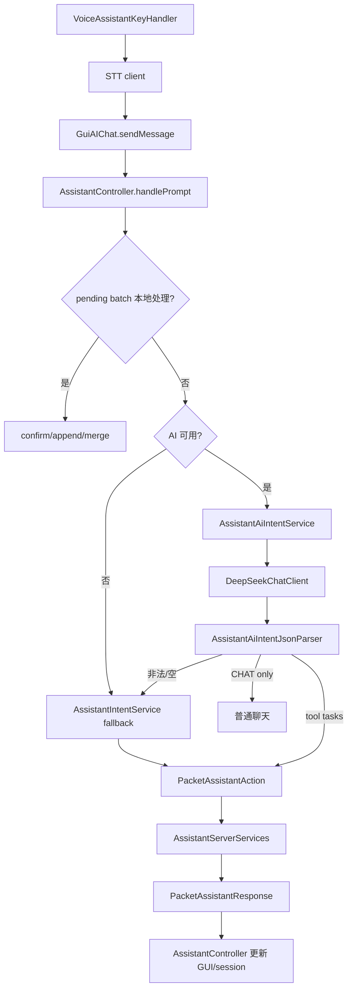

# AdvanceDataMonitor 开发者技术文档

> 受众：开发者 · 最后同步：2026-06  
> 玩家说明见 [用户手册](../player/用户手册.md) · AI 细节见 [AI 助手开发指南](../ai-assistant/开发指南.md) · 构建见 [Gradle 工作流](Gradle工作流.md)

---

## 目录

- [1. 项目定位](#1-项目定位)
- [2. 构建与运行环境](#2-构建与运行环境)
- [3. 源码目录结构](#3-源码目录结构)
- [4. Forge 生命周期与注册链路](#4-forge-生命周期与注册链路)
- [5. 方块、物品与 TileEntity](#5-方块物品与-tileentity)
  - [5.1 Advanced Data Monitor](#51-advanced-data-monitor)
  - [5.2 Data Imprint Tool](#52-data-imprint-tool数据映录器)
  - [5.3 Network Linker](#53-network-linker)
  - [5.4 Advanced Storage Linker](#54-advanced-storage-linker)
  - [5.5 Crafting Linker](#55-crafting-linker)
  - [5.6 Super Orange](#56-super-orange超能砂糖桔)
  - [5.7 Grapple System](#57-grapple-system挂索)
  - [5.8 Data Loom Cells](#58-data-loom-cells数据编织元件)
  - [5.9 Empyrean Holy Judgment](#59-empyrean-holy-judgment至高天圣裁)
  - [5.10 Manual System](#510-manual-system高级数据监视器手册)
  - [5.11 Advance Planner（高级计划器）](#511-advance-planner高级计划器)
- [6. GUI 与交互](#6-gui-与交互)
- [7. 网络包](#7-网络包)
- [8. AI 助手架构](#8-ai-助手架构)
- [9. 普通 AI 聊天与配置](#9-普通-ai-聊天与配置)
- [10. 语音助手](#10-语音助手)
- [11. 渲染系统](#11-渲染系统)
- [12. 持久化与数据文件](#12-持久化与数据文件)
- [13. 测试与验证](#13-测试与验证)
- [14. 常见开发任务索引](#14-常见开发任务索引)
- [15. 开发注意事项](#15-开发注意事项)
- [16. 调试与贡献](#16-调试与贡献)

---
## 1. 项目定位

`AdvanceDataMonitor` 是一个 Minecraft `1.7.10` / Forge `10.13.4.1614` / GTNH 环境下的工具模组，mod id 为 `advancedatamonitor`。核心能力分为三层：

- 世界内监视器：`TileEntityAdvanceDataMonitor` 采集目标 TileEntity / AE2 链接器数据，客户端 TESR 渲染为图表、文本、合成状态或存储物品列表。
- AE2 链接器方块：Network Linker、Advanced Storage Linker、Crafting Linker 接入 AE2 网络，提供存储容量、指定物品数量、合成 CPU 状态和自动合成能力。
- AI / 语音助手：客户端把自然语言解析为结构化 intent，通过 Forge packet 调服务端查询 AE2、提交合成、取出物品到背包或管理计划；语音入口先 STT，再复用文本助手链路。

项目大体仍沿用 GTNH ExampleMod 构建骨架，但业务代码已经集中在 `com.imgood.advancedatamonitor` 包下。

## 2. 构建与运行环境

关键配置：

- `build.gradle.kts`：只应用 `com.gtnewhorizons.gtnhconvention`，主要构建行为来自 GTNH convention 插件。
- `gradle.properties`：定义 `modName`、`modId`、`modGroup`、MC/Forge/MCP 版本、Jabel、shadow、发布配置和代理配置。
- `dependencies.gradle`：声明运行/编译依赖。当前包含 Vosk/JNA shadow 依赖，以及 GTNH、AE2 Fluid Craft、GT5、ArchitectureCraft、BlockRenderer6343 等 dev 依赖。
- `repositories.gradle`：补充依赖仓库。
- `libs/`：放置部分本地 dev jar。

常用命令：

```powershell
.\gradlew.bat build
.\gradlew.bat runClient
.\gradlew.bat runServer
.\gradlew.bat test
```

Unix-like shell 下对应使用 `./gradlew`。项目通过 Jabel 允许使用部分现代 Java 语法，但产物仍面向 JVM 8；开发时要避免引入 Java 8 运行期不存在的 API。

## 3. 源码目录结构

项目采用 **双轴包组织**：标准 Forge 分层（`blocks/`、`items/`、`entity/` 等）+ 功能包（`assistant/`、`items/cell/`、`handler/`、`handler/`、`manual/`、`voice/`、`ai/`）。复杂子系统的共享逻辑放功能包；Block/Item/Entity/Handler/Render 仍注册在标准包，经 `loader/` 集中注册。

主要目录如下：

- `src/main/java/com/imgood/advancedatamonitor/`：mod 入口、proxy、配置和各业务包。
- `blocks/`：五类方块实现（含挂索节点 `BlockGrappleAnchor`），负责创建对应 TileEntity、打开 GUI、放置方向、基础交互。
- `items/`：`ItemDataImprint`、`ItemAdvanceStorageLinkCell`、`ItemAdvancePlanner`、`ItemManual`、`ItemSuperOrange`、`ItemGrappleHook`、`ItemStarryCosmosSword`；数据编织元件见 `items/cell/` 包（Item 也在 `items/cell/` 内，与挂索/手册的 items/ 模式不同）。
- `tileentity/`：监视器、三个 AE2 链接器 与挂索节点的服务端状态、NBT 持久化、AE2 网络访问和同步逻辑。
- `gui/`：Forge GUI handler（`GuiHandler`，含 `GRAPPLE_HOOK_GUI_ID`）、container、自定义 GUI 控件和所有客户端配置界面。
- `renders/`：TESR、物品渲染、监视器内容渲染器、HUD、手册页面渲染（`ManualPageRenderer`）。
- `network/`：SimpleNetworkWrapper packet 与 handler。
- `loader/`：Forge 生命周期内的集中注册入口。
- `handler/`：tick handler、SuperOrange ability handler、loot handler、player join handler、`HandlerGrapple`（挂索节点索引、挂接 tick、区块加载补录）、`HandlerStarryCosmosSword`。
- `entity/`：`EntitySuperOrangeDrone`、挂索滑移实体、至高天圣裁技能实体（6 个）；不含 Render 类。
- `client/`：语音热键、按键绑定、挂索客户端输入（`HandlerGrappleClient`）、挂索客户端缓存与选点（`GrappleClientCache`、`GrappleSelectionUtil`）。
- `handler/`：挂索服务端逻辑（节点索引、玩家状态、锚点坐标、移动队列）。
- `handler/`：至高天圣裁共享工具（伤害源、运动、落点、常量、音效）；Item/Entity/Render 在标准包。
- `manual/`：手册章节/页面模型与 JSON 加载；`ItemManual` 在 `items/`，`GuiManual` 在 `gui/guiscreen/`。
- `assistant/`：AI 助手 intent、controller、服务端执行、格式化、偏好记忆和本地计划存储。
- `ai/`：OpenAI-compatible chat client、请求选项、provider profile、stream listener。
- `voice/`：录音、STT、Vosk 嵌入模型。
- `items/cell/`：数据编织元件（Data Loom Cells），实现 ICellWorkbenchItem + ICellHandler，在 ME 驱动器/箱子中按时间编织标记物品/流体/源质；仅接受编织增幅卡（默认 4×/16× 每张，倍率相乘）；tooltip 缓存有效速率。
- `utils/`：NBT 解析、绑定数据模型、TileEntity 类型识别、AE2 合成模板等辅助工具。
- `src/main/resources/assets/advancedatamonitor/`：lang、texture、AI 词表、嵌入式 Vosk 模型文件清单。
- `src/test/java/test/AssistantIntentParserSuite.java`：assistant intent 规则 parser 与 AI JSON parser 的回归用例。

注意代码中存在少量历史命名拼写，例如 `RenderAdvanceDataMonitor`、`gui/custom/`。维护时优先判断是否已有外部引用或注册名依赖，避免仅为命名整洁破坏兼容性。

配置：`Config.java` 为公共门面，分节加载逻辑在 `config/Config*Loader.java`；所有 debug 开关默认 `false`（见 `[debug]`、`[ai] debugLogging`、`[dataLoomCell] debugLogging`）。

渲染：`entity/` 仅放 Entity 类；所有 Render/TESR/HUD 在 `renders/`，由 `LoaderRender` 注册。

## 4. Forge 生命周期与注册链路

入口类是 `AdvanceDataMonitor`：

- `preInit()`：调用 `proxy.preInit()` 读取配置，然后注册 block、item、handler、TileEntity；客户端额外注册 renderer。
- `init()`：调用 `proxy.init()`，再注册 GUI handler。
- `postInit()`：调用 `proxy.postInit()`，再注册 SimpleNetworkWrapper packet。
- `serverStarting()`：交给 proxy 注册命令。

`CommonProxy.preInit()` 调用 `Config.synchronizeConfiguration()` 读取 Forge config。`ClientProxy.init()` 在客户端注册 `/admai`、`/admassistant`、语音热键和热键事件对象；服务端只注册 `CommandAssistant`。

集中注册类：

- `LoaderBlock` 注册 `advDataMonitor`、`advNetworkLinkBlock`、`advStorageLink`、`advCraftingLink`、`grappleAnchor`。
- `LoaderItem` 注册 `data_imprint`、`advance_storage_link_cell`、数据编织元件、`grapple_hook` 等，并把高级存储链接元件声明为支持 AE2 `FUZZY`、`INVERTER` 和 `ORE_FILTER` upgrade。
- `LoaderTileEntity` 注册五个 TileEntity（含 `TileEntityGrappleAnchor`）。
- `LoaderRender` 绑定 TESR / item renderer，并在 `RenderController` 注册 `line`、`crafting`、`storage` 内容渲染器。
- `LoaderGui` 注册 `GuiHandler`。
- `LoaderHandler` 注册 `HandlerTick`、`HandlerLoot`、`HandlerPlayerJoin`、`HandlerSuperOrange`、`HandlerGrapple`。HandlerTick 用于服务端延迟任务队列、计划提醒扫描、SuperOrange 无人机生成/移除逻辑。HandlerSuperOrange 处理投掷物免疫和挖掘掉落倍率。HandlerGrapple 处理挂索 tick、定身与区块加载时的节点索引补录。

- `LoaderNetwork` 注册所有 packet，discriminator `0`–`12`（含挂索 11、12）。

新增注册项时建议延续 loader 集中入口。

## 5. 方块、物品与 TileEntity

以下名称均来自 `assets/advancedatamonitor/lang/`，为游戏内实际显示名（中文 / 英文）。类文件头部 `Display names` 注释与下表一致。

| 类（主要） | 中文名 | 英文名 | lang 键 |
|-----------|--------|--------|---------|
| `BlockAdvanceDataMonitor` | 高级数据监视器 | Advance Data Monitor | `tile.advDataMonitor.name` |
| `BlockAdvanceCraftingLink` | 合成链接器 | Crafting Linker | `tile.CraftingMonitorBlock.name` |
| `BlockAdvanceStorageLink` | 高级存储链接器 | Advanced Storage Linker | `tile.StorageLinkBlock.name` |
| `BlockAdvanceNetworkLink` | 网络链接器 | Network Linker | `tile.NetworkLinkBlock.name` |
| `BlockGrappleAnchor` | 挂索节点 | Grapple Anchor | `tile.grappleAnchor.name` |
| `ItemDataImprint` | 数据映录器 | Data Imprint Tool | `item.dataImprint.name` |
| `ItemAdvanceStorageLinkCell` | 高级存储链接元件 | Advanced Storage Link Cell | `item.advanceStorageLinkCell.name` |
| `ItemAdvancePlanner` | 高级计划器 | Advance Planner | `item.advancePlanner.name` |
| `ItemManual` | 高级数据监视器手册 | AdvanceDataMonitor Manual | `item.manual.name` |
| `ItemSuperOrange` | 超能砂糖桔 | Super Orange | `item.orange.name` |
| `ItemGrappleHook` | 挂索器 | Grapple Hook | `item.grappleHook.name` |
| `ItemStarryCosmosSword` | 至高天圣裁 | Empyrean Holy Judgment | `item.starryCosmosSword.name` |
| `ItemDataDustLoomCell` | 数据织尘元件 | Data Dust Loom Cell | `item.dataDustLoomCell.name` |
| `ItemDataFormLoomCell` | 数据织形元件 | Data Form Loom Cell | `item.dataFormLoomCell.name` |
| `ItemDataFlowCell` | 数据涌流元件 | Data Flow Cell | `item.dataFlowCell.name` |
| `ItemDataTideLoomCell` | 数据织潮元件 | Data Tide Loom Cell | `item.dataTideLoomCell.name` |
| `ItemDataSourceLoomCell` | 数据织源元件 | Data Source Loom Cell | `item.dataSourceLoomCell.name` |
| `ItemWeaveAmplifier` | 编织增幅卡 | Weave Amplifier Card | `item.weaveAmplifier.name` |
| `ItemSuperWeaveAmplifier` | 超级编织增幅卡 | Super Weave Amplifier Card | `item.superWeaveAmplifier.name` |

未引用 lang 键见 [未引用lang键清单.md](未引用lang键清单.md)（英文：[../../en/developer/unreferenced-lang-keys.md](../../en/developer/unreferenced-lang-keys.md)）。

### 5.1 高级数据监视器（Advance Data Monitor）

核心类：

- `BlockAdvanceDataMonitor`
- `TileEntityAdvanceDataMonitor`
- `GuiMainAdvanceDataMonitor` 及多个 `GuiSub*` 配置页
- `RenderAdvanceDataMonitor`
- `RenderController` / `IADMRender`

`TileEntityAdvanceDataMonitor` 持有 `dataBoundList`，每个 index 对应一个 `NBTTagCompound` 显示项。显示项里保存目标坐标、字段名、采样间隔、颜色、缩放、旋转、数据类型等。服务端 `updateEntity()` 按每个显示项的 `interval` 采样：

1. 解析绑定坐标。
2. 找到目标 TileEntity。
3. 如果目标是 Crafting Linker，写入 `lines` 或 `networkLines` 并标记 `dataType=crafting`。
4. 如果目标是 Advanced Storage Linker，写入 `storageItems` 并标记 `dataType=storage`。
5. 如果目标是 Network Linker，根据字段读取 AE2 网络统计值，可选择转百分比。
6. 普通 TileEntity 则从目标 NBT 读取指定数值字段。
7. 更新本地数据并通过 `syncData()` / `PacketSynTileEntity` / vanilla description packet 同步给客户端渲染。

客户端渲染时根据显示项中的 `dataType` 或 renderer type 分发到 `LineChartRenderer`、`CraftingInfoRenderer`、`StorageInfoRenderer`。要新增一种显示类型，通常需要：

1. 定义显示项 NBT 字段和 GUI 编辑入口。
2. 在采集逻辑中写入稳定的数据结构。
3. 实现 `IADMRender`。
4. 在 `LoaderRender.registerRenderers()` 注册 type。

### 5.2 Data Imprint Tool（数据映录器）

核心类：`ItemDataImprint`、`GuiHandler`、`GuiNbtViewer`、NBT 工具类。

`ItemDataImprint` 用于映录目标方块并保存 TileEntity 的 NBT 快照，再绑定到数据监视器。与数据编织元件（织尘/织形/涌流）不同，映录器只观测与记录，不会从 AE 网络编织物质。GUI handler 的 `NBT_VIEWER_GUI_ID` 会读取手持物品上的 `boundTE`，通过 `NBTJsonParserHelper` 转成 JSON 后打开 NBT 查看器。

### 5.3 网络链接器（Network Linker）

核心类：`BlockAdvanceNetworkLink`、`TileEntityAdvanceNetworkLink`。

`TileEntityAdvanceNetworkLink` 继承 AE2 `AENetworkTile`，要求频道，连接类型为 `SMART`。它通过 AE2 grid 遍历 `TileDrive` / `TileChest` 等存储设备，统计：

- 物品总字节、已用字节、总类型数、已用类型数。
- 流体总字节、已用字节、总类型数、已用类型数。

它订阅 `MENetworkCellArrayUpdate` 和 `MENetworkStorageEvent` 刷新缓存，并通过 NBT / description packet 同步。监视器绑定它后，可以读取这些字段作为图表或百分比展示。

### 5.4 高级存储链接器（Advanced Storage Linker）

核心类：`BlockAdvanceStorageLink`、`TileEntityAdvanceStorageLink`、`ContainerAdvanceStorageLink`、`GuiAdvanceStorageLink`、`ItemAdvanceStorageLinkCell`。

`TileEntityAdvanceStorageLink` 同样是 AE2 `AENetworkTile`，并实现 `IInventory`。它有 36 个槽位，只接受 `ItemAdvanceStorageLinkCell`。每个 cell 保存一组 AE2 分区标记物品，并可带 Fuzzy / Inverter / Ore Filter upgrade，以及 NBT 流体标记：

> **与数据编织元件的区别**：Advanced Storage Linker 只统计上述「高级存储链接元件」所标记物品/流体/源质在 AE 网络中的聚合数量。四种数据编织元件（织尘/织形/涌流/织源）内部 `dataLoomItemAccum` / `dataLoomFluidAccum` 的存量**不纳入** Advanced Storage Linker 统计，也不会在 Advanced Storage Linker GUI / 绑定到监视器的存储显示中出现为独立条目。

- 普通模式：按精确匹配统计被标记物品在 AE2 网络中的数量（`isItemEqual`，避免 AE2FC 液滴混淆）。
- Fuzzy 模式：按 AE2 fuzzy 规则匹配（`FuzzyMode.PERCENT_25` 等），通过 `findFuzzy()` 查询。
- Inverter 模式：遍历网络物品，排除分区列表中的匹配项。
- Ore Filter 模式：按矿典名称通过 `OreDictionary.getOres()` 匹配所有同类物品。
- Fluid Marker 模式：读取 NBT 中的 `fluidMarkers` 列表，通过 `IStorageGrid.getFluidInventory()` 查询流体存量（按 ID 精确匹配）。

`createStorageItemsSnapshot()` 会按优先级（Ore > Fluid > 普通/Fuzzy/Inverter）把每个槽位的匹配项、数量、显示名和 item NBT 组装为 `NBTTagList`，供主监视器 `StorageInfoRenderer` 显示。`sampleStorageDeltasIfNeeded()` 每 20 tick 采样一次并计算增量（countDelta），渲染时按 `itemCountOrder` / `itemDeltaOrder` / `itemNameOrder` 排序，先启用者排在上方。

### 5.5 合成链接器（Crafting Linker）

核心类：`BlockAdvanceCraftingLink`、`TileEntityAdvanceCraftingLink`、`GuiSubAEAdvanceCraftingLink`、`AssistantServerServices`。

`TileEntityAdvanceCraftingLink` 接入 AE2 crafting grid，统计 CPU 数量、忙碌数量、总/已用存储、协处理器数量，以及每个 CPU 的快照。它订阅 `MENetworkCraftingCpuChange`。主监视器可读取全网络 summary 或按 CPU/template 显示合成状态。

AI 助手的服务端执行也依赖附近 32 格内的 Crafting Linker：查询可合成候选、查询样板详情、提交合成、批量提交和取消服务端 job 都从这里进入 AE2 网络。取出物品操作则依赖附近 32 格内的 Advanced Storage Linker，通过 `IStorageGrid` 搜索与提取物品。

### 5.6 Super Orange（超能砂糖桔）

核心类：`ItemSuperOrange`、`EntitySuperOrangeDrone`、`HandlerSuperOrange`、`HandlerTick`、`HandlerLoot`。

`HandlerTick` 在玩家 tick 中调用 `EntitySuperOrangeDrone.spawnForPlayer()`；当物品 NBT 关闭无人机或服务端 `droneEnabled=false` 时移除该玩家所有无人机。

`EntitySuperOrangeDrone` 分三种实体状态：

1. **本体（isOriginal）**：每秒在玩家周围 3 格内随机选点漂浮，拦截投掷物并生成战斗分身。
2. **战斗分身**：锁定敌对目标造成伤害；无敌人时 standby 后 despawn。
3. **拦截无人机**：预测轨迹销毁投掷物。

配置由 `[superOrange]` 分节控制。详见 [用户手册 §3.10](../player/用户手册.md#310-超能砂糖桔)。

### 5.7 Grapple System（挂索）

核心类：`BlockGrappleAnchor`、`TileEntityGrappleAnchor`、`ItemGrappleHook`、`handler/*`、`client/GrappleClientCache`、`HandlerGrappleClient`、`HandlerGrapple`、`GrappleHudRenderer`。

完整设计见 [挂索节点系统设计](../subsystems/挂索节点系统设计.md)。玩家说明见 [用户手册 §3.7–3.8](../player/用户手册.md#37-挂索节点)。


### 5.8 Data Loom Cells（数据编织元件）

核心类：`cell/ItemDataDustLoomCell.java`、`cell/ItemDataFormLoomCell.java`、`cell/ItemDataFlowCell.java`、`cell/ItemDataTideLoomCell.java`、`cell/ItemDataSourceLoomCell.java`、`cell/DataLoomCellHandler.java`、`cell/DataLoomWeaveEngine.java`、`cell/DataLoomCellTooltipCache.java`、`cell/ItemWeaveAmplifier.java`。

**功能概述**：AE 将物质数字化；数据编织元件逆向从网络数据中编织出物质/流体/源质。放入 ME 驱动器或 ME 箱子后，由 `DataLoomWeaveEngine` 按服务端 tick 调度向 AE2 网络产出工作台标记的目标。

**四件元件**：
| 元件 | 通道 | 标记限制 | 默认速率配置 |
|------|------|----------|--------------|
| 数据织尘元件 | ITEMS | 仅 GT 粉类；**不可标记本模组物品** | `[dataDustLoomCell] itemRatePerSecond`（默认 1/s） |
| 数据织形元件 | ITEMS | 任意物品；**不可标记本模组物品** | `[dataFormLoomCell] itemRatePerSecond`（默认 1/s） |
| 数据涌流元件 | FLUIDS | 任意流体；**不可用本模组物品作标记**；5 种类 | `[dataFlowCell] fluidRatePerSecond`（默认 1000 mB/s） |
| 数据织潮元件 | FLUIDS | 同涌流元件；**63 种类**；附魔光效 | 速率同 `[dataFlowCell]` |
| 数据织源元件 | FLUIDS | 仅 Thaumcraft 源质 aspect 流体 | `[dataSourceLoomCell] essentiaRatePerSecond`（默认 1000 mB/s） |

**注册流程**：
1. `LoaderItem.registerItems()` 注册四件元件与两张编织增幅卡。
2. `AdvanceDataMonitor.postInit()` 调用 `DataLoomCellHandler.register()`。
3. AE2 识别后元件可放入驱动器和箱子对应通道槽位。

**时间基生成逻辑**：
- `DataLoomWeaveEngine` 独立服务端调度（不依赖 AE 轮询 `getAvailableItems`）。
- 每 `[dataLoomCell] syncIntervalSeconds` 结算一次；总量 = 基础速率/s × 增幅倍率 × 间隔秒数。
- NBT：`dataLoomItemAccum` / `dataLoomFluidAccum` / `dataLoomNextWeaveTick`。

**编织增幅卡**：
- 仅 `ItemWeaveAmplifier` / `ItemSuperWeaveAmplifier`（`IWeaveAmplifierCard`）可插入；**不接受** AE `SPEED` 等升级卡。
- 默认普通卡 4×/张、超级卡 16×/张（`[dataLoomCell] weaveAmplifierRateMultiplier` / `superWeaveAmplifierRateMultiplier`），多张倍率**相乘**，最多 8 张。
- 倍率在 `Config.load()` 时写入 `DataLoomAmplifierRates` 静态字段，运行时直接读取。

**Tooltip 缓存**：
- 无耐久条；容量/种类行仍实时读取 NBT。
- 增幅卡信息与有效产出速率写入 `dataLoomTooltip` NBT，仅在元件工作台**标记变更**或**增删增幅卡**时刷新（`DataLoomCellConfig` / `FlowLoomCellConfig` / `DataLoomCellUpgrades.markDirty`）。
- 公共 tooltip 注明：元件内 `dataLoomItemAccum` / `dataLoomFluidAccum` 存量**不计入** Advanced Storage Linker（`TileEntityAdvanceStorageLink`）的监控统计。

**与 Advanced Storage Linker 的关系**：
- Advanced Storage Linker 通过 `IStorageGrid` 按「高级存储链接元件」分区标记统计网络存量。
- 数据编织元件的内部累积存储独立于 Advanced Storage Linker 统计逻辑；监视器绑定 Advanced Storage Linker 时不会反映编织元件内部的填充情况。

**能耗**：共用 `[dataLoomCell] energyDrainPerTick`（默认 999999 AE/t）。

**配置文件项**：
- `dataDustLoomCell.itemRatePerSecond` — float，默认 1.0
- `dataFormLoomCell.itemRatePerSecond` — float，默认 1.0
- `dataFlowCell.fluidRatePerSecond` — int，默认 1000（mB/s）
- `dataSourceLoomCell.essentiaRatePerSecond` — int，默认 1000（mB/s）
- `dataLoomCell.syncIntervalSeconds` — int，默认 5
- `dataLoomCell.energyDrainPerTick` — float，默认 999999
- `dataLoomCell.weaveAmplifierRateMultiplier` — float，默认 4.0
- `dataLoomCell.superWeaveAmplifierRateMultiplier` — float，默认 16.0

### 5.9 Empyrean Holy Judgment（至高天圣裁）

注册名 `starry_cosmos_sword`（lang：`item.starryCosmosSword.name`）。左键秒杀 + 月牙剑波；右键直线投掷 + 落地剑雨 5 秒；Shift+右键对 3×3 区块降下圣裁之剑（lang：`adm.tooltip.starry_cosmos_sword`）。

核心类：`ItemStarryCosmosSword`、`HandlerStarryCosmosSword`、`handler/*`、6 个 `EntityStarrySword*` 实体、多个 `RenderStarrySword*` 与 `CosmicStarryCosmosSwordRenderer`。Item 实现 `ICosmicRenderItem` cosmic 着色器。详见 [用户手册 §3.11](../player/用户手册.md#311-至高天圣裁)。

### 5.10 Manual System（高级数据监视器手册）

注册名 `manual`（lang：`item.manual.name`）。

核心类：`ItemManual`、`manual/ManualDataLoader`、`ManualChapter`、`ManualPage`、`GuiManual`、`ManualPageRenderer`。

JSON 位于 `assets/advancedatamonitor/manual/`；`HandlerPlayerJoin` 首次加入赠送手册。详见 [用户手册 §3.12](../player/用户手册.md#312-高级数据监视器手册)。


### 5.11 Advance Planner（高级计划器）

> 玩家向说明见 [用户手册 §19 高级计划器](../player/用户手册.md#19-高级计划器)

#### 架构概览

高级计划器由以下核心组件构成：

| 层级 | 类 | 职责 |
|------|-----|------|
| **数据层** | `PlannerEntry` | 单条计划条目的数据模型 |
| **数据层** | `PlannerMergeMode` | 合并策略枚举 |
| **业务层** | `ItemAdvancePlanner` | 物品主类，包含所有 NBT 读写 API 和合并逻辑 |
| **表示层** | `GuiAdvancePlanner` | 计划器主 GUI（列表展示、编辑、勾选） |
| **表示层** | `GuiPlannerMergeConfirm` | 整合确认 GUI（模式选择、执行合并） |
| **注册层** | `LoaderItem` | 物品注册到 Forge 游戏注册表 |

##### 数据流向

```
玩家操作 (右键/点击)
    │
    ▼
ItemAdvancePlanner.onItemRightClick()
    │
    ├─ 潜行 → setHudEnabled() → 修改 NBT
    │
    └─ 非潜行 → openPlannerGui() → GuiAdvancePlanner
                                         │
                                         ├─ 勾选 → ItemAdvancePlanner.toggleCompleted()
                                         ├─ 编辑 → ItemAdvancePlanner.setEntry()
                                         ├─ 添加 → ItemAdvancePlanner.addEntry()
                                         └─ 整合 → GuiPlannerMergeConfirm
                                                        │
                                                        └─ 确认 → ItemAdvancePlanner.mergeMultiplePlanners()
                                                                      │
                                                                      ├─ 消耗其他计划器物品
                                                                      └─ 替换当前物品为合并结果
```

---

#### 类关系图

```
Item (net.minecraft.item.Item)
  └── ItemAdvancePlanner
        ├── 使用 PlannerEntry (数据模型)
        ├── 使用 PlannerMergeMode (枚举)
        ├── 依赖 GuiAdvancePlanner (客户端 GUI)
        └── 静态方法全部为 public，可从任意位置调用

ADM_GuiScreen (自定义 GUI 基类)
  ├── GuiAdvancePlanner
  │     ├── 使用 ItemAdvancePlanner (读写数据)
  │     ├── 使用 PlannerEntry (展示数据)
  │     └── 跳转 → GuiPlannerMergeConfirm
  └── GuiPlannerMergeConfirm
        ├── 使用 ItemAdvancePlanner (合并逻辑)
        ├── 使用 PlannerMergeMode (模式选择)
        └── 跳转 → GuiAdvancePlanner (返回/完成)

LoaderItem
  └── 实例化 ItemAdvancePlanner 并注册到 GameRegistry
```

---

#### NBT 数据结构详解

高级计划器的所有数据存储在 `ItemStack` 的 NBT 标签中。

##### 3.1 顶层结构

```
ItemStack
  └── TagCompound (root)
        ├── "plannerEntries" : TagList (type=10, 即 TagCompound 列表)
        │     ├── [0] TagCompound → PlannerEntry
        │     ├── [1] TagCompound → PlannerEntry
        │     └── ...
        ├── "nextSlotIndex" : int (下一个可用的 slotIndex)
        ├── "hudEnabled" : boolean (HUD 是否启用)
        └── "hudMaxDisplay" : int (HUD 最大显示条数)
```

##### 3.2 单条 PlannerEntry 的 NBT 结构

```
TagCompound (单条条目)
  ├── "slotIndex"   : int     → 条目的唯一编号（全局递增，不因删除而回收）
  ├── "text"        : String  → 条目的文本内容
  ├── "timestamp"   : long    → 创建时间（毫秒级 Unix 时间戳）
  └── "completed"   : boolean → 是否已完成
```

##### 3.3 NBT Key 常量定义

| 常量名 | 值 | 类型 | 说明 |
|--------|-----|------|------|
| `NBT_KEY_ENTRIES` | `"plannerEntries"` | TagList | 存储所有条目 |
| `NBT_KEY_NEXT_SLOT` | `"nextSlotIndex"` | int | 下一个可用槽位索引 |
| `NBT_KEY_HUD_ENABLED` | `"hudEnabled"` | boolean | HUD 开关状态 |
| `NBT_KEY_HUD_MAX_DISPLAY` | `"hudMaxDisplay"` | int | HUD 最大显示条数 |
| `DEFAULT_HUD_MAX_DISPLAY` | `5` | int | HUD 默认最大显示数 |

##### 3.4 存储特点

- **slotIndex 单调递增：** 删除条目不会回收 slotIndex，新条目始终使用 `nextSlotIndex` 并自增。
- **条目查找方式：** 通过遍历 `plannerEntries` 列表匹配 `slotIndex` 字段，非数组下标随机访问。
- **timestamp 默认值：** 如果 NBT 中没有 `timestamp` 字段（旧数据兼容），`PlannerEntry.fromNBT()` 会使用 `System.currentTimeMillis()`。

---

#### PlannerEntry 数据类

**包路径：** `com.imgood.advancedatamonitor.items.PlannerEntry`

##### 4.1 字段

| 字段 | 类型 | 默认值 | 说明 |
|------|------|--------|------|
| `slotIndex` | `int` | `0` | 条目的唯一标识编号 |
| `text` | `String` | `""` | 条目文本内容（null 安全，构造时自动转为空串） |
| `timestamp` | `long` | `System.currentTimeMillis()` | 创建时间戳（毫秒） |
| `completed` | `boolean` | `false` | 是否已完成 |

##### 4.2 构造方法

```java
// 默认构造（slotIndex=0, text="", timestamp=当前时间, completed=false）
public PlannerEntry()

// 指定编号和文本（timestamp 自动设为当前时间）
public PlannerEntry(int slotIndex, String text)

// 全参数构造
public PlannerEntry(int slotIndex, String text, long timestamp, boolean completed)
```

##### 4.3 方法列表

| 方法签名 | 返回值 | 说明 |
|----------|--------|------|
| `getSlotIndex()` | `int` | 获取条目编号 |
| `setSlotIndex(int slotIndex)` | `void` | 设置条目编号 |
| `getText()` | `String` | 获取文本内容 |
| `setText(String text)` | `void` | 设置文本（null 自动转为空串） |
| `getTimestamp()` | `long` | 获取时间戳 |
| `setTimestamp(long timestamp)` | `void` | 设置时间戳 |
| `isCompleted()` | `boolean` | 是否已完成 |
| `setCompleted(boolean completed)` | `void` | 设置完成状态 |
| `toggleCompleted()` | `void` | 翻转完成状态 |
| `getFormattedTime()` | `String` | 返回格式化时间字符串（`yyyy-MM-dd HH:mm`） |
| `toNBT()` | `NBTTagCompound` | 序列化为 NBT |
| `fromNBT(NBTTagCompound tag)` | `PlannerEntry` (static) | 从 NBT 反序列化，tag 为 null 时返回 null |
| `copy()` | `PlannerEntry` | 深拷贝 |
| `toString()` | `String` | 调试用字符串表示 |

---

#### PlannerMergeMode 枚举

**包路径：** `com.imgood.advancedatamonitor.items.PlannerMergeMode`

```java
public enum PlannerMergeMode {
    BY_TIME,   // 按时间戳升序排列
    BY_INDEX   // 按 slotIndex 升序排列
}
```

| 枚举值 | 排序依据 | 合并行为 |
|--------|----------|----------|
| `BY_TIME` | `PlannerEntry.timestamp` | 所有条目按时间戳升序合并，重新从 1 开始编号 |
| `BY_INDEX` | `PlannerEntry.slotIndex` | 先保留第一个计划器的全部条目，再追加第二个的（slotIndex 重新分配），按编号排序 |

---

#### ItemAdvancePlanner 完整公共 API

**包路径：** `com.imgood.advancedatamonitor.items.ItemAdvancePlanner`

所有数据操作方法均为 **`public static`**，无需实例即可调用。方法的第一个参数始终是 `ItemStack stack`（计划器物品栈）。

##### 6.1 核心数据操作

###### `getOrCreatePlannerNBT(ItemStack stack) → NBTTagCompound`

确保 ItemStack 上存在计划器所需的 NBT 结构并返回根 TagCompound。如果 stack 为 null，返回一个新的空 TagCompound（不会修改任何东西）。

```java
public static NBTTagCompound getOrCreatePlannerNBT(ItemStack stack)
```

###### `getEntriesTagList(ItemStack stack) → NBTTagList`

返回 `plannerEntries` 的原始 TagList 引用。

```java
public static NBTTagList getEntriesTagList(ItemStack stack)
```

###### `getAllEntries(ItemStack stack) → List<PlannerEntry>`

反序列化并返回所有条目列表。返回的是新创建的列表，修改不会影响 NBT 数据。

```java
public static List<PlannerEntry> getAllEntries(ItemStack stack)
```

###### `getEntry(ItemStack stack, int slotIndex) → PlannerEntry`

按 slotIndex 查找单条条目。找不到返回 null。

```java
public static PlannerEntry getEntry(ItemStack stack, int slotIndex)
```

###### `getNextSlotIndex(ItemStack stack) → int`

获取下一个可用的 slotIndex 值。

```java
public static int getNextSlotIndex(ItemStack stack)
```

###### `setEntry(ItemStack stack, int slotIndex, String text, boolean completed) → void`

设置（更新或新增）指定 slotIndex 的条目。如果该 slotIndex 已存在，则更新其 text 和 completed；如果不存在，则新增一条。

```java
public static void setEntry(ItemStack stack, int slotIndex, String text, boolean completed)
```

###### `addEntry(ItemStack stack, String text) → int`

新增一条未完成的条目，自动分配 slotIndex。返回被分配的 slotIndex。

```java
public static int addEntry(ItemStack stack, String text)
```

###### `removeEntry(ItemStack stack, int slotIndex) → void`

按 slotIndex 删除条目。注意：不会回收 slotIndex，nextSlotIndex 保持不变。

```java
public static void removeEntry(ItemStack stack, int slotIndex)
```

###### `toggleCompleted(ItemStack stack, int slotIndex) → void`

翻转指定条目的完成状态。

```java
public static void toggleCompleted(ItemStack stack, int slotIndex)
```

###### `clearAllEntries(ItemStack stack) → void`

清空所有条目并将 nextSlotIndex 重置为 1。

```java
public static void clearAllEntries(ItemStack stack)
```

###### `getEntryCount(ItemStack stack) → int`

返回当前条目总数。

```java
public static int getEntryCount(ItemStack stack)
```

###### `hasEntry(ItemStack stack, int slotIndex) → boolean`

检查指定 slotIndex 的条目是否存在。

```java
public static boolean hasEntry(ItemStack stack, int slotIndex)
```

##### 6.2 查询 API

###### `getCompletedCount(ItemStack stack) → int`

返回已完成的条目数量。

```java
public static int getCompletedCount(ItemStack stack)
```

###### `getPendingCount(ItemStack stack) → int`

返回未完成的条目数量。

```java
public static int getPendingCount(ItemStack stack)
```

###### `getEntriesSorted(ItemStack stack, PlannerMergeMode mode) → List<PlannerEntry>`

返回按指定模式排序后的条目列表副本。

```java
public static List<PlannerEntry> getEntriesSorted(ItemStack stack, PlannerMergeMode mode)
```

##### 6.3 HUD API

###### `isHudEnabled(ItemStack stack) → boolean`

查询 HUD 显示是否启用。

```java
public static boolean isHudEnabled(ItemStack stack)
```

###### `setHudEnabled(ItemStack stack, boolean enabled) → void`

设置 HUD 显示开关。

```java
public static void setHudEnabled(ItemStack stack, boolean enabled)
```

###### `getHudMaxDisplay(ItemStack stack) → int`

获取 HUD 最大显示条数。如果未设置或为 0，返回默认值 5。

```java
public static int getHudMaxDisplay(ItemStack stack)
```

###### `setHudMaxDisplay(ItemStack stack, int maxDisplay) → void`

设置 HUD 最大显示条数，范围限制在 `[1, 20]`。

```java
public static void setHudMaxDisplay(ItemStack stack, int maxDisplay)
```

##### 6.4 排序/移动 API

###### `swapEntries(ItemStack stack, int slotA, int slotB) → void`

交换两个条目的 slotIndex（即在列表中互换位置）。如果任一条目不存在则不执行。

```java
public static void swapEntries(ItemStack stack, int slotA, int slotB)
```

###### `moveEntryToTop(ItemStack stack, int slotIndex) → void`

将指定条目移动到列表首位（slotIndex 设为 1），其余条目顺延重新编号。

```java
public static void moveEntryToTop(ItemStack stack, int slotIndex)
```

##### 6.5 整合/合并 API

###### `mergePlanners(ItemStack source1, ItemStack source2, PlannerMergeMode mode) → ItemStack`

合并两个计划器，返回一个新的 ItemStack。原始 ItemStack 不会被修改。如果其中一个为 null，返回另一个的副本。

```java
public static ItemStack mergePlanners(ItemStack source1, ItemStack source2, PlannerMergeMode mode)
```

###### `mergeMultiplePlanners(List<ItemStack> stacks, PlannerMergeMode mode) → ItemStack`

合并多个计划器。从第一个开始依次两两合并。如果列表为空返回 null，只有一个元素返回其副本。

```java
public static ItemStack mergeMultiplePlanners(List<ItemStack> stacks, PlannerMergeMode mode)
```

##### 6.6 背包查询 API

###### `getPlannerStacksInInventory(EntityPlayer player) → List<ItemStack>`

扫描玩家背包，返回所有 `ItemAdvancePlanner` 类型的 ItemStack 列表。

```java
public static List<ItemStack> getPlannerStacksInInventory(EntityPlayer player)
```

###### `countPlannersInInventory(EntityPlayer player) → int`

返回玩家背包中的计划器物品数量。

```java
public static int countPlannersInInventory(EntityPlayer player)
```

###### `countPlannerEntriesInInventory(EntityPlayer player) → int`

返回玩家背包中所有计划器的条目总数。

```java
public static int countPlannerEntriesInInventory(EntityPlayer player)
```

---

#### GUI 系统

##### 7.1 GuiAdvancePlanner

**包路径：** `com.imgood.advancedatamonitor.gui.guiscreen.GuiAdvancePlanner`

继承自 `ADM_GuiScreen`（模组自定义的 GUI 基类）。

###### 核心属性

| 属性 | 类型 | 默认值 | 说明 |
|------|------|--------|------|
| `plannerStack` | `ItemStack` | 构造时传入 | 当前操作的计划器物品栈 |
| `player` | `EntityPlayer` | 构造时传入 | 当前玩家 |
| `entries` | `List<PlannerEntry>` | 每次 refreshEntries() 更新 | 条目缓存 |
| `entryMap` | `Map<Integer, PlannerEntry>` | 每次 refreshEntries() 更新 | slotIndex → 条目的映射 |
| `scrollOffset` | `int` | `0` | 当前滚动偏移（行数） |
| `visibleRows` | `int` | `8` | 可见行数 |
| `totalDisplayRows` | `int` | `50` | 总显示行数（含空行） |
| `rowHeight` | `int` | `20` | 每行高度（像素） |
| `editingField` | `ADM_GuiTextField` | `null` | 当前活动的文本输入框 |
| `editingSlotIndex` | `int` | `-1` | 正在编辑的条目 slotIndex（-1 表示无编辑） |
| `isAddingNew` | `boolean` | `false` | 当前编辑是否为新建条目 |

###### 交互流程

1. **初始化 (`initGui`)**：刷新条目缓存，计算布局坐标，创建"整合"和"退出"按钮。
2. **鼠标点击 (`mouseClicked`)**：
   - 点击复选框区域 → `toggleCompleted()`
   - 点击文本区域 → `startEditing()` 创建文本输入框和确认/取消按钮
3. **键盘输入 (`keyTyped`)**：
   - Enter → `commitEdit()` 提交编辑
   - Esc → `cancelEdit()` 取消编辑
   - 其他键 → 传递给文本输入框
4. **滚轮 (`handleMouseInput`)**：调整 `scrollOffset` 实现翻页。
5. **渲染 (`drawScreen`)**：绘制标题、统计信息、列表区域（含复选框、文本、时间戳、滚动条）、悬浮提示。
6. **关闭 (`onGuiClosed`)**：自动提交未保存的编辑，禁用键盘重复事件。

###### 编辑状态机

```
空闲状态
  │ 点击文本区域
  ▼
编辑状态 (editingSlotIndex >= 0, editingField != null)
  │
  ├─ Enter / 点击"添加" → commitEdit() → 保存文本 → 返回空闲
  ├─ Esc / 点击"X"      → cancelEdit() → 丢弃修改 → 返回空闲
  ├─ 点击其他行文本      → commitEdit() 当前行 → startEditing() 新行
  ├─ 点击其他行复选框    → commitEdit() 当前行 → toggleCompleted()
  └─ 点击"整合"/"退出"  → commitEdit() 当前行 → 跳转
```

###### 颜色方案

| 用途 | 色值 | 说明 |
|------|------|------|
| 文本默认 | `0x00FFFF` | 青色 |
| 文本悬停 | `0x0055FF` | 蓝色 |
| 已完成文本 | `0x55FF55` | 绿色 |
| 未完成文本 | `0xFFFFFF` | 白色 |
| 序号/统计 | `0x888888` | 灰色 |
| 时间戳 | `0x666666` | 深灰 |
| 确认按钮 | `0x00FF00` / `0x55FF55` | 绿色 |
| 取消按钮 | `0xFF5555` / `0xFF0000` | 红色 |

##### 7.2 GuiPlannerMergeConfirm

**包路径：** `com.imgood.advancedatamonitor.gui.guiscreen.GuiPlannerMergeConfirm`

###### 核心属性

| 属性 | 类型 | 说明 |
|------|------|------|
| `currentStack` | `ItemStack` | 当前打开的计划器 |
| `player` | `EntityPlayer` | 当前玩家 |
| `plannerStacks` | `List<ItemStack>` | 背包中所有计划器（initGui 时扫描） |
| `totalPlanners` | `int` | 计划器数量 |
| `totalEntries` | `int` | 所有计划器的总条目数 |
| `selectedMode` | `PlannerMergeMode` | 当前选中的合并模式（默认 BY_TIME） |

###### 按钮 ID

| ID | 常量名 | 功能 |
|----|--------|------|
| 200 | `buttonTimeId` | 选择"按时间合并"模式 |
| 201 | `buttonIndexId` | 选择"按序号合并"模式 |
| 202 | `buttonConfirmId` | 确认执行合并 |
| 203 | `buttonCancelId` | 取消，返回主 GUI |

###### 合并执行流程 (`executeMerge`)

1. 检查 `totalPlanners >= 2`，否则直接返回。
2. 调用 `ItemAdvancePlanner.mergeMultiplePlanners()` 生成合并结果。
3. 遍历背包，移除**非当前**的计划器物品（`setInventorySlotContents(i, null)`）。
4. 将当前槽位的物品替换为合并结果。
5. 调用 `detectAndSendChanges()` 同步到服务端。
6. 跳转回 `GuiAdvancePlanner`，传入合并后的 ItemStack。

---

#### 注册流程

**文件：** `LoaderItem.java`

```java
public class LoaderItem {
    public static Item advancePlanner;

    public static void registerItems() {
        // 1. 实例化物品，设置内部名和贴图路径
        advancePlanner = new ItemAdvancePlanner()
            .setUnlocalizedName("advancePlanner")
            .setTextureName("advancedatamonitor:advance_planner");

        // 2. 注册到 Forge 游戏注册表
        GameRegistry.registerItem(advancePlanner, "advance_planner");
    }
}
```

**注册链路：**

1. `ItemAdvancePlanner` 构造函数设置：
   - `setMaxStackSize(1)` — 不可堆叠
   - `setCreativeTab(CreativeTabs.tabTools)` — 创造模式"工具"标签页
2. `LoaderItem.registerItems()` 设置：
   - `setUnlocalizedName("advancePlanner")` — 用于语言文件查找 `item.advancePlanner.name`
   - `setTextureName("advancedatamonitor:advance_planner")` — 对应 `textures/items/advance_planner.png`
3. `GameRegistry.registerItem()` 完成 Forge 注册。

**访问已注册物品：**

```java
ItemStack plannerStack = new ItemStack(LoaderItem.advancePlanner);
```

---

#### 调用示例

##### 9.1 创建计划器并添加条目

```java
import com.imgood.advancedatamonitor.items.ItemAdvancePlanner;
import com.imgood.advancedatamonitor.loader.LoaderItem;

// 创建一个新的计划器 ItemStack
ItemStack planner = new ItemStack(LoaderItem.advancePlanner);

// 添加条目
int slot1 = ItemAdvancePlanner.addEntry(planner, "采集 64 个铁锭");
int slot2 = ItemAdvancePlanner.addEntry(planner, "建造仓库");
int slot3 = ItemAdvancePlanner.addEntry(planner, "制作钻石镐");

// 标记第一条为已完成
ItemAdvancePlanner.toggleCompleted(planner, slot1);
```

##### 9.2 读取计划器数据

```java
// 获取所有条目
List<PlannerEntry> entries = ItemAdvancePlanner.getAllEntries(planner);
for (PlannerEntry entry : entries) {
    System.out.println(String.format(
        "[%s] #%d: %s",
        entry.isCompleted() ? "✓" : " ",
        entry.getSlotIndex(),
        entry.getText()
    ));
}

// 获取统计
int total = ItemAdvancePlanner.getEntryCount(planner);
int done = ItemAdvancePlanner.getCompletedCount(planner);
int pending = ItemAdvancePlanner.getPendingCount(planner);
```

##### 9.3 从玩家背包查找计划器

```java
import net.minecraft.entity.player.EntityPlayer;

EntityPlayer player = /* 获取玩家对象 */;

// 获取背包中所有计划器
List<ItemStack> planners = ItemAdvancePlanner.getPlannerStacksInInventory(player);
System.out.println("背包中有 " + planners.size() + " 个计划器");

// 获取背包中所有计划器的条目总数
int totalEntries = ItemAdvancePlanner.countPlannerEntriesInInventory(player);
```

##### 9.4 合并多个计划器

```java
import com.imgood.advancedatamonitor.items.PlannerMergeMode;

List<ItemStack> planners = ItemAdvancePlanner.getPlannerStacksInInventory(player);

if (planners.size() >= 2) {
    // 按时间合并
    ItemStack merged = ItemAdvancePlanner.mergeMultiplePlanners(
        planners, PlannerMergeMode.BY_TIME);

    // merged 是一个全新的 ItemStack，包含所有条目
    System.out.println("合并后条目数: " + ItemAdvancePlanner.getEntryCount(merged));
}
```

##### 9.5 HUD 控制

```java
ItemStack planner = /* 获取计划器 */;

// 查询 HUD 状态
boolean hudOn = ItemAdvancePlanner.isHudEnabled(planner);

// 开启 HUD
ItemAdvancePlanner.setHudEnabled(planner, true);

// 设置 HUD 最大显示 10 条
ItemAdvancePlanner.setHudMaxDisplay(planner, 10);
```

##### 9.6 排序与移动

```java
// 按时间排序获取条目
List<PlannerEntry> byTime = ItemAdvancePlanner.getEntriesSorted(
    planner, PlannerMergeMode.BY_TIME);

// 交换两个条目的位置
ItemAdvancePlanner.swapEntries(planner, 1, 3);

// 将第 5 条移到最前面
ItemAdvancePlanner.moveEntryToTop(planner, 5);
```

##### 9.7 编程式操作计划器（非 GUI 场景）

```java
// 直接通过 NBT 修改条目（不经过 GUI）
ItemAdvancePlanner.setEntry(planner, 99, "通过代码添加的条目", false);

// 检查条目是否存在
boolean exists = ItemAdvancePlanner.hasEntry(planner, 99); // true

// 删除条目
ItemAdvancePlanner.removeEntry(planner, 99);

// 清空所有
ItemAdvancePlanner.clearAllEntries(planner);
```

---

#### 扩展指南

##### 10.1 添加新的条目字段

如果需要为每条条目添加新属性（如优先级、分类标签等）：

1. **修改 `PlannerEntry`**：
   - 添加新字段（如 `private int priority;`）
   - 更新所有构造方法
   - 更新 `toNBT()` 和 `fromNBT()` 方法
   - 更新 `copy()` 方法
   - 添加 getter/setter

2. **考虑向后兼容**：在 `fromNBT()` 中使用 `tag.hasKey("priority")` 检查，为旧数据提供默认值。

3. **更新 GUI**（如果需要展示）：
   - 修改 `GuiAdvancePlanner.drawListArea()` 中的渲染逻辑
   - 可能需要添加新的交互元素

##### 10.2 添加新的合并模式

1. **扩展 `PlannerMergeMode` 枚举**：添加新值（如 `BY_PRIORITY`）。

2. **在 `ItemAdvancePlanner` 中实现合并逻辑**：
   - 添加新的 `private static List<PlannerEntry> mergeByXxx(...)` 方法
   - 在 `mergePlanners()` 的 switch 语句中添加新 case
   - 在 `getEntriesSorted()` 的 switch 语句中添加新 case

3. **更新 `GuiPlannerMergeConfirm`**：
   - 添加新按钮（参考现有按钮的创建方式）
   - 更新 `buttonId` 常量
   - 在 `actionPerformed()` 中处理新按钮
   - 在 `drawScreen()` 中高亮当前选中模式

4. **添加语言文件条目**。

##### 10.3 添加 HUD 渲染

目前 HUD 相关的 API（`isHudEnabled`、`setHudEnabled`、`getHudMaxDisplay`、`setHudMaxDisplay`）已就位，但渲染逻辑需要在 HUD 渲染事件中实现：

```java
// 在客户端事件处理器中
@SubscribeEvent
public void onRenderGameOverlay(RenderGameOverlayEvent.Post event) {
    if (event.type != RenderGameOverlayEvent.ElementType.ALL) return;

    EntityPlayer player = Minecraft.getMinecraft().thePlayer;
    ItemStack heldItem = player.getHeldItem();

    if (heldItem != null && heldItem.getItem() instanceof ItemAdvancePlanner
        && ItemAdvancePlanner.isHudEnabled(heldItem)) {

        int maxDisplay = ItemAdvancePlanner.getHudMaxDisplay(heldItem);
        List<PlannerEntry> entries = ItemAdvancePlanner.getAllEntries(heldItem);

        // 渲染逻辑：在屏幕上绘制待办列表
        int y = 10;
        int count = 0;
        for (PlannerEntry entry : entries) {
            if (count >= maxDisplay) break;
            String prefix = entry.isCompleted() ? "[x] " : "[ ] ";
            // 使用 FontRenderer 绘制
            // fontRenderer.drawString(prefix + entry.getText(), 10, y, 0xFFFFFF);
            y += 12;
            count++;
        }
    }
}
```

##### 10.4 添加新的交互操作

如果需要添加拖拽排序、批量删除等功能：

1. 在 `GuiAdvancePlanner` 中扩展鼠标事件处理（`mouseClicked`、`mouseClickMove` 等）。
2. 使用 `ItemAdvancePlanner` 的现有 API（如 `swapEntries`、`removeEntry`）实现数据操作。
3. 在 `commitEdit()` / `cancelEdit()` 后调用 `refreshEntries()` 确保缓存同步。

##### 10.5 注意事项

- **线程安全：** 所有 NBT 操作都在主线程执行，GUI 在客户端线程。如果从其他线程调用 API，需要注意同步。
- **null 安全：** `getOrCreatePlannerNBT(null)` 返回空 TagCompound 但不会修改 null 的 stack。调用方应确保 stack 非 null。
- **NBT 大小：** Minecraft 的 NBT 没有硬性大小限制，但过大的数据会影响网络同步性能。建议单个计划器的条目控制在合理范围内。
- **slotIndex 不回收：** 删除条目后 slotIndex 不会被重用，这是设计决定，确保外部引用不会意外指向错误的条目。

---

#### 语言文件格式

##### 11.1 文件位置

- 中文：`src/main/resources/assets/advancedatamonitor/lang/zh_CN.lang`
- 英文：`src/main/resources/assets/advancedatamonitor/lang/en_US.lang`

##### 11.2 格式规范

```
key=value
```

- 每行一个键值对，以 `=` 分隔
- `#` 开头的行是注释
- `§` 是 Minecraft 的格式化代码前缀（如 `§l` 表示粗体，`§n` 表示下划线，`§m` 表示删除线）
- `%s`、`%d` 等是 Java `String.format` 占位符，运行时会被实际值替换

##### 11.3 高级计划器相关语言条目

```properties
# 物品名称（对应 setUnlocalizedName 设置的 key: item.advancePlanner.name）
item.advancePlanner.name=高级计划器          # zh_CN
item.advancePlanner.name=Advance Planner     # en_US

# GUI 标题
adm.planner.title=§l高级计划器               # zh_CN
adm.planner.title=§lAdvance Planner          # en_US

# 按钮文本
adm.planner.add=添加 / Add
adm.planner.delete=删除 / Delete
adm.planner.merge=§l整合 / §lMerge
adm.planner.confirm_merge=§l确认整合 / §lConfirm Merge
adm.planner.cancel=§l取消 / §lCancel
adm.planner.exit=§l退出 / §lExit

# 整合确认界面
adm.planner.merge_confirm_title=§l整合确认 / §lMerge Confirmation
adm.planner.merge_by_time=§l按时间合并 / §lMerge by Time
adm.planner.merge_by_index=§l按序号合并 / §lMerge by Index
adm.planner.merge_prompt=背包中有 %s 个计划器，共 %s 条数据需要合并
                        / Found %s planner(s) in inventory with %s total entries to merge

# 条目状态
adm.planner.empty_slot=点击添加... / Click to add...
adm.planner.completed=已完成 / Completed
adm.planner.pending=未完成 / Pending
adm.planner.mark_complete=标记为已完成 / Mark as completed
adm.planner.mark_incomplete=标记为未完成 / Mark as incomplete

# 统计信息（%s 依次为：总数、已完成数、未完成数）
adm.planner.stats=共 %s 条 | 完成 %s | 未完成 %s
                  / Total %s | Done %s | Pending %s

# 整合确认界面详情
adm.planner.planner_detail=计划器 #%s: %s 条数据
                          / Planner #%s: %s entries
adm.planner.current=(当前) / (current)
adm.planner.selected_mode=合并模式: / Selected mode:
adm.planner.merge_tooltip=合并背包中所有计划器的数据
                         / Merge all planner items in inventory

# HUD 相关（注意：当前语言文件中尚未定义，需补充）
# adm.planner.hud_enabled=HUD 已启用
# adm.planner.hud_disabled=HUD 已关闭
```

##### 11.4 新增语言条目的步骤

1. 在 `zh_CN.lang` 中添加中文键值对。
2. 在 `en_US.lang` 中添加对应的英文键值对。
3. 在代码中使用 `I18n.format("adm.planner.xxx")` 或 `net.minecraft.client.resources.I18n.format(...)` 引用。
4. 如需带参数，使用 `%s` 占位符，在 `format()` 调用时传入参数。

---

> 本文档基于 AdvanceDataMonitor 模组源码编写。如代码发生变更，请以实际源码为准。

## 6. GUI 与交互

`GuiHandler` 当前定义三个 Forge GUI id：

- `0`：NBT Viewer，只在客户端打开。
- `1`：主监视器 GUI。
- `2`：Advanced Storage Linker GUI，服务端返回 `ContainerAdvanceStorageLink`，客户端返回 `GuiAdvanceStorageLink`。

主监视器 GUI 以 `GuiMainAdvanceDataMonitor` 为入口，子页面负责绑定目标、配置 AE2 Network Linker、Crafting Linker、Advanced Storage Linker、颜色和显示变换。AI 聊天与 AI 设置是独立 `GuiScreen`，由主界面按钮、命令或语音热键打开。

GUI 修改 TileEntity 时要注意 side：客户端负责编辑界面和发包，服务端负责可信状态更新并 `markDirty()` / `markBlockForUpdate()`。不要只改客户端 TileEntity，否则重开世界或服务端同步后会丢失。

## 7. 网络包

所有 packet 共用 `AdvanceDataMonitor.ADMCHANEL`，注册在 `LoaderNetwork`：

- `0 PacketItemNBT -> SERVER`：数据映录器相关 NBT 交互。
- `1 PacketSynTileEntity -> CLIENT`：同步监视器 TileEntity 到客户端。
- `2 PacketSynTileEntity -> SERVER`：客户端提交监视器配置到服务端。
- `3 PacketSynTileEntity -> SERVER`：历史同步 handler。
- `4 PacketRequestItemCountSync -> SERVER`：客户端请求 Advanced Storage Linker 数量。
- `5 PacketItemCountSync -> CLIENT`：服务端返回 Advanced Storage Linker 数量。
- `6 PacketAssistantAction -> SERVER`：AI assistant 工具动作。
- `7 PacketAssistantResponse -> CLIENT`：AI assistant 服务端响应。

`PacketAssistantAction` 当前支持 11 种 action（1-7 合成/查询相关，8-11 取出物品相关），通过 payload NBT 携带具体参数。

维护注意事项：

- 1.7.10 的 `SimpleNetworkWrapper` discriminator 必须双端一致，新增 packet 时不要复用现有 ID。
- packet 中传 NBT 时要考虑大小和可信边界；客户端发来的 NBT 不应直接作为最终可信数据扩散。
- 服务端 handler 中涉及世界和 TileEntity 修改时，保持在服务端线程上下文中执行；`PacketAssistantAction` 当前通过 `HandlerTick.enqueueServerTask()` 把 assistant 工具动作切回服务端 tick 执行。

## 8. AI 助手架构

AI 助手由客户端解析、服务端执行。主路径如下：



关键类：

- `GuiAIChat`：聊天窗口、普通聊天请求、assistant 文本入口。
- `AssistantController`：客户端总控，处理 pending session、AI/fallback 切换、plan 执行、候选项确认和服务端响应。
- `AssistantAiIntentService`：构造 system prompt，请求 OpenAI-compatible chat API 返回结构化 JSON。
- `AssistantAiIntentJsonParser`：抽取并校验 `{ tasks: [...] }`。
- `AssistantIntentService`：规则 parser，现在主要作为 AI 不可用或 AI 输出非法时的 fallback。
- `PacketAssistantAction` / `PacketAssistantResponse`：工具动作请求和服务端结果返回。
- `AssistantServerServices`：服务端 AE2 查询、候选构建、合成提交、批量下单、取消 job、计划查询。
- `AssistantSession`：客户端 pending 候选状态。
- `WithdrawSubmitOutcome`：AE2 取出物品服务端结果，含 `SUCCESS / FAILURE / PARTIAL_CONFIRM` 三种状态以及请求量、背包可容纳量、存储量等信息。
- `PlayerInventoryUtil`：背包空间计算与物品插入工具类。
- `OrderMemoryStore`：候选偏好记忆。
- `PlanStore`：简单本地计划存储。

AI JSON schema 只允许模型输出单个 JSON object，包含 `tasks` array。允许 task type 包括 `QUERY_RECIPE`、`QUERY_STORAGE`、`QUERY_POWER`、`ORDER_ITEM`、`WITHDRAW_ITEM`、`CONFIRM_OPTION`、`PLAN_CREATE`、`PLAN_LIST`、`PLAN_COMPLETE`、`CANCEL`、`CHAT`。`ORDER_BATCH` 和 `WITHDRAW_BATCH` 不允许模型直接返回，而由 controller 聚合多个 `ORDER_ITEM` / `WITHDRAW_ITEM` 生成。

新增 assistant 能力时通常需要同时修改：

1. `AssistantIntentType` 增加类型。
2. `AssistantIntentTask` 和 JSON parser 校验新字段或转换逻辑。
3. `AssistantAiIntentService` 的 prompt schema。
4. `AssistantIntentService` fallback 规则和 `assistant-lexicon.json`。
5. `AssistantController.executeTask()` 映射到 packet 或本地动作。
6. `PacketAssistantAction` / `AssistantServerServices` / `PacketAssistantResponse`。
7. `AssistantIntentParserSuite` 添加规则与 AI JSON parser 回归用例。

## 9. 普通 AI 聊天与配置

`DeepSeekChatClient` 是 OpenAI-compatible HTTP client，普通聊天和 AI intent 抽取都复用它。配置在 `Config` 中，主要 category：

- `ai`：base URL、API key、model、network enabled、web search、streaming、timeout、max tokens、temperature、privacy flag、debug logging。
- `voice`：enabled、privacy flag、STT mode、STT URL/key/model、timeout。
- `assistant`：最大订单数量、合成 job 超时、并发 job 数。

配置入口包括：

- Forge config 文件，由 `Config.synchronizeConfiguration()` 读取。
- 游戏内 `GuiAISettings`。
- 客户端命令 `CommandAIConfig`。
- 环境变量 fallback，例如 AI key / voice STT key。

不要把 API key 写入源码、文档示例或测试 fixture。调试日志也应保持脱敏。

## 10. 语音助手

语音入口是 `VoiceAssistantKeyHandler`。客户端注册热键后，按键开始/停止录音，`VoiceCaptureService` 采集 PCM，随后根据配置走：

- `embedded-vosk`：`VoskSpeechToTextClient`、`EmbeddedVoiceModelManager`、`StandaloneVoskTranscriber`。
- `http`：`HttpSpeechToTextClient` 或 `SpeechToTextClient`，调用 OpenAI-compatible `/v1/audio/transcriptions`。

STT 成功后把文字提交给 `GuiAIChat.submitAssistantPrompt()`，后续完全复用 assistant flow。开发语音相关功能时要特别注意：录音只在客户端执行；隐私确认必须在发送音频/文本到外部服务前完成；Vosk/JNA 是 shadow 依赖，打包体积和 native library 行为都需要实测。

## 11. 渲染系统

渲染分两类：

- 方块 / 物品外观：`RenderAdvanceDataMonitor`、`RenderAdvanceNetworkLink`、各 item renderer，由 `LoaderRender` 绑定。
- 监视器内容：实现 `IADMRender`，通过 `RenderController` 按 type 分发。

`IADMRender.render(NBTTagCompound nbt, double x, double y, double z, int facing)` 直接消费显示项 NBT，因此渲染器和采集逻辑之间的契约是 NBT 字段名。改字段名时必须同步 GUI 默认值、TileEntity 采集、NBT 持久化、同步包和 renderer。

1.7.10 的 TESR 渲染容易受 GL 状态污染影响。新增渲染器时要成对 push/pop matrix、恢复颜色/纹理/lighting/blend 状态，并避免在每帧创建大量对象或读取服务端-only 类。

## 12. 持久化与数据文件

主要持久化位置：

- TileEntity NBT：监视器显示项、AE2 链接器缓存、Advanced Storage Linker inventory。
- ItemStack NBT：Data Imprint 映录快照、高级存储链接元件 分区和 upgrade 信息。
- Forge config：AI、voice、assistant 配置。
- Assistant 数据文件：`AssistantDataFiles` 负责定位，`OrderMemoryStore` / `PlanStore` 保存偏好和计划。
- 资源文件：`assets/advancedatamonitor/config/assistant-lexicon.json` 是 fallback parser 词表。

维护建议：新字段尽量提供缺省值和旧 NBT 兼容读取；对已经进入玩家世界的 block/item NBT，不要随意改 key 或语义。

## 13. 测试与验证

目前最明确的自动化覆盖是 `AssistantIntentParserSuite`，覆盖规则 parser 和 AI JSON parser。建议在改 assistant 相关代码时至少运行：

```powershell
.\gradlew.bat test
```

如果 IDE/Gradle 没有自动执行该 main suite，可以在 IDE 中直接运行 `test.AssistantIntentParserSuite`。构建发布前建议运行：

```powershell
.\gradlew.bat build
```

手工验证建议按模块拆开：

- 监视器：放置主监视器，绑定普通 TileEntity 字段，确认 GUI 保存、重进世界、客户端渲染都正常。
- Network Linker：接入 AE2 网络，插入/移除存储元件，确认容量和百分比刷新。
- Advanced Storage Linker：配置分区、Fuzzy、Inverter，确认主监视器显示数量与 AE2 网络一致。
- Crafting Linker：触发 AE2 自动合成，确认 CPU 状态和主监视器文本刷新。
- AI 助手：无 key fallback、有效 key JSON plan、候选确认、批量下单、批量取出、部分取出确认、取消、普通聊天分流。
- 语音助手：本地 Vosk 和 HTTP STT 分别验证热键、隐私确认、转写提交。

## 14. 常见开发任务索引

新增方块：修改 `blocks/`、`LoaderBlock`、`LoaderTileEntity`、lang、texture/model 或 renderer；如果有 GUI，再改 `GuiHandler` 和 `LoaderGui` 相关入口。

新增监视器显示类型：定义显示项 NBT schema，补 GUI 默认值，扩展 `TileEntityAdvanceDataMonitor.processTileEntityData()` 或相邻采集方法，实现 `IADMRender` 并在 `LoaderRender` 注册。

新增网络包：在 `network/packet` 或 `network/handler` 添加 class，更新 `LoaderNetwork`，选择新的 discriminator，检查双端 side 和线程上下文。

新增 assistant 工具：按第 8 节的七步修改，并同步测试。取出物品类工具还需要关注 `PlayerInventoryUtil` 背包空间计算、`WithdrawSubmitOutcome` 三态结果和 `WITHDRAW_PARTIAL_CONFIRM` 客户端确认流程。

新增 AI provider：优先扩展 `AiProviderProfiles`、`GuiAISettings` 和 `DeepSeekChatClient` 请求选项，不要在 GUI 中硬编码 provider 专属逻辑。

新增 STT 模式：扩展 `Config` 的 voice mode 归一化、设置界面、`VoiceAssistantKeyHandler` 的 client 选择逻辑和隐私提示文本。

## 15. 开发注意事项

- 区分 client/server side。GUI、TESR、Minecraft client 类只允许客户端引用；共享类不要直接依赖 `net.minecraft.client.*`。
- AE2 grid 访问可能抛 `GridAccessException` 或返回 null，服务端执行层要给玩家可理解的失败消息。
- 大型 AE2 网络遍历成本高，优先缓存并靠事件/tick 刷新，不要在每帧 renderer 中访问网络。`LineChartRenderer` 等每帧渲染路径也要避免频繁创建/销毁重型 GL 资源。
- Packet payload 尽量小而稳定；对于可从服务端重建的数据，不要信任客户端提交。
- 已经写入世界或物品的 NBT key 属于兼容边界，改名需要迁移逻辑。
- Shadow 依赖会影响 jar 体积和类加载。Vosk/JNA 相关变更必须做客户端启动和语音功能实测。
- `../ai-assistant/开发指南.md` 是更细的 assistant 交接文档；改 assistant 主链路后应同步更新它，避免后续维护者读到过期流程。`../ai-assistant/开发指南.md#c1-本地-stt-服务` 可作为本地语音转写调试补充材料。

## 16. 调试与贡献

### 16.1 调试开关

所有 debug 开关在 `config/advancedatamonitor/advancedatamonitor.cfg`，**默认均为 false**：

| 配置键 | 作用 |
|--------|------|
| `[debug] general` | 通用调试 |
| `[debug] guiNetworkLink` | Network Linker GUI 调试 |
| `[ai] debugLogging` | AI 助手 trace |
| `[dataLoomCell] debugLogging` | 编织元件 trace |

启用后日志经 `AdvanceDataMonitor.LOG` 输出。

### 16.2 性能建议

- AE2 网络遍历成本高，优先事件/tick 缓存，避免每帧 renderer 访问 grid
- TESR 渲染成对 push/pop GL 状态
- Packet payload 保持小而稳定

### 16.3 贡献流程

1. Fork 仓库，基于最新 `master` 创建分支
2. 遵循现有包结构与 loader 注册约定
3. 新增/修改文本时同步 `en_US.lang` + `zh_CN.lang`
4. 改 assistant 时运行 `AssistantIntentParserSuite` / `./gradlew.bat test`
5. 提交 PR 并说明测试方式

