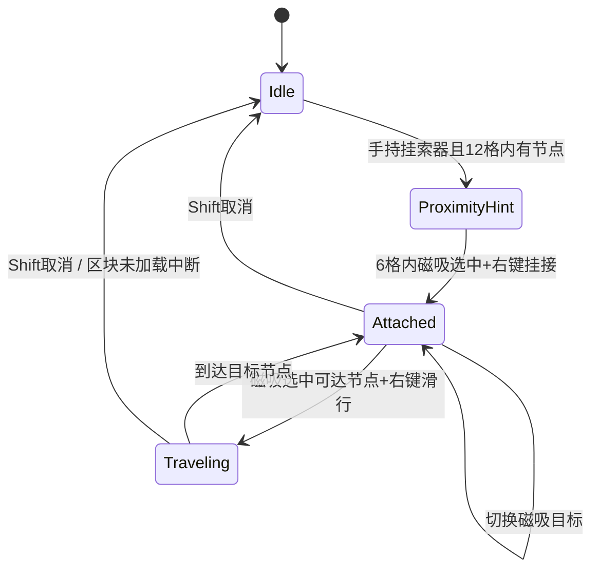
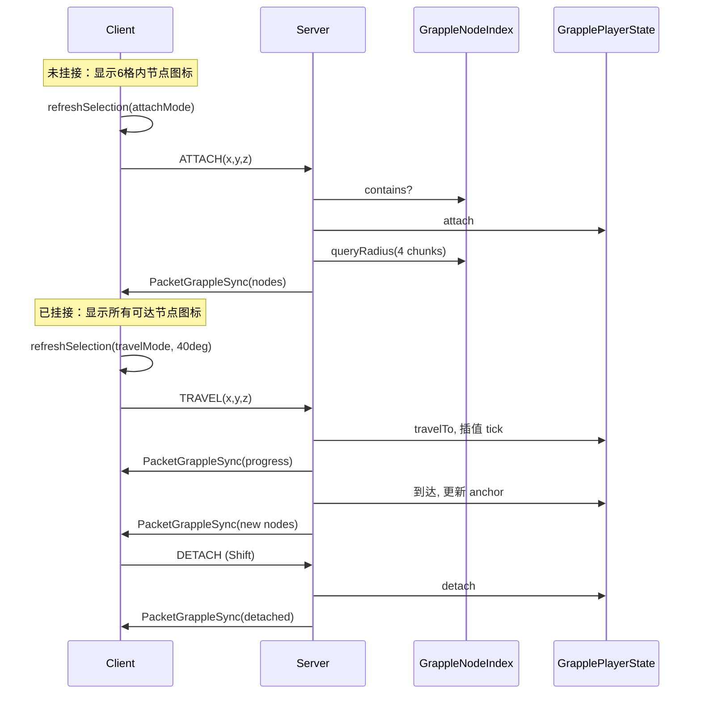

# 挂索节点系统 — 完整设计文档

> **项目**: TeXTech (GTNH 1.7.10 / Forge)  
> **代码注册名**: `GrappleAnchor`（方块）/ `GrappleHook`（物品）  
> **游戏内显示名**: 挂索节点 / 挂索器（`tile.grappleAnchor.name` · `item.grappleHook.name`）  
> **状态**: 已实现并编译通过；模型/贴图仍为占位  
> **玩家向说明**: [用户手册 §3.7–3.8](../player/用户手册.md#37-挂索节点)

---

## 目录

- [〇、设计初衷](#〇设计初衷)
- [一、功能概述](#一功能概述)
- [二、状态机](#二状态机)
- [三、交互与 HUD 显示规则](#三交互与-hud-显示规则)
  - [3.1 未挂接（Proximity 模式）](#31-未挂接proximity-模式)
  - [3.2 已挂接（Navigation 模式）](#32-已挂接navigation-模式)
  - [3.3 磁吸选点算法](#33-磁吸选点算法grappleselectionutil)
- [四、方块设计](#四方块设计)
- [五、TileEntity 设计](#五tileentity-设计)
- [六、物品设计](#六物品设计)
- [七、核心逻辑包 handler/ 与客户端包 client/](#七核心逻辑包-grapple-与客户端包-client)
- [八、事件处理器](#八事件处理器)
- [九、HUD / 渲染](#九hud--渲染)
- [十、网络包](#十网络包)
- [十一、Config 配置项](#十一config-配置项)
- [十二、注册与加载链](#十二注册与加载链)
- [十三、本地化](#十三本地化)
- [十四、完整文件清单](#十四完整文件清单)
- [十五、数据流](#十五数据流)
- [十六、占位资源（待替换）](#十六占位资源待替换)
- [十七、命名待定](#十七命名待定)
- [十八、已知限制与注意事项](#十八已知限制与注意事项)
- [十九、测试清单](#十九测试清单)
- [二十、给新 Agent 的快速入口](#二十给新-agent-的快速入口)

---

## 〇、设计初衷

我们往往花大量心思把建筑与产线做得漂亮，日常往返却习惯**飞行、跑步或直接传送**——飞行和跑步仍需占用手键，传送则让沿途景观一闪而过，精心布置的空间在赶路时被完全跳过。

挂索节点与挂索器希望在「**快到达**」与「**看见路上**」之间找到平衡：

- 在厂房走廊、景观连桥、产线参观路径、多层竖井等关键位置布置**挂索节点**；
- 手持**挂索器**磁吸挂接后，沿节点间索道**平滑滑行**；
- 滑行过程中**双手仍可自由操作**（背包、工具等），移动本身成为观赏与探索的一部分。

这不是替代传送或飞行，而是为「值得慢慢看的路」提供一种更有过程感的通行方式。

---

## 一、功能概述

新增一套「挂索节点 + 配套物品」玩法：

1. **挂索节点方块**：可贴 6 面放置（墙/顶/地），像薄板一样贴在支撑面上  
2. **挂索器物品**：手持后与节点互动  
3. **靠近提示**：12 格内有节点时，准心附近显示文字提示  
4. **挂接**：交互范围内（6 格）磁吸选中节点 + 右键 → 玩家被「挂」在节点上（定身，可转视角）  
5. **导航 HUD**：挂接后，所有可达节点在**世界坐标**处显示 billboard 图标（穿墙可见）  
6. **磁吸选点**：不必精准瞄准，视角锥形 + 屏幕像素双模式吸附  
7. **滑行移动**：挂接状态下磁吸选中目标节点 + 右键 → 沿两节点间直线平滑移动（悬挂高度）  
8. **取消挂接**：Shift  

---

## 二、状态机



| 状态 | 说明 |
|------|------|
| `Idle` | 正常行走 |
| `ProximityHint` | 提示范围内有节点，显示文字 + 交互范围内节点图标 |
| `Attached` | 定身在当前节点悬挂点，显示所有可达节点图标 |
| `Traveling` | 沿直线插值移动中 |

---

## 三、交互与 HUD 显示规则

### 3.1 未挂接（Proximity 模式）

| 项目 | 规则 |
|------|------|
| 文字提示范围 | `grappleHintRange`（默认 **12 格**） |
| 图标显示范围 | 仅 **交互范围内**（`grappleInteractRange`，默认 **6 格**）的节点 |
| 图标渲染位置 | 节点方块中心 `(x+0.5, y+0.5, z+0.5)`，世界空间 billboard |
| 图标遮挡 | **不受遮挡**（关闭 depth test） |
| 磁吸选点 | 视角锥 **22°** + 屏幕像素 **72px** |
| 挂接方式 | 磁吸选中且在交互范围内 → **右键**（`keyBindUseItem` / `PlayerInteractEvent`）→ 发送 `ATTACH` 包 |
| 文字提示 | 有节点：`附近有可挂接的节点`；磁吸选中且在交互范围：`右键挂接至选中节点` |

### 3.2 已挂接（Navigation 模式）

| 项目 | 规则 |
|------|------|
| 图标显示 | 服务端同步的 **所有可达节点**（不含当前 anchor） |
| 可达范围 | 以当前 anchor 为中心，`grappleScanChunkRadius`（默认 **4 区块** = 64 格） |
| 图标渲染 | 同上：世界坐标 billboard，穿墙可见 |
| 磁吸选点 | 视角锥 **40°**（更宽）+ 屏幕像素 **144px**（72×2） |
| 选中反馈 | 磁吸目标图标 **变绿 + 放大**（带 lerp 动画） |
| 滑行方式 | 磁吸选中 → **右键** → 发送 `TRAVEL` 包 |
| 文字提示 | 屏幕底部：`Shift 取消挂接 \| 右键前往选中节点` |

### 3.3 磁吸选点算法（`GrappleSelectionUtil`）

**挂接模式** (`pickAttachTarget`):

1. 优先：`pickByLookAlignment` — 视线方向夹角 ≤ `grappleAttachSnapDegrees`（22°），取 dot 最大者  
2. 备选：`pickByScreenDistance` — 准心像素距离 ≤ `grappleSnapRadiusPx`（72px）

**滑行模式** (`pickTravelTarget`):

1. 优先：`pickByLookAlignment` — 夹角 ≤ `grappleTravelSnapDegrees`（40°）  
2. 备选：屏幕像素 ≤ `grappleSnapRadiusPx × 2`（144px）

选点每 **tick** 和每 **渲染帧** 都会刷新（`HandlerGrappleClient` + `GrappleHudRenderer`）。

---

## 四、方块设计

### 4.1 `BlockGrappleAnchor`

**路径**: `src/main/java/com/imgood/advancedatamonitor/blocks/BlockGrappleAnchor.java`

| 属性 | 值 |
|------|-----|
| 基类 | `BlockContainer` |
| 注册名 | `grappleAnchor` |
| unlocalizedName | `grappleAnchor` |
| 创造标签 | `CreativeTabs.tabRedstone` |
| 渲染 | `getRenderType() == -1` + TESR |
| 占位贴图 | `textures/items/TeXTech.png` |

**贴面放置**:

- `canPlaceBlockOnSide`: 相邻方块对应面 `isSideSolid` 才允许  
- `onBlockPlaced`: metadata = 附着面 `ForgeDirection.ordinal()`  
- `onBlockPlacedBy`: 写入 TE 的 `attachFace`  
- `setBlockBoundsBasedOnState`: 按附着面设薄板碰撞箱（`PLATE = 0.28125F`）

**生命周期**:

- `onBlockAdded` → `GrappleNodeIndex.addNode`  
- `breakBlock` → `GrappleNodeIndex.removeNode` + `GrapplePlayerState.onAnchorBroken`（强制 detach 挂在上面的玩家）

**交互**:

- `onBlockActivated`（服务端）：手持挂索器 + 距离 ≤ interactRange → `GrapplePlayerState.attach`  
- 客户端挂接也可走 `PacketGrappleAction.ATTACH`（磁吸 + 右键，更可靠）

---

## 五、TileEntity 设计

### 5.1 `TileEntityGrappleAnchor`

**路径**: `src/main/java/com/imgood/advancedatamonitor/tileentity/TileEntityGrappleAnchor.java`

| 字段 | 说明 |
|------|------|
| `attachFace` | `ForgeDirection`，NBT 持久化 |

**悬挂点计算** `getHangPosition()`:

```
outward = attachFace.getOpposite()
x = blockX + 0.5 + outward.offsetX * 0.55
y = blockY + 0.5 + outward.offsetY * 0.55 + 0.5  // 额外半格高度
z = blockZ + 0.5 + outward.offsetZ * 0.55
```

---

## 六、物品设计

### 6.1 `ItemGrappleHook`

**路径**: `src/main/java/com/imgood/advancedatamonitor/items/ItemGrappleHook.java`

| 属性 | 值 |
|------|-----|
| 注册名 | `grapple_hook` |
| unlocalizedName | `grappleHook` |
| maxStackSize | 1 |
| 占位贴图 | `textech:advance_planner` |

**静态方法**:

- `isHoldingHook(player)` — 主手是否持有  
- `hasHookAnywhere(player)` — 背包中是否有（备用）

不在 `onItemUse` 里挂接，统一走磁吸 + 右键 / 方块 `onBlockActivated`。

---

## 七、核心逻辑包 `handler/` 与客户端包 `client/`

`handler/` 仅保留双端/服务端逻辑（索引、玩家状态、锚点坐标、移动队列）。客户端缓存与磁吸选点位于 `client/GrappleClientCache`、`client/GrappleSelectionUtil`；输入处理在 `client/HandlerGrappleClient`。

挂索配置 GUI（`GuiGrappleAnchorConfig`、`GuiGrappleHookConfig`）统一经 `GuiHandler.openGui` 打开（`GRAPPLE_ANCHOR_GUI_ID = 4`、`GRAPPLE_HOOK_GUI_ID = 5`），不再直接 `displayGuiScreen`。

### 7.1 `GrappleNodeIndex`（服务端单例）

**路径**: `handler/GrappleNodeIndex.java`

```
Map<dimId, Map<ChunkCoordIntPair, List<BlockPos>>> index
```

| 操作 | 时机 | 复杂度 |
|------|------|--------|
| `addNode` | 方块放置 / 区块加载扫描 | O(1) |
| `removeNode` | 方块破坏 | O(1) |
| `queryRadius(dim, cx, cz, chunkRadius)` | 挂接时查可达节点 | O((2r+1)²) chunk 桶，**不扫世界方块** |
| `contains` | 服务端校验 | O(1) |

**区块加载补录**: `HandlerGrapple.onChunkLoad` 扫描新区块内所有 grappleAnchor 方块写入索引（解决重启后索引丢失）。

**索引变更通知**: `addNode`/`removeNode` → `GrapplePlayerState.onNodeIndexChanged` → 若影响已挂接玩家候选集则重发 sync。

---

### 7.2 `GrapplePlayerState`（服务端权威）

**路径**: `handler/GrapplePlayerState.java`

```
Map<UUID, State> STATES
```

**State 字段**:

| 字段 | 类型 | 说明 |
|------|------|------|
| `attached` | boolean | 是否挂接 |
| `traveling` | boolean | 是否滑行中 |
| `dimId` | int | 维度 |
| `anchorX/Y/Z` | int | 当前挂接节点 |
| `travelStartX/Y/Z` | double | 滑行起点 |
| `travelEndX/Y/Z` | double | 滑行终点 |
| `travelDistance` | double | 滑行总距离 |
| `travelProgress` | float | 0.0 ~ 1.0 |
| `travelTargetX/Y/Z` | int | 目标节点 |
| `nearbyNodes` | List\<BlockPos\> | 可达候选列表 |

**关键方法**:

| 方法 | 说明 |
|------|------|
| `attach(player, dim, x, y, z)` | 校验持有物品 + 索引存在 → 定身 → refreshNearby → sync |
| `detach(player)` | 清除状态 → sync detached |
| `travelTo(player, tx, ty, tz)` | 校验 attached + 非 traveling + 索引存在 + 距离 ≤ maxTravel → 开始插值 |
| `tick(player)` | 每 tick：未 traveling 则 snap 定身；traveling 则插值推进 |
| `onAnchorBroken` | 节点被破坏 → 强制 detach 挂在上面的玩家 |
| `onNodeIndexChanged` | 索引变更 → 刷新 nearby → 重发 sync |

**滑行插值**:

```
progress += grappleMoveSpeed / travelDistance   // 每 tick
pos = lerp(start, end, progress)
EntityPlayerMP.setPositionAndUpdate(x, y, z)
```

到达后：更新 anchor 为目标节点，保持 attached，refreshNearby，重发 sync。

**定身**: `HandlerGrapple`（服务端 tick）+ `HandlerGrappleClient`（客户端 LivingUpdate）清零 motion。

**中断条件**: 滑行路径上 chunk 未加载 → detach；不再持有挂索器 → detach。

---

### 7.3 `GrappleClientCache`（客户端镜像）

**路径**: `client/GrappleClientCache.java`（`@SideOnly CLIENT`）

从 `PacketGrappleSync` 写入：

- `attached`, `traveling`, `anchorX/Y/Z`, `travelProgress`
- `nearbyNodes` 列表
- `selectedTarget`（客户端本地计算）
- `iconScales`（动画用 Map\<BlockPos, Float\>）

---

### 7.4 `GrappleSelectionUtil`（客户端磁吸）

**路径**: `client/GrappleSelectionUtil.java`（`@SideOnly CLIENT`）

| 方法 | 说明 |
|------|------|
| `buildCandidateNodes(player, attached)` | 未挂接→交互范围扫描；已挂接→`GrappleClientCache.getNearbyNodes()` |
| `refreshSelection(...)` | 刷新并写入 `GrappleClientCache.selectedTarget` |
| `pickTravelTarget` / `pickAttachTarget` | 见第三节 |
| `pickByLookAlignment` | 视角锥形吸附 |
| `pickByScreenDistance` | 屏幕像素吸附 |
| `projectToScreen` | FOV 投影（读 `gameSettings.fovSetting`） |
| `findNodesInRange` | 客户端世界扫描（仅 proximity 提示用） |

---

## 八、事件处理器

### 8.1 `HandlerGrapple`（服务端 + Forge 总线）

**路径**: `handler/HandlerGrapple.java`

| 事件 | 作用 |
|------|------|
| `PlayerTickEvent`（服务端 END） | `GrapplePlayerState.tick` |
| `LivingUpdateEvent`（服务端） | 挂接时清零 motion |
| `ChunkEvent.Load` | 补录节点到 `GrappleNodeIndex` |

注册: `LoaderHandler.registerHandlers()` → `MinecraftForge.EVENT_BUS`

---

### 8.2 `HandlerGrappleClient`（纯客户端）

**路径**: `client/HandlerGrappleClient.java`（`@SideOnly CLIENT`）

| 事件 | 作用 |
|------|------|
| `PlayerTickEvent`（客户端 END） | 每 tick 刷新磁吸选点；检测 Shift / 右键 |
| `PlayerInteractEvent`（HIGHEST） | 右键挂接/滑行（`setCanceled(true)` 阻止原版交互） |
| `LivingUpdateEvent`（客户端） | 挂接时清零 motion |

**右键检测**: `mc.gameSettings.keyBindUseItem.getIsKeyPressed()`（不用 raw Mouse 按钮）

注册: `ClientProxy.init()` → FML 总线 + Forge 总线

---

## 九、HUD / 渲染

### 9.1 `GrappleHudRenderer`（纯客户端）

**路径**: `renders/GrappleHudRenderer.java`

| 事件 | 内容 |
|------|------|
| `RenderWorldLastEvent` | 世界空间 billboard 图标 + 磁吸选点 + 缩放动画 |
| `RenderGameOverlayEvent.Post`（TEXT） | 仅文字提示 |

**Billboard 渲染**:

- 位置：节点中心  
- 始终面向相机（`playerViewY` / `playerViewX` 旋转）  
- `GL_DEPTH_TEST` 关闭 → 穿墙可见  
- 用 `RenderItem.renderItemIntoGUI` 渲染挂索器物品贴图  
- 选中：绿色 tint + 放大（lerp `0.18`）

注册: `ClientProxy.init()` → Forge 总线

---

### 9.2 `RenderGrappleAnchor`（TESR 占位）

**路径**: `renders/RenderGrappleAnchor.java`

- 模型：`model/TeXTech2.obj`  
- 纹理：`textures/model/TeXTech.png`  
- 按 `attachFace` 旋转，缩放 0.45  

注册: `LoaderRender.registerRenderers()`

---

## 十、网络包

| ID | 包 | 方向 | 用途 |
|----|-----|------|------|
| **11** | `PacketGrappleAction` | C→S | `DETACH(0)` / `TRAVEL(1)` / `ATTACH(2)` |
| **12** | `PacketGrappleSync` | S→C | 状态 + nearby 节点列表 + travelProgress |

**路径**:

- `network/packet/PacketGrappleAction.java`
- `network/packet/PacketGrappleSync.java`

**注册**: `LoaderNetwork.registerNetWorks()`（postInit）

**服务端处理**: `HandlerTick.enqueueServerTask` 保证主线程

### `PacketGrappleAction` payload

```
byte action
int targetX, targetY, targetZ   // TRAVEL / ATTACH 时使用
```

### `PacketGrappleSync` payload

```
boolean attached, traveling
int anchorX, anchorY, anchorZ
float travelProgress
short nodeCount
[nodeCount × (int x, int y, int z)]
```

---

## 十一、Config 配置项

**分类**: `grapple`（`config/TeXTech.cfg`）

| Key | 默认值 | 说明 |
|-----|--------|------|
| `hintRange` | 12 | 文字提示范围（格） |
| `interactRange` | 6 | 可挂接距离（格） |
| `scanChunkRadius` | 4 | 挂接后节点列表半径（区块） |
| `maxTravelChunkRadius` | 4 | 最大滑行距离（区块，×16=格） |
| `moveSpeed` | 0.8 | 滑行速度（格/tick） |
| `snapRadiusPx` | 72 | 屏幕像素磁吸半径 |
| `travelSnapDegrees` | 40 | 滑行视角锥形吸附角度 |
| `attachSnapDegrees` | 22 | 挂接视角锥形吸附角度 |

**代码位置**: `Config.java` 静态字段 + `synchronizeConfiguration()`

---

## 十二、注册与加载链

```
preInit:
  LoaderBlock.registerBlocks()        → grappleAnchor
  LoaderItem.registerItems()          → grappleHook
  LoaderTileEntity.registerTileEntities() → TileEntityGrappleAnchor
  LoaderHandler.registerHandlers()    → HandlerGrapple
  LoaderRender.registerRenderers()    → RenderGrappleAnchor TESR (客户端)

init:
  ClientProxy.init()                  → HandlerGrappleClient + GrappleHudRenderer

postInit:
  LoaderNetwork.registerNetWorks()    → 包 ID 11, 12
```

**Loader 静态字段**:

- `LoaderBlock.grappleAnchor`
- `LoaderItem.grappleHook`

---

## 十三、本地化

**zh_CN / en_US** key:

| Key | 中文 |
|-----|------|
| `tile.grappleAnchor.name` | 挂索节点 |
| `item.grappleHook.name` | 挂索器 |
| `adm.tooltip.grappleAnchor` | 可贴面放置… |
| `adm.tooltip.grappleHook` | 与挂索节点互动… |
| `adm.hint.grapple.nearby` | 附近有可挂接的节点 |
| `adm.hint.grapple.attach` | 右键挂接至选中节点 |
| `adm.hint.grapple.detach` | Shift 取消挂接 \| 右键前往选中节点 |

---

## 十四、完整文件清单

### 新增文件（14 个）

```
blocks/BlockGrappleAnchor.java
tileentity/TileEntityGrappleAnchor.java
items/ItemGrappleHook.java
handler/GrappleNodeIndex.java
handler/GrapplePlayerState.java
client/GrappleClientCache.java
client/GrappleSelectionUtil.java
handler/HandlerGrapple.java
client/HandlerGrappleClient.java
renders/GrappleHudRenderer.java
renders/RenderGrappleAnchor.java
network/packet/PacketGrappleAction.java
network/packet/PacketGrappleSync.java
```

### 修改文件

```
loader/LoaderBlock.java
loader/LoaderItem.java
loader/LoaderTileEntity.java
loader/LoaderRender.java
loader/LoaderHandler.java
loader/LoaderNetwork.java
ClientProxy.java
Config.java
assets/.../lang/zh_CN.lang
assets/.../lang/en_US.lang
.cursor/rules/project-structure.mdc
.cursor/rules/network-packets.mdc
```

---

## 十五、数据流



---

## 十六、占位资源（待替换）

| 资源 | 当前占位 |
|------|---------|
| 方块 TESR | `TeXTech2.obj` + 纹理 |
| 物品贴图 | `advance_planner` |
| HUD 图标 | 同上物品 RenderItem |
| 合成配方 | 仅创造模式（未加工作台配方） |

---

## 十七、命名待定

用户尚未最终确定中英文命名。当前占位：

| | 类名 | 注册名 | 中文 |
|--|------|--------|------|
| 方块 | `BlockGrappleAnchor` | `grappleAnchor` | 挂索节点 |
| 物品 | `ItemGrappleHook` | `grapple_hook` | 挂索器 |

候选方案（供参考）：

- A: 织锚节点 / 织索（`WeaveAnchor` / `WeaveTether`）
- B: 数据挂点 / 挂索器（`DataGrappleAnchor` / `GrappleHook`）
- C: 锚定监视器 / 锚定索（`AnchorMonitor` / `AnchorLink`）

---

## 十八、已知限制与注意事项

1. **1.7.10 无原生平滑移动**：服务端 tick 插值 + `setPositionAndUpdate`，观感依赖 tick 速率  
2. **玩家状态不持久化**：挂接/滑行状态仅存内存，断线/重进清除  
3. **节点索引靠区块事件补录**：首次加载已存在世界需等 chunk load  
4. **挂接时定身**：拦截 motion 清零，保留视角旋转  
5. **专用服务器安全**：`HandlerGrappleClient` / `GrappleClientCache` / `GrappleSelectionUtil` 均 `@SideOnly CLIENT`，不可在服务端类中直接引用  
6. **level.dat 损坏报错与模组无关**：存档 gzip 损坏，非本功能导致  
7. **未加工作台合成配方**  
8. ~~**未加手册 JSON 章节**~~（已在铽丝科技手册「方块与物品」章节补充挂索节点/挂索器页面）  

---

## 十九、测试清单

- [ ] 创造模式拿挂索节点 + 挂索器  
- [ ] 贴墙/贴顶/贴地放置，碰撞箱正确  
- [ ] 12 格内出现文字提示  
- [ ] 6 格内节点显示世界图标，大概瞄准变绿  
- [ ] 右键挂接，玩家定身  
- [ ] 挂接后远处节点显示图标（穿墙可见）  
- [ ] 大概瞄准远处节点变绿，右键滑行  
- [ ] Shift 取消挂接  
- [ ] 破坏挂接中的节点 → 强制 detach  
- [ ] 多人：各玩家独立状态  

---

## 二十、给新 Agent 的快速入口

| 需求 | 先看文件 |
|------|---------|
| 改磁吸/选点 | `client/GrappleSelectionUtil.java` |
| 改 HUD 图标渲染 | `renders/GrappleHudRenderer.java` |
| 改滑行/定身 | `handler/GrapplePlayerState.java` + `handler/HandlerGrapple.java` |
| 改右键交互 | `client/HandlerGrappleClient.java` |
| 改范围/速度 | `Config.java` |
| 改贴面放置 | `blocks/BlockGrappleAnchor.java` + `tileentity/TileEntityGrappleAnchor.java` |
| 改网络 | `network/packet/PacketGrapple*.java` + `LoaderNetwork.java` |
| 替换模型 | `renders/RenderGrappleAnchor.java` + 资源文件 |
| 改显示名 | `lang/zh_CN.lang` + `lang/en_US.lang` |
